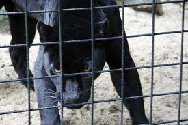

[Pic courtesy vanwageningen.net

I forget where I found the extract below. But it instantly transported me to the last trip to Mysore Zoo – the description couldn’t be more spot-on.

> The desperation of a life in captivity is perhaps conveyed best in Rainer Maria Rilke’s poem “The Panther”: As the animal “paces in cramped circles, over and over,” he seems to perform “a ritual dance around a center / in which a mighty will stands paralyzed.” Unlike the dogs in the Seligman experiment, the panther displays his paralysis not by lying still, but by constantly moving. Just like the helpless dogs, however, he cannot see past his confinement: “It seems to him there are / a thousand bars; and behind the bars, no world.” Whether the bars are real or metaphorical, when one has no control, it is as if nothing exists beyond the pain of this loss.

The full text of [The Panther](http://www.poemhunter.com/poem/the-panther/) below:

His vision, from the constantly passing bars,  
has grown so weary that it cannot hold  
anything else. It seems to him there are  
a thousand bars; and behind the bars, no world.

As he paces in cramped circles, over and over,  
the movement of his powerful soft strides  
is like a ritual dance around a center  
in which a mighty will stands paralyzed.

Only at times, the curtain of the pupils  
lifts, quietly. An image enters in,  
rushes down through the tensed, arrested muscles,  
plunges into the heart and is gone.

