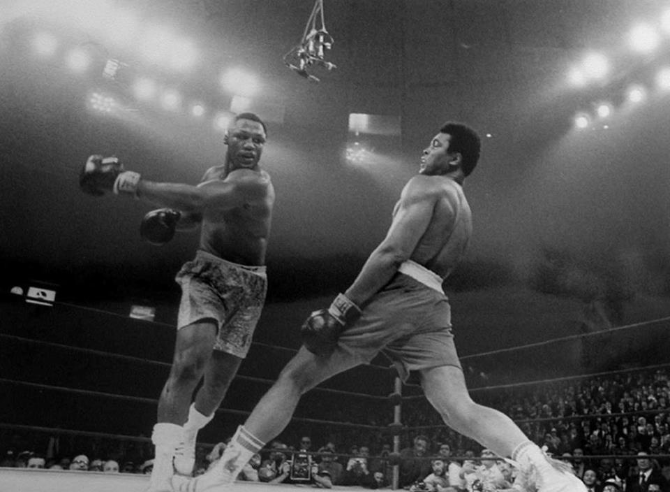

<figure aria-describedby="caption-attachment-2544" class="wp-caption alignleft" id="attachment_2544" style="width: 300px">

<figcaption class="wp-caption-text" id="caption-attachment-2544">Pic via Muhammad Ali’s Facebook Page</figcaption></figure>

Q: What does it take to float like a butterfly?

A: \[Randy Smith on Facebook\] It is a humble and meek beginning as a caterpillar. Then one must willingly submit to the transformation process in the cocoon. And finally now it must break free of it’s constraints in the cocoon to become the butterfly it was meant to be. This is an arduous journey that requires patience while we submit to God’s miraculous work on us and plan for us to fly high.