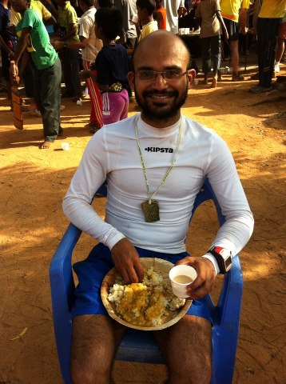

*Prerequisite reading for this blog post*: the story of Ekalavya. If you are a Mahabharata neophyte or if you just have a terrible memory, this [Wikipedia page](http://en.wikipedia.org/wiki/Ekalavya) will come in handy.. as also this [trinetra.org.uk](http://www.trinetra.org.uk/#/hindu-history-ekalavya/4541092700) page.

Now let me walk you through an alterative Ekalavya mythology.

After Dronacharya said “Sorry! No can do”, Ekalavya didn’t sit around moping nor did he make a clay statue of Dronacharya and worship him with flowers et al. He just scoured the Internet.

Not our antediluvian Internet with boring touch tablets and sexy voice-activated Siri smartphones. Ekalavya’s Internet was completely thought-based – think Neil Stephenson’s [Young Girl’s Illustrated Primer](http://www.amazon.com/Diamond-Age-Illustrated-Primer-Spectra/dp/0553380966/ref=sr_1_1?s=books&ie=UTF8&qid=1322224981&sr=1-1) meets Arthur C Clarke’s [Childhood’s End](http://www.amazon.com/Childhoods-End-Arthur-C-Clarke/dp/0345347951). As he scanned the cosmos, Ekalavya hit pay dirt with a succession of stints with luminary gurus. Under the guidance of a succession of gurus, he kept mastering new skills. How to focus. How to relax. How and what to eat. How to train. How to invoke the elements and the astras to do his bidding — as an archer. In short, the perfect master plan designed to transform him into the perfect athlete (nay, archer).

By the time Ekalavya ‘graduated’ from the last gurukul, he had become — what he had set out to become — the best archer the world would ever see. There was one small problem. He didn’t want to fight anyone. He no longer wanted to prove anything to anyone. The path to perfection had burned to a cinder all his *lower chakra* desires.

What did such a man do?

He still wanted to see all the things he had mastered and ‘try out’ the powerful *astras* in his quiver. But he wanted no part of the M war that was soon to wage in his neighborhood. He created the world’s first reality game — what I’d like to call Ekalavya vs. Ekalavya. But that’s a story for a different day.

\*\*\*\*\*\*\*\*\*\*\*\*\*

<figure aria-describedby="caption-attachment-2558" class="wp-caption alignleft" id="attachment_2558" style="width: 223px">

<figcaption class="wp-caption-text" id="caption-attachment-2558">Sir Rajaram Gaunker – “mehnat karte hai, toh fal milta hai”</figcaption></figure>

Today’s story is about my friend and fellow runner Rajaram Gaunker. I christened him *Sir Gaunker* after he pulled off a stupendously awe-inspiring feat of running a full marathon in 3:24 (yes, that is *three hours and twenty four minutes*). Wanna know how crazy that is? This was his *2nd* race at the full marathon distance. He timed *5:41* in his first marathon which he ran *four* years ago. That’s an improvement of *2 hrs 18 min*! If you measure your Personal Best (PB) improvements in terms of 15-min quadrants, that’s *ten frikkin’ quadrants*. Wow!

Okay. In case the enormity of this feat still hasn’t sunk in, let me state that this is INCREDIBLY rare. Sure — a lot of people keep improving on their PBs (most of my runner friends are in their 40’s or 50’s and they routinely improve on their PBs year after year). The quantum of improvement, however, is much smaller. Breaking the sub-4 barrier is the first hurdle (psychological and physical). The progress from 4:00 towards 3:30 is incredibly arduous.. and slow. Sir Gaunker blew past sub-5, sub-4, and sub-3:30 all in one fell swoop.

In the last few months, there were signs of Gaunker’s march to greatness. What was evident to all was that he had shed some serious kilos. On the Sat Dandi ritual runs (when he started reappearing regularly), a few of us noticed that he had gained considerable speed. While the Bangalore running fraternity had decamped to Mumbai for the annual *Kumbh Mela*, Gaunker snuck in a full marathon on training day. With no running partners to slow him, Gaunker posted a comfortable time of 3:43. He shared it on the group’s Facebook page with his trademark blend of nonchalant modesty. On the eve of Mumbai Marathon, most folks either missed the update.. or thought he was pulling a fast one.

Three weeks later, he scorched the field at Auroville with a third place finish – a trail marathon which starts at 5am and is run with a ghostly galleon of zig-zagging torchlights for the first 45-50 min.

The short version of his story on our group.. The emphasis is all mine.

> I started my comeback with aim of sub-2 half marathon and sub 3:30 full just happened as side effect. few of the reasons I think which worked me are 1. moving to diet I had as child (mostly fish and vegetables – lost 17Kg weight because of that ) 2. Dandi runs of 30+ Kms, 3. Giving up on “supportive shoes” 4. strength/interval/tempo training.

Boy! Is that the mother of all side effects?

Choosing the right diet, strength/interval/tempo training and long runs — these are common ingredients to majority of the training plans out there. But *giving up on “supported shoes”*? Such blasphemy, Sir Gaunker. Tut tut tut. Runners with minimalist shoes are *not supposed* to run this fast. They are supposed to just enjoy their runs and motor along at a stop-and-smell-the-roses pace. And what’s more this *kal-ka-chokra* didn’t even have a renowned coach tracking and tweaking his every move. Nor was he following any acclaimed *Run Less Run Faster* regimen. What the $#%$% happened?

The music stopped. He was deluged by effusive words of awe and congratulations that would make proud a Robert Funk. The Dronocharyas and the Arjunas watched awkwardly from the sidelines. Behold the modern era Ekalavya.

And now… do read his longer (though still modest) account of his [5:41 to 3:24 marathon journey](http://rajar.am/post/43463306664/5-41-to-3-24-my-marathon-journey).