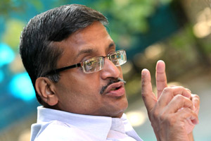

<figure aria-describedby="caption-attachment-1982" class="wp-caption alignleft" id="attachment_1982" style="width: 300px">

<figcaption class="wp-caption-text" id="caption-attachment-1982">Pic courtesy indianexpress.com</figcaption></figure>

*Newton’s Law of Corruption: *an Indian babu’s* likelihood of being corrupt is inversely proportional to the number of times he’s transferred. Higher the transfers, lower the likelihood of being corrupt.*

While babudom and anti-corruption agitation are topics that are not within the primary ambit of this blog, every once in a while I feel compelled to stray (for ‘public good’ reasons of course). The (not so) [curious case of Raju Narayan Swamy](http://www.techsangam.com/2012/01/25/the-not-so-curious-affair-of-ias-officer-raju-narayana-swamy/) and [rebooting IAS](http://www.techsangam.com/2011/12/07/rebooting-ias-an-essential-part-of-reforms-2-0/) are notable precedents.

If you’ve been following the brazenness of Robert Vadra’s real estate dealings even cursorily, you may have heard of Mr. Ashok Khemka. This [article on Independent](http://www.independent.co.uk/news/world/asia/indian-bureaucrat-hounded-out-of-office-43-times-for-fighting-corruption-8222297.html) caught my attention. 43 transfers in 21 years! That’s a transfer every 6 months. If you were keenly following the Anna Hazare agitation (the first phase), you might recollect Bollywood actor Om Puri castigating the political class — besides usual some choice words to describe the politicians he bemoaned the feudal power-play practice of transferring bureaucrats. There are several things *wrong* with the Indian political system and giving the ruling state (&amp; central) governments power to *arbitrarily* transfer bureaucrats is one of them.

Below’s a chronological summary of the 43 positions that Khemka (actually **Dr**. Khemka — he’s also a Ph.D in Computer Science) has held so far gleaned from his [official IAS record sheet](http://persmin.nic.in/ersheet/MultipleERS.asp?HiddenStr=01HY020600). There are only five positions where his tenure was at least one year (highlighted in blue). Stints 3 mos or less highlighted in red. As Chief Administrator (Urban Development), he lasted *18 mos* and his deputation at Warehousing Corporation was a phenomenal *21 mos*!

1. SDO (Land Revenue Mgmt &amp; District Admn) – **11 mos**
2. Under Secy (Agriculture &amp; Cooperation – Cooperatives) – **1 mo**
3. SDO (Land Revenue Mgmt &amp; District Admn) – **7 mos**
4. Addl. Dy Commr (Land Revenue Mgmt &amp; District Admn) – **7 mos**
5. Registrar (Human Resource Dev, Higher Education) – **4 mos**
6. Dy Secy (Human Resource Dev, Technical Education) – **1 mo**
7. Registrar (Human Resource Dev, Higher Education) – **6 mos**
8. Addl Dy Commr (Land Revenue Mgmt &amp; District Admn) – **6 mos**
9. Addl Registrar (Agriculture &amp; Cooperation – Cooperatives) – **7 mos**
10. Dy Secy (Social Justice &amp; Empowerment, Prohibition) – **8 mos**
11. Jt Commr (Law &amp; Justice, Legal Affairs) – **3 mos**
12. Dy Secy (Personnal &amp; General Admn, Administrative Reforms) – **9 mos**
13. \* Registrar (Human Resource Dev, Higher Education) – **15 mos** – *Cadre Deputation?*
14. Jt Secy (Personnel &amp; General Admn, Administrative Reforms) – **12 *days***
  - *Gap of 15 months – presumably for a continuing education gig?*
15. Director (Labour &amp; Employment, Employment &amp; Training) – **15 mos**
16. Jt Secy JAG (Communications &amp; IT) – **6 mos**
17. Dy Commr JAG (Land Revenue Mgmt &amp; District Admn) – **6 mos**
18. Administrator JAG (Urban Development) – **20 *days***
19. Jt Secy JAG (Agriculture &amp; Cooperation – Dairy) – **4 mos**
20. Jt Secy JAG (Communications &amp; IT) – **6 mos**
21. In Charge JAG (Commerce) – **6 mos**
22. Jt Secy JAG (Communications &amp; IT) – **15 mos**
23. Director (Human Resources Dev) – **6 mos**
24. OSD JAG (Personnel &amp; General Admn) – **6 mos**
25. Dy Commr JAG (Land Revenue &amp; General Admn) – **4 mos**
26. Chief Administrator JAG (Urban Development) – **18 mos**
27. Spl Secy (Finance) – **8 mos**
28. Spl Secy (Planning &amp; Prog Implementation) – **39 *days***
29. Spl Collector (HQ) &amp; Spl L A O (Land Revenue &amp; General Admn) – **2 mos**
30. Director &amp; Spl Secy (Agriculture &amp; Cooperation – Agriculture) – **1 mo**
31. Director &amp; Spl Secy (Rural Dev) – **21 *days***
32. Spl Secy (Land Revenue &amp; General Admn) – **8 mos**
33. \* Managing Director (Industries) – Warehousing Corporation Ltd, Panchkula – **21 mos**
34. Director (Consumer Affairs, Food &amp; PD) – **3 mos**
35. Member Secy (Personnel &amp; General Admn) – **1 mo**
36. OSD (Planning &amp; Program Implementation) – **1 mo**
37. Spl Secy (Social Justice &amp; Empowerment) – **12 mos**
38. DG (Social Justice &amp; Empowerment) – **10 mos**
39. Managing Director (Communications &amp; IT) – **2 mos**
40. Spl Secy &amp; DG (Communications &amp; IT) – **2 mos**
41. DG (Land Revenue Mgmt &amp; District Admn) – **1 day?**
42. DG (Land Revenue Mgmt &amp; District Admn) – **1 day?**
43. Spl Collector (Land Revenue Mgmt &amp; District Admn) – **1 day?**

More observations..

- In 16 of the positions, the duration was 3 months or less; of these 10 were 1 month or less. What could the possible reasons have been? “I don’t like the look of this guy!” or “I can smell incorruptible on him” or “Oops! You were supposed to be transferred to Office of Assery and Thuggistan. Who sent you here?”
- 10 of the positions were in the Land Revenue Mgmt &amp; District Admn. While he was clearly a thorn in the flesh of corrupt land administration officials, the bane of the IAS cadre system must be such that he couldn’t have been transferred anywhere else?
- The last 3 roles must be some aberration because all lasted ONE day?

Just for grins, I briefly perused the IAS record sheet of the 8 other officers in Haryana cadre. Here’s what their transfer count looks like:

- Anil Malik: 24 transfers
- Vineet Garg: 17 transfers
- Abhilaksh Likhi: 18
- HS Malik: 17
- Sandeep Garg: 20
- Apoorva Singh: 28
- Shrikant Walgad: 27
- G Anupama: 23

Mr. Ashok Khemka: may your tribe proliferate. More importantly, I pray that system be reformed and the arbitrariness of transfers reduced drastically.