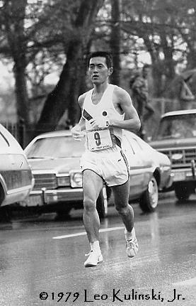
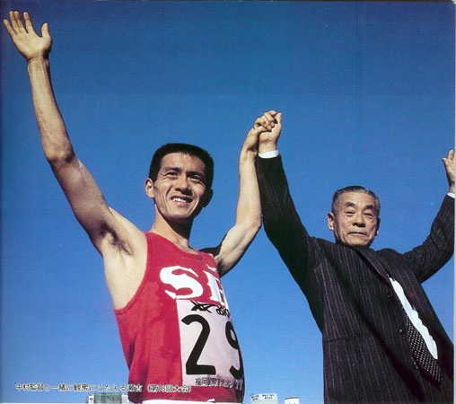

> <figure aria-describedby="caption-attachment-2571" class="wp-caption alignleft" id="attachment_2571" style="width: 192px">

<figcaption class="wp-caption-text" id="caption-attachment-2571">Toshihiko Seko (Pic courtesy whalesandwolves.com)</figcaption></figure>
> 
> “Does a runner at your level feel like you’d rather not run today, like you don’t want to run and would rather just sleep in?” He stared at me and then, in a voice that made it abundantly clear how stupid he thought the question was, replied “Of course. All the time!”

The questioner? Novelist and marathoner Haruki Murakami. The elite runner? Japanese Olympian Toshihiko Seko. Seko represented his country in the 1984 and 1988 Olympics. While he didn’t win any Olympic medals, his memorable wins include the Boston Marathon (1981 and 1987), London Marathon (1986), and Chicago (1986). I’ve seriously short-changed Seko’s accomplishments so must absolutely read[ Toshihiko Seko and Kiyoshi Nakamura’s Old School](http://moti-athletics-histo.blogspot.com/2011/06/toshihiko-seko-and-kiyoshi-nakamuras.html) to truly appreciate his greatness — world records in the 25k and 30k distances that stood for 30 years is but ONE facet of his greatness.

I recalled the Murakami story today at 5:15am. After snoozing the 5:05am alarm, I was in a quandary. I had woken up with a headache. If it was the head-splitting variety, my course of action would have been easy – pop an Ibuprofen tablet and try to go back to sleep. It was the more annoying variety – the one that lingers all day irrespective of whether you rest, close your eyes or take an Ibuprofen.

I only run thrice a week – a tempo run on Tuesdays and an interval training run on Thursday and the long one on Saturday. Lately the Tue/Thu runs have become a bit unstructured. Sometimes I miss a Tue so Thu becomes a tempo, other times the interval run becomes a conversational easy-pace run with friends. I rarely miss both Tue and Thu. When that does happen, I notice it on my Saturday Dandi run. ‘Notice’ as in ‘struggle’. The *sole* point of the Tue/Thu runs are so I can enjoy the Sat long run (I’m not athletically gifted like my friend Pankaj who can just get up Sat morning and run like the Red Eveready battery). The Dandi ritual run needs to be written about. Someday soon.

Anyway, I had missed my Tue run due to the perfectly legitimate reason that I was working late Mon night. Hope you understand my quandary now. I mentally thanked Murakami and headed for my run. Did a warm-up round and followed up with a 4×800 interval drill. By the time I hit the third interval, an aching head was no longer top of mind. And yeah, the annoying headache was gone by breakfast. I suppose *loha se loha cut-ta hai*. The legendary Scott Jurek’s physician friend and fellow ultra-marathoner had once remarked *Not all pain is significant*.

It’s only apt to end this post with Murakami’s reflection (following his Seko interview).

> Now that I look back on it I can see what a dumb question that was. I guess even back then I knew how dumb it was, but I suppose I wanted to hear the answer directly from someone of Seko’s caliber. I wanted to know whether, despite being worlds apart in terms of strength, the amount we can exercise, and motivation, when we lace up our running shoes early in the morning we feel exactly the same way. Seko’s reply at the time came as a great relief. *In the final analysis we are all the same*, I thought.

*Closing Note*: the Murakami story is from his running memoir [What I talk about when I talk about running](http://www.amazon.com/What-About-Running-Vintage-International/dp/0307389839/ref=tmm_pap_title_0).

<figure aria-describedby="caption-attachment-2573" class="wp-caption aligncenter" id="attachment_2573" style="width: 300px">

<figcaption class="wp-caption-text" id="caption-attachment-2573">Toshihiko Seko and coach Nakamura, after 1983 Fukuoka marathon  
Photo: Nobby Hashizume  
http://www.juanjosemartinez.com.mx/running.html</figcaption></figure>