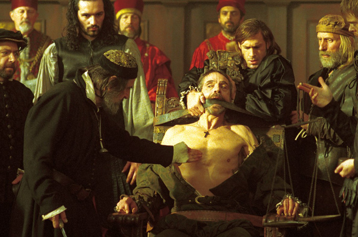

<figure aria-describedby="caption-attachment-2579" class="wp-caption alignleft" id="attachment_2579" style="width: 300px">

<figcaption class="wp-caption-text" id="caption-attachment-2579">Pic courtesy maddyndss.edublogs.org</figcaption></figure>

I think of Portia’s famous speech often – every time a corrupt minister gets implicated in a corruption scam. When Infosys’ Narayana Murthy came up with that ridiculous suggestion that anti-corruption legislation should be crafted to only punish the “taker” and not the “giver”, I thought of it again. When Vadragate broke I thought it might be fun to ‘play’ with the passage and replace ‘mercy’ with ‘corruption’. One thing led to another and I ended up making many other changes.

Here’s the original in its full glory – fair Portia appealing to Shylock the Jew’s mercy.

> The quality of mercy is not strain’d,
> 
> It droppeth as the gentle rain from heaven  
> Upon the place beneath: it is twice blest;  
> It blesseth him that gives and him that takes:  
> ‘Tis mightiest in the mightiest: it becomes  
> The throned monarch better than his crown;  
> His sceptre shows the force of temporal power,  
> The attribute to awe and majesty,  
> Wherein doth sit the dread and fear of kings;  
> But mercy is above this sceptred sway;  
> It is enthroned in the hearts of kings,  
> It is an attribute to God himself;  
> And earthly power doth then show likest God’s  
> When mercy seasons justice. Therefore, Jew,  
> Though justice be thy plea, consider this,  
> That, in the course of justice, none of us  
> Should see salvation: we do pray for mercy;  
> And that same prayer doth teach us all to render  
> The deeds of mercy. I have spoke thus much  
> To mitigate the justice of thy plea;  
> Which if thou follow, this strict court of Venice  
> Must needs give sentence ‘gainst the merchant there.

In the parody below, replace Antonio the Merchant with any of your favorite corrupt minister (Raja, Kalmadi, Pawar, etc.) and Shylock’s place is taken by a humble Indian citizen. What of Portia? Replace her with your favorite government prosecutor CBI. Edits in blue.

> The quality of corruption is not strain’d,
> 
> It droppeth as the acid rain from heaven  
> Upon the place beneath: it is twice curst;  
> It curseth him that gives and him that takes:  
> ‘Tis ghastliest in the ghastliest: it becomes  
> The throned *maun*arch worse than his crown;  
> His turban shows the force of temporal power,  
> The attribute to pusillanimity and servility,  
> Wherein doth sit the greed and impudence of ministers;  
> But corruption is above this turbaned sway;  
> It is enthroned in the hearts of merchants,  
> It is an attribute to Devil himself;  
> And earthly power doth then show likest Devil’s  
> When corruption seasons justice. Therefore, Citizen,  
> Though justice be thy plea, consider this,  
> That, in the course of justice, none of us  
> Should see salvation: we do pray for gullibility;  
> And that same prayer doth teach us all to render  
> The deeds of corruption. I have spoke thus much  
> To mitigate the justice of thy plea;  
> Which if thou follow, this strict court of India  
> Must needs give sentence ‘gainst the merchant there.