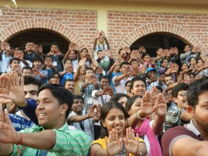

<figure aria-describedby="caption-attachment-1986" class="wp-caption alignleft" id="attachment_1986" style="width: 300px">

<figcaption class="wp-caption-text" id="caption-attachment-1986">Pic courtesy meerasanyal.wordpress.com</figcaption></figure>

A year ago I had a brief encounter with a young SELCO employee (Nikhil Nair – NN) following a scintillating chat with Harish Hande. Outside in the parking lot, NN cast a curious look at my Reva while I looked approvingly at his Royal Enfield Bullet and we struck up a conversation. Two recollections stood out. NN was an MBA grad from Christ College — that’s ‘recall worthy’ since Hande is extremely skeptical about MBA grads! NN attributed his joining SELCO to a memorable few weeks spent aboard the Tata Jagriti Yatra – a few years before. Here’s how the Yatra is described on their [website](http://www.jagritiyatra.com/about/):

> Jagriti Yatra is an annual train journey that that takes hundreds of India’s highly motivated youth (with some participation of international students) between the ages of 20-25 and experienced professionals with age above 25, on a eighteen day national odyssey, introducing them to unsung heroes of India. The aim is to awaken the spirit of entrepreneurship – both social and economic – within India’s youth by exposing them to individuals and institutions that are developing unique solutions to India’s challenges. Through this national event we have begun to inspire the youth of India to lead and develop institutions both nationally and within their communities.

I filed this as another initiative worthy of blogging someday. When Meera Sanyal (CEO of RBS India who contested parliament elections in 2009) blogged about her experience as a *Resource yatri* on the 2012 edition, I knew I had found the material. Sanyal’s 3-part blog series ([Part 1 link](http://meerasanyal.wordpress.com/2012/12/27/in-the-shadow-of-dreams-jagriti-yatra/)) makes for great reading and the extracts below will hopefully serve as sufficient teasers.

**How Meera Sanyal got hooked**

> A train journey of 9000 kilometres around India with 450 young aspiring entrepreneurs – the idea was intriguing…
> 
> My journey to the *Jagriti Yatra* started on *Gandhi Jayanti* this year. Invited to address the*Yatris* at a function on 2nd Oct, at the Tata Institute of Social Sciences, I was captivated by the passion and energy of the young people who filled the room. Drawn from all over India, they shared how their experience on the *Yatra* had transformed their perspective and in some cases their lives.
> 
> Inspiring as the stories of the journey were, what was really interesting was the theme: **Building India through Enterprise.** This then, was more than just a fun exercise in experiential learning – *Yatris* were selected both on the basis of their ideals and their dreams – of a better India driven by entrepreneurship.
> 
> The idea of the trip was to provide an immersive learning experience (live in sleeper class compartments on a train for 15 days); visiting role model institutions (from Infosys in Bangalore to the Barefoot college in Tilonia Rajasthan); using Case study methodology (intensive Group discussions within Cohorts designed to be diverse) and building a support network of like minded individuals who care deeply about building a better India.
> 
> I was hooked ! This seemed a perfect continuum of the journey I had begun in April, to the villages of India. So I signed on to be a Resource person for the 2012 Yatra that commenced on December 24.

**2% acceptance rate and 375 yatris…**

> The *Yatris* are an interesting bunch : 375 aspiring entrepreneurs aged 20-25, and 75 slightly older participants who form the organising and facilitating team, many of whom are ex-*Yatris* themselves.
> 
> This year 18000 registrations were received for the *Yatra*, of whom 375 participants were finally selected. 35 are international participants representing 12 countries. The Indian participants are drawn from 24 Indian states. 39% are female and 57% come from semi urban and rural backgrounds.
> 
> The chemistry between *Yatris* is fun to watch – adjustments as people jostle for space : physical, mental and philosophical !

**Hope and dreams…**

> But everywhere is a common thread – the thread of dreams that range from changing India and serving our people, to building businesses that will be global giants.
> 
> As I walk through the compartments, I feel as if I am walking in the shadow of these dreams…and as these young Yatris awake to their full potential, and start realising these dreams, India will be a better place.

**Day #6: sharing of stories and a rhythmic tight schedule**

> The sharing of stories builds a bond that grows closer in the confines of our moving home. Time and space are both limited and the schedule is a tight one. The train has been chartered from the Indian Railways and slots on the destination Railway platforms have a precise and finite time limit. Miss them and there are not just financial penalties – but a cascading effect on the entire schedule.
> 
> Early morning starts ( typically 5.30 to 6 am) are followed by breakfast either on the train or platform. The group then heads to the Role Model Institution, for an on-site visit. On return to the train each evening, different groups present critiques of the Institution to the larger Group. Two chair cars linked back to back and connected by Video and Audio act as the Conference room for upto 200 *Yatris* ! Those who are unable to join the Chair car sessions, crtique the role models in smaller groups in Compartment sessions. Discussions are intense &amp; critical. The quality of presentations is impressive, with an innovative use of music, poetry (Urdu *shairi* rules the day !) and drama, in addition to Power point presentations

**Not just the youngsters who are learning**

Elizabeth the spider scholar from Kochi, researching the medical potential of spider webs; Shadab who has set up a school for 500 under privileged children in Ranchi; Manish the engineering student in Gauhati who has set up an on line travel agency specialising in tours of the North East…this is an incredibly bright and enterprising group of young people.

Our role is to act as Resource persons and provide perspective and context. Increasingly however, it is clear that it is we, who have much to learn from these youngsters ! Our visits to the Role models over the past three days has also provided much food for thought.

**In closing..**

As the train pulls out of Patna, I reflect on the thread that connects the role models we have recently visited. Each of them has converted their concern for others, into tangible actions that give others both hope and dignity. There can be no better way to start the new year than to spend it in the company of such people.

**Role model institutions**

The list of role model institutions described in Sanyal’s blog posts (perhaps partial) are: Infosys, Toe Hold Artisans, SELCO, Flipkart, Redbus, Zivame, Aravind Eye Care, R Elango, Naandi, Gram Vikas, and Nidan.