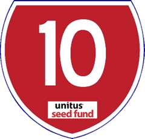

<figure aria-describedby="caption-attachment-2006" class="wp-caption alignleft" id="attachment_2006" style="width: 240px">

<figcaption class="wp-caption-text" id="caption-attachment-2006">Pic courtesy usf.vc</figcaption></figure>

*\[Editor’s Note: A few weeks ago, I had an engaging coffee chat with [Unitus Seed Fund](http://www.techsangam.com/2013/01/10/indian-social-enterprises-silicon-valley-makeover/)‘s (USF) Srikrishna Ramamoorthy and Eleanor Horowitz. The bulk of our discussion was on early stage social enterprises (USF’s sweet spot) and brainstorming on social entrepreneurship’s ‘top of the funnel’. If you are a current (or aspiring) social entrepreneur, you definitely want to start following the [USF blog](http://usf.vc/updates/). Will Poole (Founder &amp; Managing Partner of USF and previously a Corporate VP at Microsoft) wrote an informative post on how BOP startups should pitch to them… specifically the 10 commandments to focus on (my favorites are #4, #5 and #7). Republished below with USF’s permission.\]*

Like any venture firm, we get pitched continuously. Listening carefully is our job. We love hearing from inspired entrepreneurs, especially those that have developed a business that has the potential to positively impact the lives of hundreds of thousands – if not millions – of families living at the base of the economic pyramid in India. Helping great “BoP Startups” succeed is why we’re here. Also see [9 tips on preparing to pitch to Unitus Seed Fund](http://usf.vc/9)

All too often, pitches are not only too long (we’ve only seen one that was too short), and they don’t answer key questions we need to understand in order to make a good decision about moving forward in the investment process. After seeing eight pitches over the past 10 days, we compiled the following list of our “Top 10” topics we need to understand about any BoP Startup.

1\. What is **unique / differentiated** in both the short and long term for your product or service offering? What’s your “secret sauce”? What will keep others from copying you?

2. What have you **learned** via your pilot / proof-of-concept? We expect you’ve had some failures as well as successes – tell us about both.

3\. What are you hoping to **accomplish in the next 12 months**? E.g. key milestones, validations, expected learnings.

4\. Explain your **business unit economics** – meaning how do you make money and hopefully profit on each unit/service sold, excluding corporate overhead. Many BoP Startups serve local areas (villages, towns, cities) – what do the economics look like for any one of them?

5\. Characterize the “**Business Unit Total Addressable Market** (TAM)” for your product/service around your pilot market area. E.g., how many customers are there within some stated distance from your business unit facility? What penetration of that TAM do you expect for each business unit when it’s running at scale?

6\. Why is your team the **right/best team** to achieve your objectives? What skillsets are you missing?

7\. Characterize your **social impact** – how do you define it? How will you measure it over time? What are key assumptions that support getting to 100k BoP families in 5 years? (Or if your ability to scale is not that fast, how do you characterize a compelling impact you’ll have on each person/family you touch?)

8\. What have you learned from **competitors** or similar companies operating in similar areas, in India or other developing economies? Who are local and regional and national competitors, and why will you prevail over them?

9\. Where have you **spent the money** you’ve raised/earned/been-granted so far? What valuable assets have you created with it?

10. What is the **minimum amount** (and if different, your desired amount) that you’d like to raise in this financing round and how will those funds be used over the next 18 months? How are you thinking that investors will get their capital back with a **strong financial return**?

With only an hour for a pitch and discussion, you can see that there is a lot of ground to cover. That means that other topics can’t get airtime, or can’t get much. Your meeting time-management is critical. If we get through the hour and have not learned about the ten topics above from you, we’re not going to be able to make a good decision. Our goal is to move quickly once we’ve got our head around these topics, giving quick feedback on whether there is a good fit for moving forward now, later (after you achieve some milestone), or not at all.