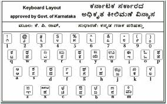

<figure aria-describedby="caption-attachment-2595" class="wp-caption alignleft" id="attachment_2595" style="width: 284px">

<figcaption class="wp-caption-text" id="caption-attachment-2595">Pic courtesy sourceforge.net</figcaption></figure>

English translation of title: You CAN teach an old dog new tricks – one small story!

A few months ago, I finally enrolled for a Kannada Learning class. 4 1/2 years after moving to Bangalore, the time had finally arrived. 4 weekends (8 classes 2 hours each) conducted in the apartment common room – it couldn’t be more convenient. Highly recommend the class taught by the [Kannada Learning School](https://www.facebook.com/KannadaLearningSchool) – an algorithmic and pattern-based approach to teaching Kannada.

Somewhat similar to the ‘graduating’ speech in English Vinglish, our teacher (Sangamesh) asked everyone to write a few sentences about our experience or any random story. So I (obviously) picked the most random aspect of my life – running. Here you go and I’m addressing ‘my Kannada friends’ here 🙂

You’ll see an occasional English noun — one Kannadifies it by merely appending “u”.

*Nanage maataDi ishta-agutti-de. innu nanage bare tumba ishta-agutti-de. Hale naayi-ge hosa tricksu kalisa bahudu – ondu chikka story-u.*

*Nanna prathama ippattu erudu varsha tumba asthma aagittu. Olage ondu savara ombattu nooru tombattu aaru, naanu ardha marathon oDide. Aaru varsha mele, naanu sampoorna marathon oDide. Varege eega, naanu hadinaidu marathons-u oDide mattu eeginadinagaLu hattirakke taru erudu savara kilometers-u shoes illade oDittaidini.*

I’ll be surprised if you didn’t find the above strange. One example of the strangeness (from literal translation) is “varege eega” — I am starting that sentence with “Till now”..