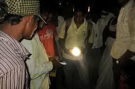

<figure aria-describedby="caption-attachment-2016" class="wp-caption alignleft" id="attachment_2016" style="width: 276px">

<figcaption class="wp-caption-text" id="caption-attachment-2016">The 1600 INR Pollinate lamp (Pic courtesy theatlanticcities.com)</figcaption></figure>

Just read an intriguing Mother Jones article on the [adoption of solar power in India’s slums](http://www.motherjones.com/environment/2013/04/selling-solar-power-indias-slums). The two solar startups profiled in the article? Bangalore-based Simpa Networks and Bangalore-based Pollinate Energy. Here’s another interesting nugget – the co-founders of Simpa are two Americans and one Canadian while the co-founders of Pollinate are Australian. Australia vs. North America on neutral Indian territory? I know I’ve missed way too many *Social Enterprise Happy Hours* because I missed this latest [batch of firangs](http://www.techsangam.com/2012/04/13/firang-invasion-of-indias-social-enterprise-ecosystem/). Welcome to Bangalore, Pollinate Energy!

Jokes apart, Pollinate seems focused on the urban slums while Simpa is selling to the rural poor. The former has already sold 400 solar systems in a short span of 5 months.

This quote from Pollinate’s co-founder (Chivers) caught my attention.

> “It’s a nice idea—the poor leap-frogging the rich.”

It’s cute sounding but let’s not kid ourselves. There’s little danger of the rich-poor gap being narrowed anytime soon in India.

Another interesting quote, this from Simpa’s MacHarg.

> “We’re looking to be the first electricity that a family has,” explains MacHarg.

<figure aria-describedby="caption-attachment-2015" class="wp-caption alignright" id="attachment_2015" style="width: 300px">

<figcaption class="wp-caption-text" id="caption-attachment-2015">The Simpa box (pic courtesy simpanetworks.com)</figcaption></figure>

For the uninitiated, Simpa Networks is a pay-as-you-go solar system integrator. I said ‘integrator’ because inside the Simpa ‘box’ is the SELCO solar system (SELCO is another Bangalore-based solar social enterprise founded by Magsaysay-award winning [Harish Hande](http://www.techsangam.com/2012/06/05/two-bright-lights-in-indias-impact-investing-landscape/)) – the Simpa metering gizmo is integrated with the SELCO system to enable/disable the lighting system based on how many “solar credits” the customer has purchased.

Another nugget I prised from the article is a unit sales comparison. In two years, Simpa has sold over 100 solar systems while the (relatively younger) Pollinate has sold about 4X the number in 5 months.

No – this does not mean that Australians are better salesmen than Americans &amp; Canadians.

Pollinate’s products appear to be lamp+mobile charger (essentially ‘single light’) and are priced at 1600 INR. The basic SELCO units are ‘home lighting systems’ which usually means two or more lights (in multiple rooms) and starts at 6,000 INR (if I recall my SELCO stats correctly). The sales cycle for rural customers is presumably higher than that for urban slum dwellers. Lest you still assume that Simpa Networks is a laggard in this space, they recently raised [$2 million from Asian Development Bank](http://www.adb.org/news/pay-you-go-model-expands-solar-energy-access-rural-india). I need to circle back with MacHarg whether that was a Series A or B. Congratulations, Simpa!