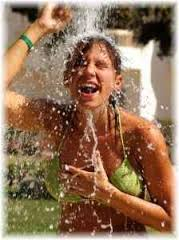

<figure aria-describedby="caption-attachment-2617" class="wp-caption alignleft" id="attachment_2617" style="width: 179px">

<figcaption class="wp-caption-text" id="caption-attachment-2617">Pic courtesy gettingstronger.org</figcaption></figure>

**Todd Becker,** a freelance San Francisco Bay Area-based blogger, writes [Getting Stronger](http://gettingstronger.org/) – a blog on the philosophy of Hormetism, *based on the application of progressive, intermittent stress to overcome challenges and grow stronger physically, mentally and emotionally.*

If the preceding sounded like a whole lotta mumbo-jumbo, may I request just a little patience.

I was alerted to Becker’s blog 6 months ago by my friend (Pradeep K) when I posted something on barefoot running. His articles tend to be long (but highly captivating) and I’ve been remiss in not sharing them on the usual F and T channels. In this provocatively titled blog interview, [How to lose weight, quit coffee and stop wearing glasses](http://inoveryourhead.net/how-to-lose-weight-quit-coffee-and-stop-wearing-glasses-part-1/), Becker lucidly lays out how cold showers and barefoot running (activities I’ve been doing for 4 years and 1 year respectively) are connected to a word you might not have heard before (hormetism/[hormesis](http://en.wikipedia.org/wiki/Hormesis)).

If you are leery of clicking on “How to do…” type of links (I understand), below are the most intriguing extracts of the interview.

> Julien (J): What is **Hormetism**? Why is it important?
> 
> Todd Becker (TB): Hormetism is both a philosophy of life and a set of specific self-improvement techniques, based upon the practical application of [hormesis](http://en.wikipedia.org/wiki/Hormesis). Hormesis is a biological principle which is surprising or counterintuitive to most people when they first encounter it: **a small dose of something harmful or stressful is frequently good for you.** There is a lot of research showing that health and lifespan can be improved by exposure to a wide variety of stressors, including toxic chemicals and radiation, exercise and calorie restriction. Of course, there is always a balance, and too much stress or toxicity can harm you. However, I think most people unnecessarily fear and avoid stress, and as a result they miss out on the benefits. It is very important to understand how to gradually adjust the dose and frequency of the stress to get the maximum benefits.
> 
> J: I bet the main question you get from people is “Why would anyone do this to themselves?” So, why would they?
> 
> TB: You’re right, there’s often a certain puzzlement as to why anyone would subject themselves to cold showers, skipping meals, [running barefoot](http://gettingstronger.org/2010/03/the-paradox-of-barefoot-running/), or lifting heavy weights slowly. All of these things are uncomfortable, at least at first. One of my readers tried taking a cold shower and commented that it was ‘the most intensely uncomfortable non-dangerous thing’ he’d ever tried. So I can understand the reluctance. But I’m not recommending masochism or self-harm. The practices I’m advocating trade **short term pain for long term gain.** Everything I write about is something I’ve tried myself, after I’ve researched it to understand the scientific basis and evidence for the benefits. In each case, there are long term objective benefits, which become increasingly apparent with time. And what is remarkable is that the initial short term discomforts generally also diminish in short order.
> 
> Two good examples of that are **cold showers** and **barefoot running**. When you take your first cold shower, you’ll probably experience “cold shock” — involuntary gasping, a pounding heart rate, and very cold extremities. But after several cold showers, this reaction gets much shorter and milder, and you’ll soon feel a kind of radiance and vitality that lasts all morning. **Cold showers are a great anti-depressant!** Barefoot running can also be a bit awkward and uncomfortable at first. You get calluses and sore muscles you didn’t known you had. But after a few sessions, you realize how fun it is, and people find themselves stronger and less prone to injury.
> 
> J: That fits right into the stuff I wanted to bring up next. It was actually on your blog that I first read about the “[opponent-process theory of emotion](http://gettingstronger.org/2010/05/opponent-process-theory/),” which I’ve found to be an interesting way to build willpower. Can you explain how that works?
> 
> TB: In the 1950s, two neurologists, Leo Hurvich and Dorothea Jameson, tried to understand why we see after-images. When we stare for a while at bright colors and then look at a white wall or paper, we’ll often see a ghostly image with the opposite, complementary color. Hurvich and Jameson traced these after-images to processes within our nervous system, in the retina and ganglion cells, that act in opposition to the initial stimulus, so when you remove the stimulus, this weaker but persistent “opponent process” is still running. And as I already mentioned, psychologists like Richard Solomon and J.D. Corbit found this to also be a good explanation for **why intense thrills like skydiving give way to pleasurable relief**, while intense pleasures from drugs or whatever can lead to addiction, because they leave one feeling down or depressed between highs. Solomon’s biggest insight, I think, was not just in coming up with many examples of these kinds of psychological reactions and describing them, but in actually trying to locate their **underlying causes within our nervous systems**.
> 
> The basic idea is that our nervous systems try to resist large changes through a mechanism called **homeostasis**. Whether we see a change as “good” or “bad” doesn’t matter; homeostasis acts to compensate for big changes. This applies to any physiological system in our body, not just our nervous systems.
> 
> …
> 
> **For any big change, there is a simultaneous, lower level process acting to at least partially blunt the impact of that change.**
> 
> …
> 
> For example, if we take a cold shower, the thermogenic opponent-process outlasts this and we feel a lasting pleasant warmth after stepping out of the shower. More interestingly, **the opponent process gets stronger and lasts longer with each repetition**; the body is adapting and realizes it must try harder to maintain homeostasis. That means that the original “shock” is muted faster and more strongly, even from the beginning. It also means that with repetition the opponent process continues to get stronger and last longer after the stimulus stops. So the more you take cold showers, the shorter the initial unpleasantness, and the longer and stronger the “afterglow”.

*Closing note*: I’ll be returning to Todd Becker’s blog soon and will likely make this into a series.