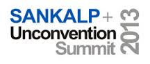

By now they should have changed the venue of Sankalp Forum from Mumbai to Bangalore. I attended the third edition of Sankalp in 2011. The only reason I missed it last year (and will sadly be missing this year’s edition too) is because it’s in *Mumbai*, and not *Bangalore*.

Is there any other metro that has a vibrant and growing [social enterprise happy hour club](http://www.techsangam.com/2012/04/13/firang-invasion-of-indias-social-enterprise-ecosystem/)? And if that wasn’t reason enough, 20% of this year’s Sankalp finalists are headquartered in Bangalore. Well, there’s always next year I suppose. Btw, if one digresses at the *beginning* of an article, is it still digression?

Coming to the subject of this piece… many reasons why you should attend Sankalp Forum 2013, especially if you live in (or nearby) Mumbai.

1. It is THE largest watering hole for social enterprises and impact investors. I’ve never heard of M&amp;A in the conferences space before but Intellecap has pulled off a merger of sorts in combining Sankalp Forum with Chennai-based Villgro Unconvention to create Sankalp Unconvention Summit.
2. Energy/cleantech social enterprises again making their presence felt – 20% of the award finalists are from the cleantech sector – Avani Bio Energy, Claro Energy, Frontier Markets, and Green Power Systems.
3. Like [last year](http://www.techsangam.com/2012/04/10/5-reasons-excited-sankalp-forum-2012/), I’ve picked my favorites from the list of 20 finalists (see below).
4. Day one of the Sankalp Unconvention Summit will host the G-20 Inclusive Business Workshop and organised by the Governments of Germany and Saudi Arabia. G20 Pillar theme – “Private Investment and Job Creation.” Interesting to see Saudi Arabia

TechSangam’s Picks

- **Banka BioLoo**: Waste generated in a toilet is treated in the bio-tank beneath the toilet. The tank is fitted with bio-digesters which decompose 99% waste in a short duration. Regular toilets can be converted into bio-toilets. Current status spans Lakshwadeep and Indian Railways with 12,000 and 22,000 toilets respectively.
- **Sudiksha**: Promoting a model of pre-school education that is high quality and affordable (Rs. 400/month per child). Currently operating 18 schools in Hyderabad (&amp; nearby districts) with a setup cost per school at Rs. 80,000.
- **Hippocampus**: Primary and basic education targeted at rural India, training women and employing them as teachers and also reducing the number of unemployable youth. Currently operating 80 schools in rural Karnataka (Mandya and Devangere).

*Official press release below…..*

Mumbai -born and bred ‘Sankalp Forum’ is now acknowledged as the world’s largest aggregation of social enterprises.

**The** **Sankalp Forum is the mecca of impact based social enterprises that**  are geared towards building solutions for an under-served population.

These are enterprises that work across India to create impact – in the areas of healthcare, education, clean energy (renewable), technology for development and agri businesses.

In attendance will be representatives from UNDP, USAID, The World Bank, IFC, Village Capital, Villgro, German Federal Ministry for Economic Cooperation and Development (BMZ), Department of Industrial Development (DFID UK Governments grant arm ), GIZ ( German Governments grant arm) , Akshaya Patra, Deshpande Foundation, Ashoka Singapore Advisory Council, Legatum and other stakeholders in this will be swarming Renaissance Powai on 16th, 17th and 18th of April 2013.”

**Aparajita Agrawal, Director Sankalp Forum confirmed, ”** Sankalp’s Annual Summit is the largest social enterprises focused gathering in the World. In its 5th year, Sankalp’s Annual Summit has now become the largest social enterprise focused gathering in the world, and in 2013 it partnered with Unconvention to become the Sankalp Unconvention Summit. “

Day one of the Sankalp Unconvention Summit will host the G-20 Inclusive Business Workshop.The event marks the Asia leg of the G20 Inclusive Business Workshop series, and is organised by the Governments of Germany and Saudi Arabia, as co-facilitators of the G20 Pillar “Private Investment and Job Creation” .

Day two and Day three will see the The Sankalp Forum itself, under the aeigis of which are the Sankalp Unconvention Summit, Sankalp Awards, Villgro Awards, DFID women impact recognition and Global Alliance of Cookstoves Recognition.

The Sankalp-Artha Grand prize of USD 40,000 **has also been** announced**. This will honour one among the five sector winners of the Sankalp Awards itself. Prakash Bakshi**, the Chairman of National Bank for Agriculture and Rural Development, **William Hammink** is the Mission Director of USAID/India , **Sunil Kaushal** is Regional Chief Executive, India &amp; South Asia, Standard Chartered constitute the jury for the Artha Awards. 

The Sankalp Forum has recognized &amp; rewarded social enterprises across the length and breadth of the country. Sankalp will engage over 11,000 stakeholders globally which includes:-Social Enterprises, Impact &amp; Mainstream Investors, Policymakers to encourage innovation and Enablers, who are part of the ecosystem.

**ABOUT SANKALP** 

Sankalp Forum ([www.sankalpforum.com](http://www.sankalpforum.com/)), an Intellecap initiative, recognizes &amp; supports innovative, sustainable, high impact social enterprises. It builds an enabling ecosystem for early-stage businesses, channels impact investments, and engages over 11,000 stakeholders globally through collaborative year-round initiatives. It mobilizes a community of entrepreneurs, investors, enablers and policy-makers to encourage innovation, facilitate scalability, and drive consensus on matters that aid social enterprise development. 

Sankalp’s Annual Summit is the largest social enterprise focused gathering in the world, and in 2013 it partnered with Unconvention to become the Sankalp Unconvention Summit. The Summit brings together more than 1,000 delegates, thought leaders, industry experts, policy makers from around the world to voice, discuss, debate issues, trends and solutions that aid social enterprise development.

