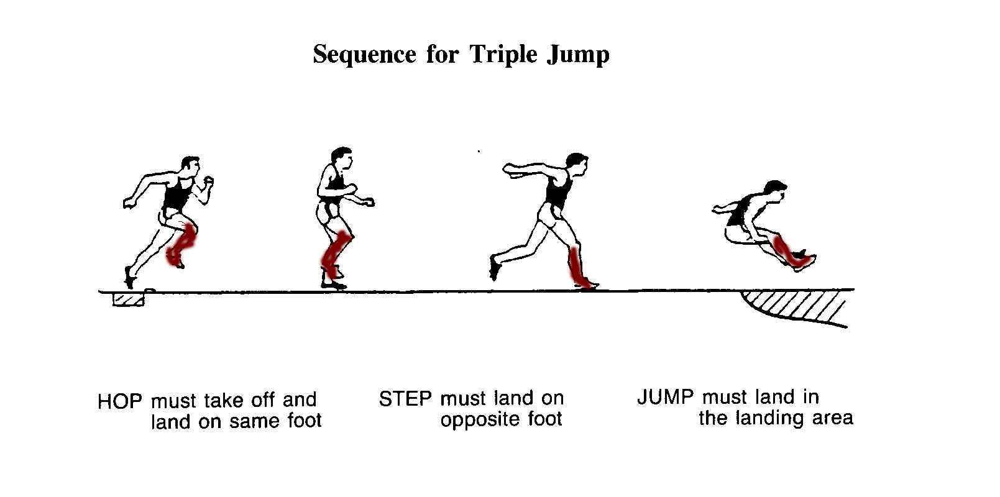

> <figure aria-describedby="caption-attachment-2630" class="wp-caption alignleft" id="attachment_2630" style="width: 300px">

<figcaption class="wp-caption-text" id="caption-attachment-2630">Pic courtesy bobtrump.com</figcaption></figure>
> 
> The **triple jump**, sometimes referred to as the **hop, step and jump** or the **hop, skip and jump**, is a track and field sport, similar to the long jump, but involving a “hop, bound and jump”: the competitor runs down the track and performs a hop, a bound and then a jump into the sand pit.

I’m sure about it. The **triple jump running plan for marathoners** (abbr. “TJ Plan”) does not exist today. How do I know? I Googled it of course. Once I hit publish, this blog post shall become the oracle.

I know one person in Chicago who wouldn’t cast a second look at the TJ Plan – Judith Johnson Brown, my flute teacher from Old Town School of Folk Music. Sixteen years ago, Judith was a striking woman in her late 40’s who could easily pass off as an aristocratic British woman with a natural American accent. My unsuccessful attempt to learn the silver flute was *before* I discovered the pleasures of running so I couldn’t appreciate the fact that Judith was a daily runner. I recall her once saying “Oh! How I hate winter mornings when the ground is frozen. I can’t run and I’m miserable rest of the day.”

Back then, I thought to myself “What an obsessive compulsive woman. She runs nearly throughout the year, even during Chicago’s brutal winter months and she complains about missing the odd morning run due to extra inclement weather.”

There are a lot of daily runners out there but I’m not one of them. There’s also no danger of my becoming one of them. If you are like me, the rest of this post might be of special interest.

The TJ Plan is very simple.

1\. Tempo run on Tuesday  
2\. Interval run on Thursday  
3\. Long run on Saturday

Unlike any of the plethora of celebrated (or notorious) training plans which have elaborate ramp up, ramp down and taper profiles over a 12 week duration, the TJ Pan offers NO mileage guidance.

Should your tempo run be 5k, 8k or 10k? Whatever. Just get your ass out of bed and run as hard as you can. And yeah, feel free to convert this to an easy run if one of your slower runner friends is feeling particularly chatty that morning.

Should you run 400m intervals? Or 800? Or 1600? Doesn’t matter. Maybe start with 400s. If it feels easy (even at faster pace), move to 800s and then 1600s.

Ok – so I lied a bit. The TJ Plan has a distance guidance – but *only* for the long run. 25k would suffice though ideal recommendation is 30k.

The beauty of the TJ Plan is that it plugs in seamlessly into your racing calendar with a few minor alterations. Say you are racing on Sunday X, you skip the \[X-1\] regulation 30k run. If you are a bit old fashioned (or too much into this ‘taper’ business), drop your long run mileage the previous weekend (Day \[X-7\]) to 20k or (if you really must) 16k. Depending on how hard you raced, drop some mileage for long run Day \[X+7\]. That’s it.

**Who should NOT follow this plan?**

- If you derive a disproportionate amount of pleasure from your race day performances (compared to your long training runs), then the TJ Plan is probably not for you.
- If you are looking for a certain level of certitude that you *will* get faster within \[X\] months, then the TJ Plan is probably not for you.
- The incorrigible daily runner of course.

**Then who SHOULD follow this plan?**

- You should have run at least 5 marathons to date.. and at least 2 in the last calendar year.
- If you derive nearly as much pleasure from your long training run as your races, then this might be worth a whirl.

**But why TJ Plan?**

It’s all about maximizing happiness, you see. Sure – all runners get a special high after running a race, especially if they’ve achieved a PB. But why restrict (&amp; delay) happiness to only a few times a year? Why not once every Saturday? The *hop* (tempo) and the *skip* (interval) are but a rhythmic preparation for the pleasurable long *jump*.

A PB might be awaiting you at your next race but don’t let that get in the way of current happiness. Run happy. Week after week.
