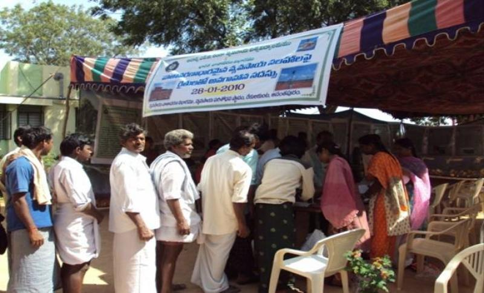

*\[Editor’s Note: Last year, I *attended the Anantpur Cooperative Federation Annual General Meeting (AGM) *in Gutturu village of Anantpur district (Andhra Pradesh).** Conversations with a few farmers and related observations provided valuable insights into the workings of a farmer cooperative and the healthy dynamic between Center for Collective Development (CCD) and the cooperative. *This is a (11-months delayed) Part 2 of a two-part report – [Part 1 here](http://www.techsangam.com/2012/06/28/observations-from-a-farmer-cooperative-agm/). It focuses on my conversation with a farmer’s son (Nagendra Reddy) and the gist of [Dr. Trilochan Sastry’s](http://www.techsangam.com/2011/12/04/the-many-lives-of-trilochan-sastry-%E2%80%93-academic-social-activist-social-entrepreneur/) speech to the gathering.* \]*

**Conversation with Nagendra Reddy**

A confident man in his early 20’s, Nagendra Reddy was possibly the only person (that day) who *introduced himself* to me. The son of a Talamarla farmer in Kottacharu Mandal (not far from where the meeting was being held), Nagendra is a B.Sc (Math) graduate from Anantpur, has worked in a fertilizer company in Bangalore and speaks very good English. His family hadn’t joined the cooperative yet but he was here to do his research. Over the next two hours we had several conversations as we watched the proceedings. He listened intently but also didn’t resist the urge to make cheeky remarks when some of the speakers got boring. A persistent refrain I kept hearing from him was *“all this is good but how/when do they sell?”* In short, the crux of the matter (rightly so) was whether he’d make more money if he joined the cooperative. After lunch, as I headed to our vehicle, Nagendra called and said “Wanted to tell you that I’ve decided to join the cooperative. I’m satisfied with what I saw/heard.” I congratulated him and wished him well. Notch it up as another small anecdote in the cooperative movement narrative in Anantpur district.

**Dr. Trilochan Sastry’s Speech**

<figure aria-describedby="caption-attachment-2040" class="wp-caption alignleft" id="attachment_2040" style="width: 300px">

<figcaption class="wp-caption-text" id="caption-attachment-2040">Pic courtesy imdagrimet.gov.in</figcaption></figure>

He starts off with a series of questions that he intends to answer – what is CCD? how does it work? He openly voices the farmers’ sense of doubt – does the mill work? will it get me profits?

A man deeply inspired by Dr. Verghese Kurien, it was no surprise that his answer started with the Amul/Kurien story and how it inspired him to begin the CCD journey. A key nugget he highlighted was that for every *one rupee* of Amul product sold, *85 paise* goes to the cooperative farmer. Bringing the context immediately back to Anantpur, he mentioned some equivalent numbers for groundnut value addition (Rs. 30 worth of groundnut, after value add processing, gets sold in the market for Rs. 100/200). He had gotten the attention of the audience by now.

***sabhya sangha penchali***

Rallying cry in Telugu translates to “need to grow members”. Announced the goal that the coop federation needs to build 50+ mills in the next 10 years. He drove home the point about product branding using the analogy of motorcycles – it’s not just about cost. He asked the gathering whether they would buy cheaper (but adulterated) seeds from government or high quality ‘brand X’ seeds from CCD – loud affirmative from the farmers on the latter.

Farmer Anjaneyulu had a suggestion – “why not village X make product A and village Y make product B?” Sastry responded with “making products at home in a decentralized way not a good idea because quality control cannot be ensured uniformly. Those kind of products would only get sold in villages, not in quality-conscious towns and cities at higher prices.”

He talked about the institutions and programs supporting CCD – Axis Bank, NABARD and government (godown subsidies, farmers association). He mentioned that whenever he visited government entities in New Delhi, they’d ask “why only 700 farmers in cooperative? Why not 7,000?”

He invited the gathering (especially the farmers who recently joined) to a trip to Bangalore — where they would visit all the shops selling the value added products. In his closing, he reiterated that the cooperative’s top mantra is *quality and quality*. Reminded everyone that the cooperative meets every month at the mill. Farmers who are considering joining the cooperative could of course attend these meetings.

…..

After Dr. Sastry’s speech ended, it was time for the cooperative members to vote for the new board. And while that was going on *inside* the mill, the gathering *outside* was entertained by Anantpur Idol – back to back singing by farmers and CCD managers. An old farmer belted out a crowd-pleasing song and returned to encores.

In two days, I return to this year’s edition of the Annual General Meeting. Hope to meet Nagendra Reddy and many of the farmers I met last year.