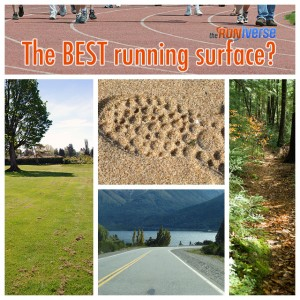

<figure aria-describedby="caption-attachment-2671" class="wp-caption alignleft" id="attachment_2671" style="width: 300px">

<figcaption class="wp-caption-text" id="caption-attachment-2671">Pic courtesy theruniverse.com</figcaption></figure>

Steve Sashen of Invisibleshoe.com (now rebranded as XeroShoes.com) wrote an interesting blog post back in Dec 2009. I discovered it only a few days ago via an email subscription on his website. The gist of his article (which I agree with) is that soft surfaces are absolutely the worst surfaces for barefoot running and hard surfaces are the best.

Sounds crazy, right?

Well, the provocative title of his (and this) post leaves out an important qualifier — *beginner* barefoot runners. After you read the excerpts from Sashen’s article, you’ll soon understand why.

> When I tell people that I run barefoot (or when they see me out running without any shoes), the first response I get is
> 
> “Oh, so you run on the grass?”
> 
> Or when I suggest to people that they might want to try running barefoot, the first thing they say is,
> 
> “With my feet/knees/ankles/eyelashes, I’d need to run on the grass.”
> 
> I mean, it makes sense, right?
> 
> Grass is soft. Feet are soft. Therefore, feet should be on grass.
> 
> Barefoot = Grass is the common wisdom.
> 
> But wisdom is rarely common, and what’s common is rarely wise.
> 
> Here’s what I can tell you, though. And it’s not just me, every accomplished barefoot runner I know will say the same thing. And all the other good coaches I know agree.
> 
> Here it is:
> 
> THE WORST SURFACE for learning to run barefoot is GRASS.THE WORST.
> 
> ABSOLUTELY.
> 
> Why?
> 
> Three big reasons:
> 
> BIG: Who knows what’s hiding in the grass. If you can’t see it, you might step on it.
> 
> BIGGER: One of the principles of barefoot running is that you don’t use cushioning in your shoes… well, when you run on grass, you’ve basically taken the cushioning out of your shoes and put it into the ground.
> 
> BIGGEST: Running on grass, or any smooth surface does not give you the feedback you need about your barefoot form to help you change and improve your form.
> 
> The best surface for barefoot running is NOT grass or sand or anything soft, but the smoothest and hardest surface you can find.
> 
> For me, here in Boulder, Colorado, we have miles and miles of bike path.
> 
> In New York City, the sidewalks are perfect!

Over here in Bangalore, the sidewalks are far from perfect, the bike paths non-existent and the asphalt anything but smooth. If you are lucky enough to live close to a lake or a stadium, you are in business. In my case, [pitter pattering](http://www.ulaar.com/2012/09/10/my-first-barefoot-run-time-to-pitter-patter/) around the 1.9km perimeter of Kaikondrahalli Lake for the first 3 months provided just the surface. Not smooth but certainly trail hard.

Sashen then goes on to explain why a hard smooth surface is the best.

> So, what makes a hard, smooth surface the best?
> 
> It’s the biggest reason, from above: FEEDBACK.
> 
> Grass and sand and soft surfaces are too forgiving of bad form.
> 
> Hard smooth surfaces tell you, with every step, whether you’reusing the right form.
> 
> If it hurts, you’re not.
> 
> If you end up with blisters, you didn’t.
> 
> Pay close attention and each step is giving you information about how to run lighter, easier, faster, longer.

Sashen ends with something that I can relate to.. especially in Bangalore where the contrast between regular asphalt and the painted white line is clear as night and day.

> If you want to see a barefoot runner get a wistful look in his or her eye, mention a newly painted white line on the side of a road. Smooth, solid, cool… it’s the best! 😉

Link to Steven Sashen’s original article – [What’s the WORST surface for running barefoot?](http://xeroshoes.com/barefoot-running/surfaces/)