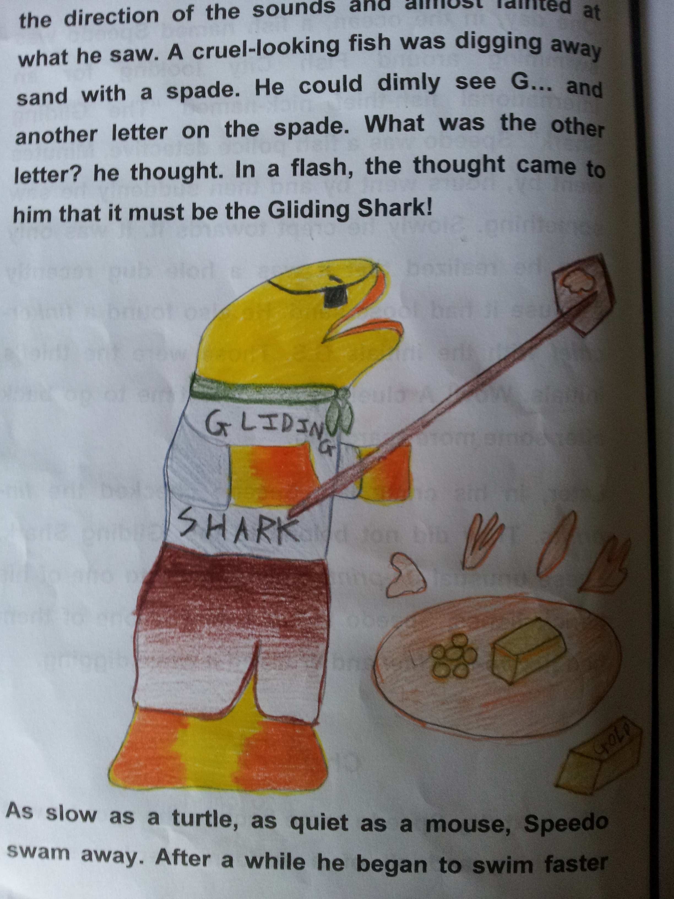

*\[Editor’s Note: The Case of the Gliding Shark (Adventures of Detective Speedo) is the first in, what might become, a series of short stories centered around Speedo – a fish detective. The author is my older son who’ll soon turn ten. He wrote this story four months ago for a school assignment. Barring some editorial help from his mother, the plot and storyline is all his.\]*

\*\*\*\*\*\*\*

One day, in the ocean, a fish named Speedo was swimming around Fish City looking for an international fish-thief nicknamed “The Gliding Shark”. Speedo was a fish police detective. Minutes went by, hours went by and then suddenly he saw something. Slowly he crept towards it. It was only then he realized that it was a hole dug recently because it had loose sand. He also found a *finker-chief* with the initials G.S. Those were the thief’s initials. Wow! A clue! Soon it was time to go back after some more searching.

Later, in his crime lab, Speedo checked the *fin-prints*. They did not belong to the Gliding Shark. These unusual *fin-prints* must belong to one of his hench fishes, Speedo thought. Maybe one of them had his *fin-kerchief* and dropped it while digging.

**\*\*\*\*\*\*\***

The next day Speedo came back to the spot he was searching and all of a sudden heard a sound. CLANK! SWISH! CLANK! Slowly Speedo peeped in the direction of the sounds and almost fainted at what he saw. A cruel-looking fish was digging away sand with a spade. He could dimly see G… and another letter on the spade. What was the other letter? he thought. In a flash, the thought came to him that it must be the Gliding Shark!

As slow as a turtle, as quiet as a mouse, Speedo swam away. After a while he began to swim faster and faster. Soon he reached Fish City’s police station, huffing and puffing. He pushed his way in and ran straight to the *fish-inspector*. Speedo explained all the important events to the *fish-inspector* who got excited and ran to bring his *fish- officers*. Soon, they all were swimming at full speed to the crime spot.

Instead of showing themselves immediately, the *fish-officers* had a plan. Each and every officer followed Speedo over the (cave shaped) mould of hard mud. First two, then four, six, eight and more eyes peeped down. The *fish-inspector’s* jaw dropped and he almost slipped off the mould. An extraordinary thing happened. First, Speedo quietly requested the *fish-inspector* to send an officer with *fin-cuffs* to the bottom of the mould and watch what happens.

\*\*\*\*\*\*\*

One *fish-officer* bent down to carefully inspect the *fish-thief’s* work and jumped up in a few minutes, scaring the other *fish-officers*. The officer excitedly explained that the *fish-thief* was digging out metal and other unidentified stolen objects. On hearing this, Speedo whirled around and dived straight off the mould and knocked the *fish-thief’s* spade down. Just as he signalled the *fish-officer* with the *fin-cuffs* and tried to get hold of the *fish-thief* – the *fish-thief* began swimming away at the speed of sound. When the other *fish-officers* and *fish-inspector* dived down, the *fish-thief* was even more scared and ran helter-skelter, pushing dustbins in his path, throwing rocks into *fish-houses* (CRASH!) and hitting anyone in his way.

\*\*\*\*\*\*\*

It was very tough for the *fish-police* to manage the thief. After a while, two *fish-officers* swam to a side path. When the *fish-thief* noticed that fewer *fish-officers* were chasing him, he was mystified. Suddenly, Speedo shouted “This is the real culprit!” Meanwhile, the Gliding Shark soon found out what happened to the other *fish-officers*.

Before you could finish blinking your eyes, the two missing *fish-officers* appeared. One of them put fin-cuffs around the *fish-thief’s* fins. In a few weeks, the valuables were found in the *fish-thief’s* home along with his fake fins.

*\*\*\*\*\*\*\**

**From the author (S)**

This is my first attempt to write my own novel. It was a school assignment. I enjoyed writing it but it took a lot of hard work from me. I would like to thank my mother for her support.

**About the author** (written by his mother)

S is a bright 4th grade student who enjoys detective stories. At the tender age of 9.5 years, his first short story reveals an active imagination and promises to be the start of an exciting series of books. Stay tuned for more adventures of Detective Speedo in which he solves exciting mysteries.
