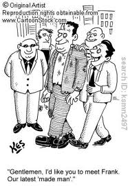

> I have stood here before inside the pouring rain  
> With the world turning circles running ’round my brain  
> I guess I’m always hoping that you’ll end this reign  
> But it’s my destiny to be the king of pain

For all you non-Police fans out there, the above lyrics are from [King of Pain](http://www.elyrics.net/read/p/police-lyrics/king-of-pain-lyrics.html) (Synchronicity album). This post is mostly about pain.

\*\*\*\*\*\*\*\*\*\*\*\*\*\*\*\*

> You start a marathon with your legs and finish with your heart.

Surely you’ve encountered this quote in some runner’s email signature. Let me break the bad news, sweetheart. It’s just a bullshit quote to oversimplify things for newbie runners.

<figure aria-describedby="caption-attachment-2682" class="wp-caption alignleft" id="attachment_2682" style="width: 186px">

<figcaption class="wp-caption-text" id="caption-attachment-2682">Pic courtesy cartoonstock.com</figcaption></figure>

If you’ve seen mafia movies like The Godfather, Good Fellas or Casino you know all about ‘made men’. What if I told you that the well-tempered marathoner is made of ‘made men’? Quick, say that tongue twister aloud three times without slipping!

The point is that a marathoner needs **all parts of his body** to cooperate and perform consistently if he want to be a regular marathon runner for years and years.

Cardiovascular fitness is the first order limiting factor on the path to marathon greatness but let’s leave the lungs and heart out of the current discussion.. for now. This one is all about muscles, tendons and ligaments.

**1. Quadriceps**  
Easily the muscle that’s first put to the mafiosi test. Most first-time amateur marathoners will complain of *killing quads* sometime after the 30k mark. If lucky, it might just be extreme soreness. If not it might be cramps. Heck, sometimes you might not even know the difference. In *my* first marathon, my quads were killing me at the 22 mile marker and I got this bright idea to stretch. Ouch! Ten seconds later, I got an even brighter idea – how about bringing pain symmetry by stretching the other quad? Double ouch! The good news is that quads tend to be less of a problem after you run a few more marathons.

**2. Calves**  
Just as you start feeling good about your quads performance after (say) your fourth marathon, bam! Your calves remind you that they are working their ass off too. Since the newbie runner usually doesn’t pay attention to early warnings, calves distress manifests suddenly in the form of severe cramps. Good news about non-severe calf cramps is that you can rebound reasonably quickly with the right stretching routine. I was felled by calf cramps on the hilly Hyderabad Marathon a few years ago but a helpful runner (and now pal) Suresh showed me a stretching trick that worked like a charm.

As the newbie marathoner graduates to the intermediate stage and strides along to a faster orbit, he discovers that killing calves can be more deadly than killing quads.

**3. Knees**  
Oops. How did I skip to calves without talking about knees? If you’ve taken up long distance running late in your life OR are several pounds above your target weight OR don’t believe in the virtues of gym’ming, chances are *Lady Knee Pain* will pay you a visit.

The most common knee ailment is the ITB (IlioTibial Band), a thick band of fibers that begins at the iliac crest (curved border of the ilium – biggest bone of the pelvis) and runs on the outside part of the thigh until it attaches into the tibia (shinbone). When the connected muscles go out of whack (layman speak for “some muscles going weaker than others”), the ITB stretches beyond comfortable limits and .. (you guessed it) signals pain.

Fortunately the ITB is easily appeased. Drop your weekly mileage (or, better still, take a complete break), start stretching the concerned muscle groups and hit the gym regularly (focusing on squats and lower body workouts) and you’ll be back to running ways soon enough.

My own tryst with ITB occurred a month before my fourth marathon. Like clockwork, the pain would start around the 7k mark on my long runs and persist until the end, even lingering on for the next two days. I was forced to taper earlier than usual and, in spite of following the usual stretching and strengthening (S &amp; S) recommendations, couldn’t stave off ITB during the race. I stuck to the S &amp; S regimen and ITB has stayed away ever since.

****4. Glutes****

Years ago a friend described the *glute* as playing a sheet anchor role in the runner’s body. Hmm.. Really? Didn’t pay it any heed for most of my years as a runner. It just sits there and doesn’t bother you, right? Ok, so it enables us to sit for inordinately long hours while we indulge our Internet/TV addictions. When I heard one of my faster runner friends nursing a *glute strain,* I wondered how bad it really could be.

After one of my marathons last year (where I had pushed myself in the back half), I got a first inkling – kinda like that post-48-hours feeling after an injection in you buttock. Last month when I ran a solo marathon (on a humid morning) I got a second indication that my glutes weren’t particularly happy with me. As indications go, it was a rather polite one and it’s receiving due attention.

**5. Plantar fascia**

The plantar fascia is a thick fibrous band of connective tissue (ligament) originating on the bottom surface of the calcaneus (heel bone) and extending along the sole of the foot towards the toes. When the ligament gets strained, it results in tiny tears leading to pain and swelling – a condition called *plantar fasciitis*. This condition usually afflicts runners with flat feet or high arches, sometimes folks with a pronounced heel strike. Recovering from plantar fasciitis is frustratingly long, as some of my friends attest to.

I’ve either been incredibly lucky or my date with Dame Plantar is set for a date in the future.

**6. Achilles**

The achilles tendon connects the calf muscle to the calcaneus (heel bone). The associated injury/pain is called *achilles tendonitis* – a chronic condition that occurs primarily from overuse. It tends to come on gradually over time until pain is constant and exercise or activity too painful to continue. The biggest cause of chronic Achilles tendonitis is ignoring early warning signs and pushing through pain.

Senor Achilles knocked on my heel a few month ago. Very politely, I might add. I’ve been listening intently ever since and have added suitable stretches to my regimen. You should too — a good friend’s recovery from this condition has taken more than a year and he rues not taking it seriously earlier.

**7. Balls**  
No – not those. I’m referring to the balls of your feet. If you are NOT a barefoot runner, you’ll never have problems with the balls of your feet. Then again, you might have more problems with #1 through #6 but that’s a story/gyan for another day.. in the [Barefootia](http://www.ulaar.com/category/barefootia-2/) category.

**In closing…**

Like the labors of Hercules, you will encounter pain at various points in your evolution as a runner. It might be two, three, or all seven labors but you ***must*** break through the pain barrier each and every time. Why? Because redemption lies on the other side.

*Not all pain is significant*. *If it doesn’t kill you, it can only make you stronger*. Reflect on what the preceding two statements mean to you. At the end of it all, when you become *king of pain*, each muscle group in your body would have become a *made man* and you can call yourself a mafiosi runner. Did I say *end*? By that, I mean that it’ll be the *beginning* of your next round of metamorphosis. See you on the other side.

Related post: [Cramps in the final 10k of a marathon – what gives?](http://www.ulaar.com/2013/01/24/cramps-in-the-final-10k-of-a-marathon-what-gives/)