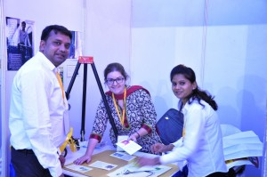
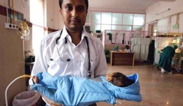

*\[Editor’s Note: The World Bank’s Development Marketplace (DM) is a competitive grants program that surfaces and funds innovative projects with high potential for development impact that are scalable and/or replicable. Through a combination of grant funds and strategic technical advisory support, the grant aims to catalyze innovative social enterprise solutions delivering a range of social and public services to the most undeserved low-income groups in the target regions.\]*

I was invited by Parvathi Menon to guest blog this year’s India Development Marketplace event. My education started soon after I stepped out of the Bhopal airport. Sharing the cab ride with me was Santosh Kumar from Shore Bank International – he gave a helpful overview of the various World Bank organizations. By the time we finished lunch at the hotel, we had discovered at least three common contacts. Arriving a day earlier meant I got an opportunity to spend half a day meeting many of the finalists in an informal setting.

A total of twenty finalists from an initial pool of 190 received applications have been selected after a series of merit based evaluations and a due diligence and needs assessment visit by teams comprising of senior assessors from the World Bank, Innovation Alchemy and independent subject matter experts.

*As a social enterprise watcher for over two years, I was pleasantly surprised to learn that I had only heard of seven finalists. When I mentioned this factoid to Parvathi, she remarked that DM often turns out to be a discovery platform for the finalist organizations. Besides the broad awareness generated from winning, the recognition by World Bank ‘validates’ these organizations especially in the eyes of state and central government entities leading, in many cases, to active cooperation and collaboration.*

My first conversation yesterday was with Dr. KS Sunanda and Dr. KT Arasu. Their organization, [Alternative for India ](http://www.aidindia.com/)[Development](http://www.aidindia.com/), was born with the ideological overtones of the 70′s with an exclusive focus on Jharkhand (Palamau district). After being a grant-based organization for decades, they started experimenting with a self-sustaining social enterprise model as early as 2007. They are now providing banking services for the tribal poor (via RBI’s Business Correspondent model) through a network of 120 retail points which they term as ‘panchayat kiosk banking’.

<figure aria-describedby="caption-attachment-2062" class="wp-caption alignleft" id="attachment_2062" style="width: 300px">

<figcaption class="wp-caption-text" id="caption-attachment-2062">SMV Wheels’ Naveen Krishna &amp; Joyce</figcaption></figure>

Varanasi-based [SMV Wheels](http://www.smvwheels.com/) has made a lot of progress since the last time I spoke to them (~ 2 years ago). Joyce Jauer (SMV’s CFO) talked about her journey from Texas to Boston to Delhi to Varanasi. When she’s not traipsing around on her scooter in Varanasi, she’s helping SMV *bring dignity to rickshaw drivers*. I asked Joyce what dignity meant to an auto rickshaw driver and she replied “pride of ownership, legitimate permit to drive, reduced persecution by the police”. The SMV network now boasts 1200+ auto rickshaw drivers and they are adding about 50 per month. Rickshaws cost about Rs. 11,000 – SMV sells the drivers the rickshaws via a deferred weekly repayment loan model (Rs. 300/week) which eventually works out to Rs. 15,000 to the driver.

We got a teaser of a low-cost infant baby warmer story from [Embrace’s](http://www.embraceinnovations.com/) Rahul Panicker. The device costs Rs. 12,000 (compared to a standard incubator which retails for over 1 lakh) and has already sold 9,000 in the past 2 years. With 20 million infant deaths worldwide of which a whopping 8 million are in India, Embrace is targeting saving a million+ babies from premature death.

My carefully constructed and sanitized world of social entrepreneurship came crashing down towards the tail end of a dinner conversation with Anima Baa and Prashant of [South Vihar Welfare Society for Tribals – SVWS](http://www.svwst.org/). Earlier that evening, Anima had given an impassioned backdrop to SVWS but it still didn’t prepare me for the stories of human trafficking I would hear. 29% of Jharkhand is forest land where most of the tribals live. Unable to derive livelihoods and a missing-in-action government, Jharkhand women are migrating in large numbers to the metros (especially Delhi and Mumbai) – lured by unscrupulous ‘placement agents’ with the promise of a better life. For many, the ‘better’ life turns out to be a nightmarish world of red light districts and trafficking. The lucky few manage to eke out a relatively dignified living as domestic help. It was the scale and magnitude of trafficking that shook me – more on this later.

Fascinating stories from BILT Tree Tech of Chhattisgarh &amp; Orissa and Boston/Delhi-based Dimagi — stay tuned here for these stories and more from the other finalists.

\*\*\*\*\*\*\*\*\*\*

*Originally published on the [Innovation Alchemy blog](http://innovationalchemy.com/2013/05/2013dm-finalist-review-1/). All pictures courtesy Innovation Alchemy. The series continues [here](http://www.techsangam.com/2013/05/30/world-bank-india-development-marketplace-finalist-review-part-2/).*