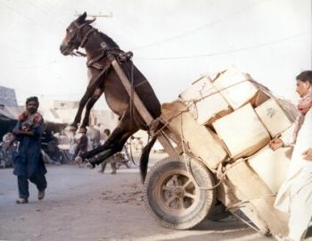
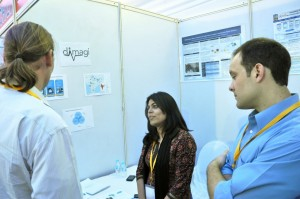

*\[Editor’s Note: The World Bank’s Development Marketplace (DM) is a competitive grants program that surfaces and funds innovative projects with high potential for development impact that are scalable and/or replicable. This is Part 3 of a 3-part series from my guest blogging in Bhopal (early May). Previous episodes [here](http://www.techsangam.com/2013/05/29/world-bank-india-development-marketplace-finalist-review-part-1/) and [here](http://www.techsangam.com/2013/05/30/world-bank-india-development-marketplace-finalist-review-part-2/).\]*

<figure aria-describedby="caption-attachment-2078" class="wp-caption alignleft" id="attachment_2078" style="width: 300px">

<figcaption class="wp-caption-text" id="caption-attachment-2078">My friend Jugy read this post and sent me this pic and asked – “Where would you put the boulder on this one?”</figcaption></figure>

Sometime last year I was waiting at the Sony World signal in Koramangala (Bangalore) in my blue Reva. One of those rare “peak traffic” moments when I had plenty of time to look around. A cargo auto rickshaw (the type where the driver cockpit area is clearly demarcated from the cargo hold area) was right next to me. Giving the driver company in the cockpit area was a medium sized boulder. We Indians have so many modes of communication available to us. For this moment, I used ‘body language’. Peering over, I stared very obviously at the boulder (as though it were an art gallery exhibit). After five seconds, I looked away and repeated the maneuver. The driver gesticulated to the back and then pointed to the boulder. I nodded slightly and slid my window open – an obvious translation to “Could you elaborate?” He explained “When I have heavy cargo in the back, I need to balance it out in the front.”

Totally makes sense, right? Another example of India’s *jugaad* in action. You’ve no doubt seen those pictures on Facebook of mopeds (and bicycles) laden high and wide with buckets, snacks, or whatever. Pictures that generate 1,000s of Likes and 100′s of laudatory “Indian jugged is great”, “we are like THAT only” comments. Well, I’m simply not impressed with this kind of *jugaad* and that’s putting it mildly.

What India’s BOP needs is good old-fashioned *innovation*. The kind of innovation that involves understanding customer pain points, researching candidate solutions and eventually choosing a solution at the right price point that drives significant adoption by the target customer. I spoke to five such organizations yesterday at the Development Marketplace.

**[Vigyan Ashram](http://www.vigyanashram.com/)**: Two-time winner of the Development Marketplace award. They first won in 2007 when World Bank was giving awards at the ‘idea stage’. The funny thing is that I interviewed Ashish Gawade (one of the co-founders) two years ago but didn’t make the connection because I knew them as BOPEEI – the for-profit division of Vigyan Ashram. Their initial foray was in productizing [pedal-generated lighting systems](http://www.techsangam.com/2011/08/11/bopeei-generating-off-grid-electricity-in-cloudy-and-coastal-regions/) but they soon diversified to creating solar versions of their fast charging systems.

While they are still selling the pedal generator systems (targeting shared community users), most of the growth is coming from three solar models: a) Rs. 750 entry-level single lamp with integrated solar panel, b) Rs. 1550 unit with rooftop panel and single separate light, and c) Rs. 3000 unit with two lights and a rooftop panel. So far they’ve sold to 2000 households in Maharashtra, Chhattisgarh, and Karnataka. Their product and pricing strategy puts them in the space between D.Light and Selco – though the former’s products are priced even lower than Rs. 750.

**[Operation Asha](http://www.opasha.org/)**: Possibly the most high-profile organization in this year’s cohort and another two-time winner (previously in 2011). I had a long conversation with the ebulliently eloquent Dr. Shelly Batra (Operation Asha’s Founder) about her back story and learnt what makes them a successful low-cost intervention in combating tuberculosis in India.

Their technology stack, developed in partnership with Microsoft Research, features a fingerprint reader and a Web+SMS infrastructure that enables a fraud-proof way of ensuring that a TB patient takes the full course of medicines. Operation Asha’s army of community health workers work with lists of TB patients (provided by its hospital partners) but they don’t stop there. Health workers proactively visit slums and other impoverished areas and, using a smartly designed verbal questionnaire with probing TB symptom questions, they obtain sputum samples from ‘likely’ patients. Patients that test positive are on-boarded to the Operation Asha treatment workflow. (Read more about the Operation Asha’s model from the [guest post by Dr. Shelly Batra](http://innovationalchemy.com/2011/07/biometrics-for-tuberculosis-management/) on Innovation Alchemy.)

**[Waterlife](http://www.waterlifeindia.com/)**: At the heart of Waterlife’s solution is the Waterlife Center – a water treatment plant that purifies water of fluorides and nitrates. The purification systems, imported from US and Europe, along with the physical structure capital expenditure costs about Rupees 35 lakh. Add to this India’s perennial problem “how do you maintain systems?” – Waterlife’s business model innovation lies in solving both these problems. The capital expenditure is paid by state governments and the Waterlife Center is run/maintained by Waterlife employees (usually village residents), an operational expense easily supported by villagers paying Rs. 3 for 10 liters and Rs. 5 for 20 liters.

Waterlife now has an installed base of 35,000 villages across 14 states. Some states are now urging Waterlife to also setup biodigester-based community toilets – Jharkhand might be the first state. Waterlife is venture-backed by Aavishkar and Matrix Partners.

<figure aria-describedby="caption-attachment-2074" class="wp-caption alignright" id="attachment_2074" style="width: 300px">

<figcaption class="wp-caption-text" id="caption-attachment-2074">Dimagi’s Devika Sarin on song. Pic courtesy Innovation Alchemy</figcaption></figure>

Dimagi and Embrace had similar beginnings. The former was founded in MIT Media Lab and the latter in Stanford’s d.school (Design for Extreme Affordability) and both decided to tackle the massive health challenges in the third world. While Dimagi’s team now straddles two continents (an 18-person engineering team in Boston and a 30-person go-to-market operations team in New Delhi), Embrace’s 60-person organization is entirely based in Bangalore.

Dimagi recognized early that community health care was broken and “health workers” were the linchpins in driving any positive change. Dimagi has built a suite of open-source based tools for health workers but it deploys those tools via partnerships with NGOs (now numbering 50 across 25 countries). The company’s unique philosophy is to let *teams* decide which projects to pickup based on three criteria (in descending priority order): impact, team satisfaction, and profit. Dimagi’s Devika Sarin told me that she was initially skeptical but after two years, she’s convinced that there’s no better company out there. CommCare, Dimagi’s flagship product, leverages audio clips and images to reinforce each prompt, creating a simple interface accessible to low-literate users.

Embrace’s first product is the Nest, a Rs. 12,000 baby incubator which comprises a charging device (which heats a special material that stays warm for 6 hours) and a vest that is put around the baby. Embrace is partnering with the government in states such as Karnataka, Rajasthan and Kerala to deploy its warmers in government healthcare facilities, right from PHCs all the way up to medical college hospitals.

*Originally published on the [Innovation Alchemy blog](http://innovationalchemy.com/2013/05/2013dm-finalist-review-1/).*