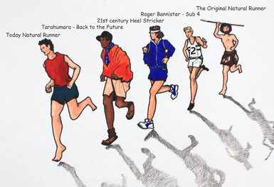

*The human foot is a work of art and masterpiece of human engineering. – Leonardo Vinci*

<figure aria-describedby="caption-attachment-2698" class="wp-caption alignleft" id="attachment_2698" style="width: 300px">

<figcaption class="wp-caption-text" id="caption-attachment-2698">Re-evolution of running (courtesy naturalrunningcenter.com)</figcaption></figure>

This post is meant to be just a teaser about Dr. Mark Cucuzzella. Something tells me I’ll get carried away.

> In the beginning there was darkness, and runners seemed lost, confused, chronically injured, always experimenting with “bigger is better” footwear as a potential remedy. Then a new “less is more” approach emerged, a radical way of thinking led by a handful of scientists, athletes, coaches, and charismatic best-selling author. They looked backward to the past for inspiration. Soon, a healer and educator came forth. Collectively, they would become the shepherds to a flock of broken-down, often-sidelined runners accustomed to wearing conventional running shoes.

That healer and educator was Dr. Mark Cucuzzella, a family physician and an elite runner, who, in his early 40s, can still reel off sub 2:40s at the Boston Marathon.

> In early summer 2010, he opened the first minimalist running store in the nation. He called it Two Rivers Treads because culturally and historically vibrant Shepherdstown is located near the confluence of the Potomac and Shenandoah rivers. Mark and his tiny store became a fixture in the natural running community, Coaches, athletes, trainers, physical therapists, bloggers, and runners from near and far became connected to one another through Two Rivers Treads.

There’s no better introduction to Cucuzella than this 4 minute video below:

<iframe allowfullscreen="true" class="youtube-player" height="394" src="https://www.youtube.com/embed/kpnhKcvbsMM?version=3&rel=1&fs=1&autohide=2&showsearch=0&showinfo=1&iv_load_policy=1&wmode=transparent" style="border:0;" type="text/html" width="700"></iframe>

Cucuzzella’s virtual compatriots at the Natural Running Center are Bill Katovsky and Nick Pang.

> Then along came Bill Katovsky, a two-time Hawaii Ironman finisher, founder of*Tri-Athlete* magazine, and author and editor of several health and fitness books. He lived in the San Francisco Bay Area, but heard of Mark when he started his own blog [Zero Drop](http://zero-drop.com/) in late fall 2010. He had just come out with his latest book, “Return to Fitness: Getting Back in Shape after Injury, Illness, or Prolonged Inactivity.”
> 
> To help them reach these goals, they reached out to Nick Pang, also a West Coaster, who was a self-described web technologist living with his family just north of Silicon Valley. For twenty-five years, Nick was a serious runner before he got injured in traditional running shoes. He then saw the light two years ago in minimal shoes. He gradually retooled his gait and form, and began to run injury-free. Based on his own experiences, in the summer of 2010, he created the [Minimalist Running Shoes ](http://minimalistrunningshoes.org/)website that quickly became an important destination for anyone looking for shoe reviews in this rapidly expanding sector of the footwear market.

The above excerpts from [About the Natural Running Center](http://naturalrunningcenter.com/about-us/).

I’ll end the Cucuzzella trailer with his account running Comrades 2013 – [What Goes Up… Goes Up!](http://naturalrunningcenter.com/2013/06/08/comrades-marathon-upgoes/)