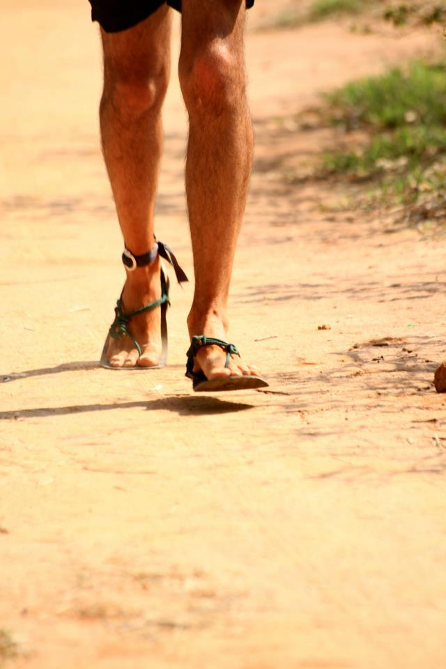

<figure aria-describedby="caption-attachment-2310" class="wp-caption alignleft" id="attachment_2310" style="width: 200px">

<figcaption class="wp-caption-text" id="caption-attachment-2310">Somewhere between 37.5km and 50km at the Bangalore Ultra 2012</figcaption></figure>

It’s ironic that I’m finishing this post 13 months after switching to the 4mm huaraches (christened “*4mmH*” for the rest of this post). Ironic because after logging 1569km, one of the lace holes got ripped and I’ve cabled a warranty replacement request to Xeroshoes’ Steve Sashen.

I’ve had an absolutely wonderful time with *4mmH*. It has taken my barefoot running to the next level and has proven to be an indispensable foil to my bare soles, especially on Bangalore roads.

As I describe in [achieving terminal velocity](http://www.ulaar.com/2012/06/26/achieving-terminal-velocity/), Barefoot Ted’s advise (start by ‘going bare’ before eventually switching to minimalist footwear) resonated with me. However, after I started my [barefoot adventure](http://www.ulaar.com/2012/09/10/my-first-barefoot-run-time-to-pitter-patter/) on Feb 18, 2012, I thought to myself — how far can I go without resorting to minimalist footwear?

**First week and Bata Shoes**

Just two barefoot runs in February – the 6k on 18th followed by a 5k on 28th. Interspersed between was a 4k treadmill run with my newly procured Bata canvas shoes. That run turned out to be my first (and quite easily the most) painful run in my barefoot runner transition. Nothing wrong with the Batas so why did my calves hurt like hell? In my attempts to land ‘front foot’ on a non-proprioception-friendly surface, apparently I was trying too hard and landing acutely on my \*toes\*! The shooting calf pain started at the 2k mark but I was stubborn enough to keep going until it became unbearable. Poor Bata shoes – it became a victim of a bad start. In the next ten months, I used it for exactly 8 runs — barring one 26k run and two 15k runs, all others were in the 5k-8k range. As I recall, those long runs happened only because I needed to re-lace my huaraches. The Batas are too narrow for my wide toes. The loud flopping sound also annoyed me.

**March 2012**

In the first three weeks of March, I gradually increased my barefoot run distances: 4, 5, 6, 6, 7, 12, 6, 10. All at the Kaikondrahalli Lake. The trail surface would get worse in coming months but in March, the 2k loop terrain was just what the doctor ordered for newbie barefooters – mostly hard without much gravel and small stretches of soft earth.

On March 24, I did my first road run – joining my Bhukmp running buddies for the first segment of the regular Dandi run – 11k followed by a 6k loop inside Cubbon Park where I discovered (to my surprise) that paving blocks are a barefoot runner’s best friend. Ah! how many times did we shod runners look snootily at walkers and runners using the paving blocks surface instead of the naturally superior trail?

A week later (on my second road run with my Bhukmp gang), I extended the distance to 23k. Soles were definitely more sore. Over the weekend, I resorted to wearing socks inside the house and wore shoes even for a short trip to the grocery store.

**April 2012**

It took me three more weekends before I mustered courage for my third road run. Sometimes I wonder if I was inspired by The Glass Mountain fairy tale. On Apr 21, I managed to extend the distance to 26k. The soles, while still hurting, seemed to have realized that I was like a man possessed so they turned their attention to recovering faster from the Saturday road run travails.

\*\*\*\*\*\*\*\*\*\*\*\*\*\*\*\*\*\*\*

*\[Original placeholder post written on Nov 19, 2012: see below. Clearly not many takers for my crowd-voting experiment.\]*

Welcome to my very own crowd-sourcing/crowd-voting/social media experiment. This blog post ain’t done yet but I’m going to hit the Publish button after I complete the teaser blurb below.

What *will* this post be about?

It will answer the question as to why I picked the huarache sandals from [Invisibleshoe.com](https://www.invisibleshoe.com/) as my minimalist footwear. Why not [Luna Sandals](https://www.lunasandals.com/) from Barefoot Ted? And why not the more popular [Vibram Five Fingers](http://www.vibramfivefingers.com/index.htm) or the more shoe-like [Vivo Barefoot](http://www.vivobarefoot.com/us/)?

If you’d like me to complete this post, either do a Facebook Like or leave a comment. Based on the response, will bump up its publishing priority 🙂

