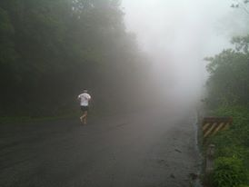

<figure aria-describedby="caption-attachment-2736" class="wp-caption alignleft" id="attachment_2736" style="width: 274px">

<figcaption class="wp-caption-text" id="caption-attachment-2736">Into the clouds (click thx to my pal Hari)</figcaption></figure>

I’m beginning to think I’m really special. Not like ‘every human being is special’. More like [Phenomenon](http://www.imdb.com/title/tt0117333/). Sure I can’t make spoons magically move nor can I learn new languages in an hour nor can I sense a quake.

But… I run multiple marathons a year… fast. Scratch the *fast* bit. Still working on that.

As runners age, they develop a keen sense of awareness about their bodies, especially the parts they push to their limits. A faculty like the AWACS radar, it allows them to discern what kind of pain is *significant* and what is plain ol’ *cribbing* by a muscle group. Rookie or stubborn runners who can’t see beyond their noses (I mean “their next race”) ignore warning signs at their own peril. Now *barefoot* runners, with their heightened proprioception and an altered stance to support scanning of the ‘ground beneath their feet’ naturally develop more awareness than their shod counterparts.

What makes me special (beyond a barefoot runner’s proprioception) is that I have a direct hotline to… practically any part of my body. Not only am I aware of what a body part is *feeling* (deliciously satisfying pain vs. tolerable-for-the-next-hour pain vs. ok-this-one-is-serious-gotta-take-a-break-now pain) but I also know what it’s *thinking*. Sounds hokey, right? It’s true though. Just hear me out, ok?

Let me walk you through a scene from Toy Story. The scene where the toys (led by Woody) decide that Sid (the evil kid) needed to be taught a lesson — even if it meant breaking the cardinal toy rule that *one can’t talk in front of humans*.

What if I told you that our body parts have a similar cardinal rule.. that they could only talk when *we* couldn’t listen.. i.e. they could only talk when we were asleep. I first stumbled upon their conversation almost two years ago – [It’s all a vast upper body conspiracy!](http://www.ulaar.com/2012/06/14/its-all-a-vast-upper-body-conspiracy/) It happened again a month ago – the *Time to change laces* post awaits its turn in the Drafts folder*.*

Last Sunday night (after my first legitimate hill training run), I tapped into their conversation for the third time. THIS is why I feel special and blessed.

**Glutes**: “Wow! That was one helluva hill run, wasn’t it?”

**Left &amp; right calves** (in unison): “Indeed! We felt like we could have keep going and going..”

**Right quadricep**: “I must confess LQ and I were nervous about the climb because he hasn’t been gym’ming in a long time and he really doesn’t like hills (even the bunny ones).”

**Left quadricep**: “RQ is only partly right. He used to hate hills up until last year but lately he’s not struggling on the Sat long run slopes – he even attacks the inclines near Windsor Manor and on Race Course Road.”

**Unknown**: “Hmm.. He definitely seemed like a very different person today. Actually in a different *place* altogether. I sensed nostalgia.. a lot of *joie de vivre* in his every move but there was something more… When he was navigating the misty clouds stretch, he was in a trance.”

**Temples**: (giggling) Trance indeed! He almost bumped into the arch at the summit. He didn’t realize he had reached and kept peering ahead wondering if there was a second arch further up.”

**Unknown**: (continuing) “Uttarakashi! That’s it. He was thinking about those 3 weeks in the Himalayas in 1991. The trip where, for the first time in his life, he was breathing normally…”

**Lungs**: “Stop looking at us like it’s OUR fault he has asthma. Not entirely at least. There’s genetics, there’s environment… heck, there’s so much more involved!”

**Unknown**: (continuing) “When he started the hike he was a worried boy wondering when his lungs would unexpectedly play spoilsport. By the end of week #1, he was at home in the mountain air and holding his own with the other boys. By week #2, he was carrying extra baggage (to help a girl struggling with asthma) and by the time they returned to Uttarakashi he was a self-confident young man ready to take on any physical challenge. Do you know the crowning glory of his trip happened on their last day?”

**Calves**: “All we remember about that time was how strong we felt. I vaguely recall a conversation with his friends and everyone remarking that WE had become big and strong as ‘ox’ in a span of 3 weeks.”

**Ankles**: “They had a run on the last day, right?”

**Unknown**: “Yes, a run. Either a 5k or 10k run. In a field of 35, he finished 4th which turned out to be a game changer for him.”

**The Funny Bone**: “Not even a podium finish and you call it a game changer… Right.”

<figure aria-describedby="caption-attachment-2737" class="wp-caption alignright" id="attachment_2737" style="width: 300px">

<figcaption class="wp-caption-text" id="caption-attachment-2737">Downhill fun on Nandi (click thx to Hari)</figcaption></figure>

**Unknown**: “Can you imagine what a 4th place finish can do to someone who has stepped on an athletic field maybe three times in school and run exactly ONE race — a race where he aborted 400 meters before the finish line because he couldn’t bear the mortification of finishing in last place?”

**RQ**: “Are you insinuating that his running obsession is related to his 4th place finish in that Uttarakashi race?”

**Unknown**: “I’m not insinuating. I’m TELLING you. Those redoubled efforts at squash in Jamshedpur, a brief but frenetic gym’ming phase in Houston, racquetball in Chicago, those long runs along Lake Michigan… The entire pattern of behavior was inspired by that run. He was not running in Nandi hills today. He was running in the hills of Uttarakashi.”  
(goes silent)

**Temples**: “You know who’s been conspicuously silent today… the proverbial elephant in the room!”

**Soles:** “Ha! It’s the first time somebody called me an elephant.”

**Temples**: “So how was the hill run for you guys?”

****Soles****: “Pretty good actually. The two previous long runs going fully barefoot (as opposed to the 4mm sandals) gave us a lot of confidence. The traction we get on the slopes (both uphill and downhill) is distinctly superior with bare feet instead of the sandals.”

**Temples**: “Why do you reckon he switched to Puma chappals at the 18k mark?”

**Soles**: “He should have burnt his bridges and left them at home. Since he left them in J’s car, there was always the possibility he would use them. We honestly don’t know why. We merely signaled a mild-moderate soreness and were fully expecting to be overruled. Maybe HE knows..”

**Unknown**: “In Uttarakashi lies the answer. That’s where he felt (almost) invincible for the first time in his life. He was trying to reproduce some of that magic today. As all of you are widely attesting to, he WAS feeling strong – he just wanted to attack the slopes with the same vigor a second time. Since he didn’t want to be distracted (and slowed down) by the sole soreness, he opted for the chappals. And did he keep his end of the bargain?”

**Several voices** (chiming in): “He sure did!”

**Temples** (continuing the inquisitor role): “My dear soles, the last 18 months couldn’t have been easy for you. How rough has your journey been? From a sheltered cushioned and cocooned existence to an in-your-face screaming-world teeming with all kinds of non-living and living things assaulting every pore of your being every time you land on the ground? I know I’m trying to put words in your mouth but.. you know what I’m asking.”

**Soles**: “The first 10k on any terrain (even bad Bangalore roads and moderately rocky trails) are fine. The fun starts after that. After the first three long road runs (where he progressively upped the mileage), I wondered whether he was a masochist. My moderate pain signals were summarily being ignored and my distress signals were barely acknowledged. Things slowly got better with subsequent runs. He started paying more attention to running surfaces, realizing that concrete and cobble stoned pavements (previously on his ‘avoid’ list) were far superior to Bangalore’s pathetic excuse for an asphalt surface. Before long, I was rebounding from my soreness in one day (instead of three days when it all started).

Strange thoughts started entering my head. For the first time in my life, I was experiencing pain on a sustained metronomic basis. You know what? I finally understood the import of that stupid idiom – *if it doesn’t kill you it can only make you stronger*. I *was* getting stronger (*and* recovering faster) with each passing run. I got an up-close-and-personal sense of what LQ, RQ and Calves must have been going through all these years.

The final insight came after I had exhausted my quota of self-pity. As I moved my gaze towards you guys, I noticed that you were all quite happy. Not happy at my misery of course.. but happier (as in hurting less) compared to the shod running days. He also seemed to require less sleep. The afternoon naps, once a mandatory fixture after his long runs, were becoming fewer and further in between. He ran a marathon with nothing but us gently tapping the trail. He followed it up with his first ever 75k (with the first 50k in 4mm sandals) — none of you guys were remotely in distress, neither was I. Heck – we were good for another 25k! Maybe the Tarahumara, Mark Cucuzella, Barefoot Ted, Salazar, McDougall et al *were* right after all. I’m now convinced that this barefoot switch is a gift that keeps on giving.

You know what’s most satisfying? That we are no longer just sitting around in our cushioned seats while you guys chuff it out. We TOO are sweating and bloodying ourselves on the road to running nirvana!”

**Unknown**: “S’s singularly marvelous monologue reminds me of Goldratt’s fine book *The Goal*.. in which the lead character Alex Rogo…”

**Kidney**: “Shhh….. I think he’s going to wake up soon. I’m about to burst!”

The voices go silent. And I wake up.

