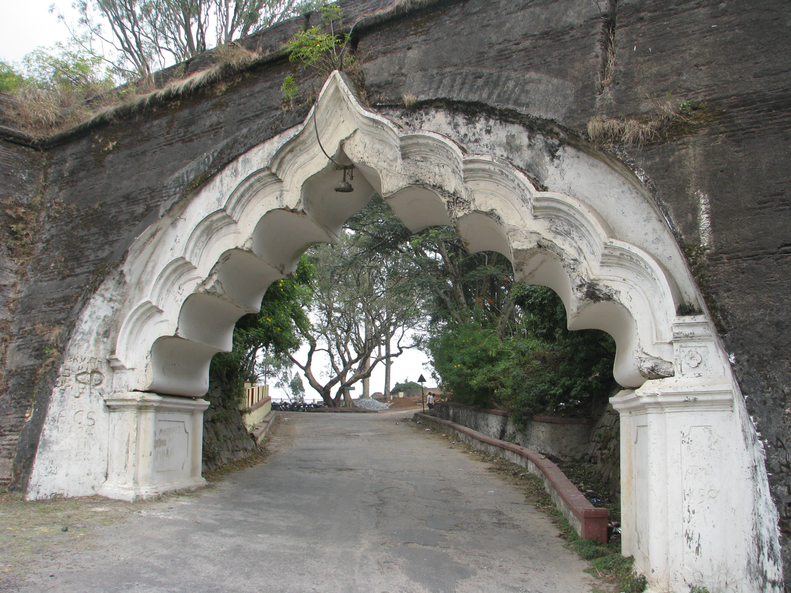

<figure aria-describedby="caption-attachment-2749" class="wp-caption alignleft" id="attachment_2749" style="width: 300px">

<figcaption class="wp-caption-text" id="caption-attachment-2749">Nandi arch: the runner’s halfway breasting tape</figcaption></figure>

This is my fourth year of regular long distance running in Bangalore. Every year, sometime between August and October, my running buddies go for an annual jaunt of the Nandi Hills. Sixty kilometers away, it’s the closest ‘hill running course’ – a 7.15 km climb with a steadily increasing gradient in the first five km and a quad-bursting slant in the final two km.

Every year, the roll call would be taken and I would be missing. I always had a good excuse.

*“Too soon. I’m barely a flat lands runner.”*

*“Umm.. I have Sunday afternoon plans so the 12:30pm return time wouldn’t work…”*

*“I know it’s supposed to be scenic and all but…”*

Truth be told I was scared of hills. In almost all my marathon races, I adopted the tried and tested approach of fast-walking the hills (even many of the bunny hills). A rare exception was Hyderabad Marathon 2011. After negotiating the initial rolling hills cautiously, I couldn’t resist attacking the latter ones. I would regret that decision at the 35km mark where I experienced excruciating calf cramps (not that there is such a thing as ‘non-excruciating’ calf cramps).

Starting 8 months ago, my fear progressively vaporized. In our regular Saturday morning long runs, I started noticing that I wasn’t huffing at the medium-grade inclines. At the steeper gradients, I was catching (and sometimes even overtaking) the fast suspects.

Vaishno Devi’s devout pilgrims insist that they go when the *bulaava* (“calling” in Hindi) comes. My *bulaava* from Nandi Hills finally came last month. I had a magical first run – partially described in [a gift that keeps on giving](http://www.ulaar.com/2013/07/15/a-gift-that-keeps-on-giving/). I was so moved that I also wrote up an impromptu *Ode to Nandi Hills* and shared it on our Facebook running group.

Yesterday, I did my second Nandi Hills run. It wasn’t as magical – no mist, clouds seemed more distant and noticeably warmer. Nonetheless I had a fantastic run.

In my July run, I ran barefoot for the first 18 km and switched to my Puma *chappals* for the final 10k. I completed the first loop in 87 min. The second loop was slower but I don’t know by how much (no Garmin). I finished my first Nandi run feeling quite strong so I told myself I’d return and push myself harder.

Much deliberation was given to the choice of footwear – a) Barefoot all the way, b) Huaraches all the way, c) Barefoot for the 1st loop and huaraches for the second. Option c) was quickly ruled off because I had “already done it” last time. I finally steered to Option b) primarily because I didn’t want to give myself any ‘excuses’ for not pushing myself. Note that this decision clearly establishes the fact that I’m not a hard-core purist barefooter. The craving for *speed-for-speed’s-sake* was definitely still there.

**First loop**

With my Garmin strapped on, I took off at a canter (seemed like that anyway). I averaged 5:50 pace for the first few km before dialing down to 6:05. I finished the climb in 46 1/2 min. Then I turned around and said hello.. to Dame Gravity. What seemed like a recovery ambling down turned out to be a 4:40 pace. Ho ho ho! This could be fun I thought. After the gradient became more sane, I checked the pace – it was 4:36. My stride had lengthened considerably. Arms swinging more than usual too. All the changes happened Everything seemed ‘oh so natural’. I would finish the 7.16 km downhill at an average pace of 4:34. The beauty of gravity on display. I *have* done intervals at a faster pace but they lasted all of 800 meters. Whoever described *running as controlled falling* knew his stuff. I finished the first loop in 1 hrs 19 min – 8 minutes faster than my first loop last month.

**Second loop**

After a two minute hydration+refueling break I began the second loop. Right away, my quads started their protest. It was going to be an interesting second lap. The ability of our minds to create repositioning (moving the goals) bullshit is quite amazing. Some thoughts that came up for consideration..

*“Maybe I don’t need to run the second loop ALL the way. After all, I DID run the first loop hard.”*

*“Do I even need to run the second loop? The rest of the guys would have to wait for me for breakfast.. and that’s kinda rude.”*

*“Maybe I’ll just drop the pace and see how far up the hill I make it before making any drastic decisions.”*

In the midst of these indecisive thoughts (around the 15k mark), my friend Shilpi (S) joined me. Turned out to be a really good break for me. S is a really good runner and an exceptionally strong hill runner. She finished the first loop climb only 2-3 minutes slower than me but, significantly, without pushing herself much. Since she hasn’t made friends with Dame Gravity yet, I was able to gain some minutes on my downhill slalom.

As we reached the 18k mark, doubtful thoughts crept in again. At some point, I voiced them. S didn’t say anything. At a couple of steep inclines, I pragmatically walked a few hundred meters. Close to the 20k mark, S cheerfully declares “We are just a km away. Why don’t we finish it?” Sometimes when the decision is taken away from you, it’s immensely liberating. Off we went. S also finally got tired of me slowing her down and increased her pace just enough to finish the climb about 70 meters ahead of me. Yes, ladies and gentleman, I got [“chicked”](http://www.runnersworld.com/trail-running-training/getting-chicked-or-duded) and believe me, there’s no shame getting beat by a stronger runner (male or female).

The second downhill was negotiated at a more sane pace (6:10’ish for the first 3km) and I finished the remaining 4 km at a 5:10 average pace. Two loops of Nandi Hills (28.76 km) in 2:57 min – inclusive of two refueling breaks (4 minutes in total).

Thank you Nandi Goddess. I shall be back again. Hopefully soon.

*\[Closing note: My calves were extremely sore (think “knife like shooting pain” every time I took a step) the next day. This morning, they were still sore but I managed to do an easy 8k run. I believe I’ve figured out why my calves took such a beating. Stay tuned for that *sequel post –* Lessons from my second Nandi Hills climb.\]*