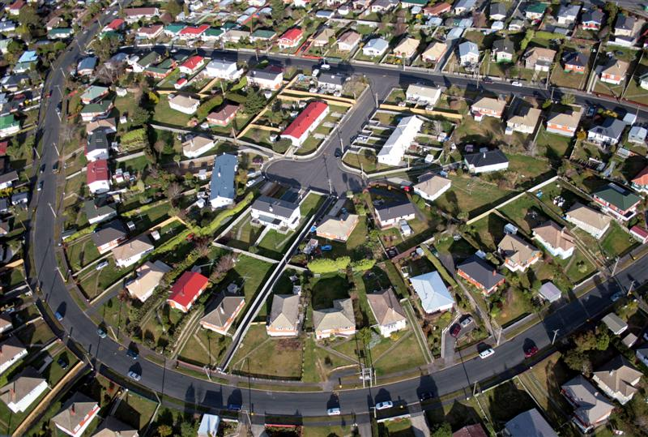

Editor’s Note: I started this blog in [March 2011](http://www.techsangam.com/2011/03/). My preliminary plan was to research, learn and write about the Indian social enterprise space for at least a year. What did I intend at the one year mark? I framed the answer in the form of two possible outcomes: a) Future career as a writer/blogger (covering the social enterprise space), b) Crystallizing of a social problem that **I’d** want to solve (also matching my skills and readiness) within the construct of a social enterprise. I shared my thinking with many friends and ex-colleagues. 

In my first ever interview (with Dr. Rita Salva of [Radhee](http://radhee.com/wp/)), I shared the potentially temporal nature of TechSangam. She made a passionate case for the long-term sustenance of a blog like this. It’s a pity that my post on Radhee (doing some exemplary work in disaster preparedness) never graduated from the Drafts folder. An apology of an excuse can be found in [this post](http://www.techsangam.com/2012/04/23/why-some-blog-posts-have-a-longer-gestation-period/). 

At the blog’s one year anniversary, the ‘writing on the wall’ was palpably clear. A writing career was not in the offing. The smattering of loyal readers was still in the hundreds and monthly traffic was still in the tens of thousands. Yeah – this wasn’t your what-did-Sanjay-Dutt-do-in-jail-today kinda reading. More important was the realization that I was still more of a **doer** than an observer (no offense to the laudable and critical profession of journalism). I gave myself a 6-month extension and eventually option b) got *crystallized.* 

Exactly a year ago and 17 months into my blogging journey, [Solomon Prakash](http://www.techsangam.com/2011/06/30/war-stories-from-ashoka-fellow-solomon-prakash/) (a serial social entrepreneur and then Country Head of Ashoka India), shared his vision for mGaadi and I was hooked. The rest, as they say, is history. The post below is our vision for a different kind of Indian city. Hopefully irregular service has been resumed at the TechSangam blog. Thanks for your interest, dear readers.

> <figure aria-describedby="caption-attachment-2092" class="wp-caption alignleft" id="attachment_2092" style="width: 300px">

<figcaption class="wp-caption-text" id="caption-attachment-2092">Resemblances to a New Zealand city are purely coincidental and in no way reflect what an Indian city should look like</figcaption></figure>
> 
> Population of Indian cities, already more than 340 million, is projected to reach 600 million by 2030. Daily passenger trips among 87 of the country’s major cities will have doubled to roughly 482 million a day. Commuting in Indian cities is universally painful. The texture of pain might differ – based on whether one uses public transportation, takes auto rickshaws or drives a personal car. Commuters privileged enough with access to chauffeur-driven vehicles, company shuttles or taxis fare better… but they too are not immune to gnarling traffic conditions.
> 
> We would like to see a different Indian city. A better city. A city where more people use public transportation. A city with less privately-owned cars plying on roads. A city with more green vehicles than ever before. A city with seamless multi-modal transportation options. A city where you stop associating vehicles with *owning* or *EMIs* or *renting*… actually a city where you stop thinking of vehicles altogether and instead think of *commuting options*. A city where commuting evokes *on-demand* and *transactional* in a manner not different from Amazon EC2. A city where commuting via an auto rickshaw is no longer a game of Russian roulette. A city where auto rickshaw drivers don’t need to waste fuel (or time) looking for customers. A city with significantly less friction between commuters and auto rickshaw drivers. A city where driving an auto rickshaw could well be the start of a fruitful career. A city where you won’t see too many auto rickshaw drivers driving a rental vehicle with nary a change to his standard of living. A city where your taxi company will not call you at the last minute to regretfully convey their inability to fulfill your airport dropoff booking. A city whose residents breathe more fresh air than ever before. A city where cyclists and runners are no longer endangered species.
> 
> *You might say we are dreamers but we are not the only ones*. (Thank you John Lennon)
> 
> B.H.A.G. (Big Hoary Audacious Goal). You can’t bring about change without dreaming big.
> 
> We have to start *somewhere* though. What is our proverbial beachhead?
> 
> Auto rickshaws and taxis.
> 
> **Why?**
> 
> There is a LOT of pain and a LOT of inefficiencies in this commuting vertical. Pain for commuters. Pain for drivers. In fact it’s a perfect storm begging for a solution to efface all that pain. We are building mGaadi to be that solution.
> 
> **What are our motivations?**
> 
> Over 95% of India’s workforce (which includes approximately 30 million commercial drivers) is unorganized. Research has demonstrated that financial and health decision “defaults” and income determinism are significant inflection points in raising the standard and quality of living of this demographic. We are passionate about mGaadi’s potential as a market-based solution that will delight commuters and generate incremental income (and social security cover) for auto rickshaw and taxi drivers. Some might call this an *inclusive solution*. We prefer to call it a *fair solution*.

*Closing note: This post originally published on the [mGaadi blog](http://www.mgaadi.com/a-different-kind-of-indian-city/) on Aug 12, 2013.*