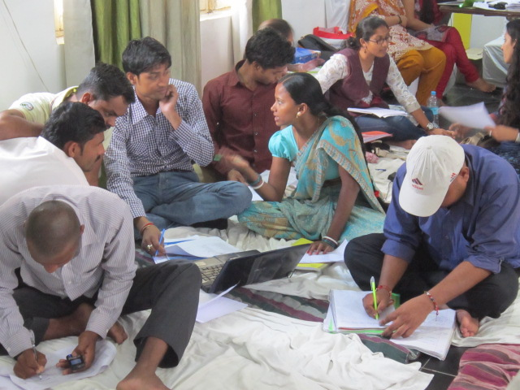

*\[Editor’s Note: In the early days of this blog (circa Apr 2011), I wrote about CREAM – a unique [no frills traveling MBA program](http://www.techsangam.com/2011/04/15/no-frills-mba-program-from-trees/) targeting rural and social entrepreneurs. Last month, I had a chance meeting with CREAM Founder (Ranjeet Ranade). He told me that in the past two years, CREAM had gained considerable traction in multiple Indian states. This didn’t surprise me too much. What he shared next is more newsworthy – the program was making a far more significant impact on entrepreneurs than on ‘accustomed-to-entitlements NGO types’. Those were probably not his exact words but you get the import. In the post below, CREAM co-founder and regular faculty (Richa Govil) writes on how and why CREAM is working for these entrepreneurs.\]*

“I would prefer to start a business even if I could make the same amount of money in a job,” said Sanjay, a participant at a recent training session of CREAM (Certificate in Rural Entrepreneurship, Administration and Management”. Ever since some friends and I created this course, I have volunteered as faculty.

Last week I was in Bihar, delivering the “Strategy and Planning” module over a period of 5 days together with a friend. This particular module was part of the program being delivered for Jeevika, Bihar’s Rural Livelihood Mission and focused mostly on business planning and starting a business. It was the culmination of several months of business management training, which covered Overview of Business, Financial Management, Operations Management, Sales and Marketing, and Strategy and Planning.

The participants had already been exposed to the concept of opportunity cost back in March. So when I asked the question, “Which would you do: a business or a job which earns you the same amount of money?”, I was gratified to have someone use the words “opportunity cost” in his response.

For numerical concepts, such as break-even analysis, we had participants come up to the board, do the calculation and then explain it to the rest of the class. Here’s an example:

**Measuring impact**

Every time I teach this program, I end up asking myself about its impact. Finding out the impact of education and training is always a difficult matter. It is presumptuous to attribute the success of an individual squarely on her education. Yet, we need to keep trying to figure out the impact in some way.

We’ve tried collecting data about the business the participants own or advise. But the data is often incomplete or inconsistent and it is difficult to claim with certainly that any success in the business is due to the program.

In one of our previous batches, when we had delivered a very targeted program for branch managers of a social enterprise, we got definite feedback from the senior management (unprompted!) that they saw a clear impact within a few months. Apparently, their branch managers were now asking the headquarters staff many more detailed questions about their branch’s financial statements and performance. The senior management felt that as a result, most of their branches were better managed. They also felt that the participants now understood the implications of their operational decisions on finances of the business.

This time around in Bihar, I got another glimpse into the impact of CREAM. Three years ago, we had delivered a program for Kudumbashree, Kerala’s state poverty eradication mission. It was a train the trainer program, where we trained 31 people who went on to become master trainers and consultants. People we trained had trained yet others.

So this time in Bihar, 2 people I had taught directly, and 3 others whom they had taught, acted as mentors to the training participants in Bihar. This group of 5 had learnt Hindi in a few months and were speaking almost fluent Hindi with Biharis from rural Muzzaffarpur and Gaya! One of them spoke without any discernible accent which was quite fun to see – but I digress…

From an impact perspective, I got to observe the depth of understanding of this group of 5 from Kerala. I was quite impressed. All of them clearly understood the concepts they had learnt 3 years ago. So much so that they could correctly solve all exam problems and coach their Bihar counterparts effectively during the evening assignments.

Admittedly, Kudumbashree must have chosen their best to send to Bihar as mentors. But still it is really heartening to see the impact first hand.

Secondly, I spoke with several training participants, especially those who already own and run their own businesses. All of them were adamant that this program has helped them tremendously. I played the devil’s advocate – claiming that they must know all this already since they have been running their businesses for years. Here are some of the responses I got:

“I was running my business, but not in a systematic manner. This training has helped me run it more systematically.”

<figure aria-describedby="caption-attachment-2096" class="wp-caption alignright" id="attachment_2096" style="width: 300px">

<figcaption class="wp-caption-text" id="caption-attachment-2096">Participants working on a group assignment</figcaption></figure>

“Before, I used to write down only my sales and expenses, and tracked credit transactions in a separate register. Now I understand how to calculate my profit and loss correctly, and how cash and credit are related.”

“Earlier I didn’t realize that depreciation is a cost of my business. Now I know why it is important to think this way.”

“Learning about how much stock to order at one time was very useful for me.”

Statements like these are heartening to hear and provide a glimpse into the impact of the program.

This group of participants will go on to train another larger set, creating a larger number of people trained in proper business management. They will act as business advisors to the thousands of businesses that Jeevika plans to create and foster in Bihar over the next few years.

Impact like this, especially its multiplicative nature, is what makes my own opportunity cost of developing and delivering this program worthwhile.

*Republished with permission from Richa Govil from her [blog](http://stirringthepyramid.wordpress.com/2013/08/27/business-management-training-bihar-impact/).*