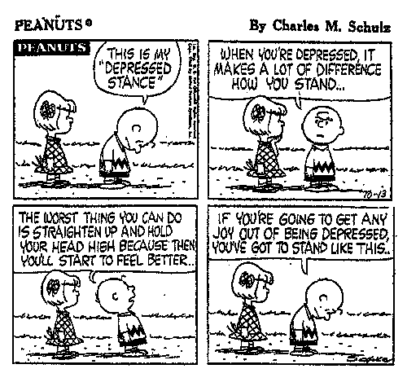

***re·sil·ience** (r-zlyns)*

*n.*

***1.** The ability to recover quickly from illness, change, or misfortune; buoyancy.****2.** The property of a material that enables it to resume its original shape or position after being bent, stretched, or compressed; elasticity.**\[Editor’s Note: Replace &lt;material&gt; with &lt;Indian city&gt; and ask yourself how true that statement might be for the city you live in. If you have recovered sufficiently from your laughter-induced fit, read about Rockefeller Foundation’s $100 million Resilient Cities Challenge and do the needful.\]*

In these early decades of the 21st century, we are witnessing stresses and shocks that come with a new intensity. To enable cities to better absorb the shocks of our world, and quickly spring back after a blow, The Rockefeller Foundation is making a $100 million commitment to building urban resilience in cities around the world. Through the 100 Resilient Cities Centennial Challenge, 100 cities from across the globe will be selected to receive technical support and resources for developing and implementing plans for greater urban resilience.

To enable 100 cities to better address the increasing shocks and stresses of the 21st century, The Rockefeller Foundation has launched the 100 Resilient Cities Centennial Challenge. One hundred cities from across the globe will be selected to receive technical support and resources for developing and implementing plans for urban resilience.

The challenge invites municipal government leaders, or major institutions that have a predominant affiliation / association with the city and demonstrate collaborative partnership with a municipal government, from across the globe to register on this page to apply on behalf of their city. Registration is required by September 23, 2013 in order to receive the application.

For the purposes of this challenge, a city will be defined by a population with over 50,000 inhabitants with a municipal government, or other elected or appointed chief executive office uniquely assigned to govern that population. Applications representing regional or metropolitan areas are permissible, but one municipal government must serve as the lead organization in the challenge application process.

Challenge applicants may include municipal governments or major institutions (e.g., a nonprofit organization, university, chamber of commerce, or research center) that have a predominant affiliation/association with the city and demonstrate collaborative partnership with a municipal government. Strong preference will be given to municipal government applicants, unless circumstances do not allow for a city to represent itself. All applicants will be required to submit a letter of support from the senior-most representative of their city’s government, whether elected or appointed. Only one application from each city will be eligible for consideration in the challenge.

Visit the Resilient Cities Centennial Challenge website and apply on behalf of your city:

<http://100resilientcities.rockefellerfoundation.org/>