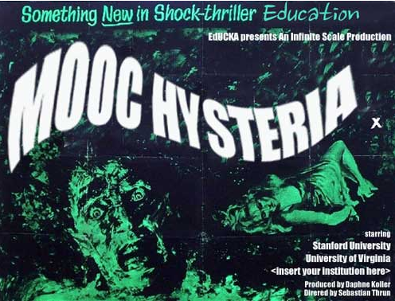
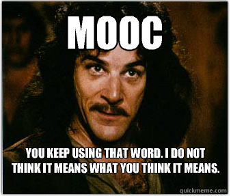

*\[Editor’s Note: There are some who consider educational institutions to be the best examples of social enterprises. I’m not one of them. The reason why I periodically share education perspectives on this blog is because I’m convinced that higher education (and high school education) is being disrupted right now. Whether it’s [Khan Academy](http://www.techsangam.com/2011/11/28/global-online-education-trends-and-its-import-for-india/) for middle and high school students or [peer instruction](http://www.techsangam.com/2011/12/15/peer-instruction-lessons-from-a-top-harvard-physics-professor/) at Harvard University or the [$6,600 Masters CS degree](http://www.slate.com/articles/technology/technology/2013/07/georgia_tech_s_computer_science_mooc_the_super_cheap_master_s_degree_that.html) from Georgia Tech/Udacity or [Minerva Project](http://online.wsj.com/article/SB10001424127887324110404578627712224845012.html)‘s brash claim to displace Harvard as the #1 global brand, it’s ALL happening. Countries with abysmally low teaching standards and a voracious appetite for quality education (India is at least ONE of them) stand to gain the most from this education revolution.\]*

A history professor from Colorado State University (Jonathan Rees) wrote a hysterical anti-MOOC rant in Slate 6 weeks ago. This Clay Shirky tweet caught my attention *“Professors: Read comments on this anti-MOOC piece. As with travel agents &amp; book stores, no one is coming to save us.*

Rees’s article [The MOOC racket](http://www.slate.com/articles/technology/future_tense/2013/07/moocs_could_be_disastrous_for_students_and_professors.html) is an easy enough read. There’s probably one point some might sympathize with – *widespread **“online-only”** higher education will be disastrous for students*. But the most interesting perspectives came from the commenters. I pored through the comments (and there are a LOT) and mined 12 super-interesting perspectives.

<figure aria-describedby="caption-attachment-2113" class="wp-caption alignleft" id="attachment_2113" style="width: 300px">

<figcaption class="wp-caption-text" id="caption-attachment-2113">Pic courtesy 30days23districts.wordpress.com</figcaption></figure>

**\#1 The end of ‘elite colleges’/elite professors**

> I have my misgivings about MOOCs, but they certainly have one very appealing feature — over time, the available lectures will be of the highest quality. As with many other things, the quality of lecturers is variable, with most being passably OK, some being good, and too many being horrendous. At a brick-and-mortar university, there’s often not much that a student can do to avoid the bad ones, or even the mediocre ones. But with a free market for MOOCs, students (consumers) will be able to gravitate to the superior teachers, and spurn the inferior lecturers. This might not happen right away, but fairly soon we will end up with a set of class materials on elementary topics such as physics or statistics that will be far superior to what most college students currently experience in their education.

**\#2 Continuing Education that is FREE**

(Commenter Rip Stauffer on his Santa Fe Institute experience)

> I can understand that the author feels threatened. I would not want our entire educational system replaced by MOOCs. However, I just recently completed a MOOC on a subject that really interested me. I had read books on chaos and complexity theory years ago, and they introduced me to the Santa Fe Institute. When I saw on an online forum that the Santa Fe Institute was offering a 12-week MOOC on complex adaptive systems, I jumped at the chance to learn from the institute doing most of the research in these topics.
> 
> The class was great! The video lectures were interesting and well-paced (if a little pixellated). We all downloaded a simulation application (NetLogo), and we were able to play with most of the concepts taught in class by running simulations. There were numerous papers and other resources for download, links to interactive websites that took you to a much deeper level on topics that interested you, and an asynchronous forum where we could interact with the lecturers. In each week, there was an interview with one of the top scientists involved with that week’s topics.
> 
> Do I wish I could have been at the institute, actually learning in the classrooms and labs with these professors? You bet I do! I’m not likely to have that chance any time soon, though, so I’m pretty happy to have had the chance to take the MOOC. To top it all off, I had that very rich learning experience and it cost me nothing. Nothing. Not a dime. I will no doubt buy some books from the institute, but that’s my option.
> 
> In their current state, I don’t see them as replacements for brick and mortar universities, but they could certainly play a role, supplementing classroom instruction; additionally, for the masses of working people who’d like to keep their hand in and continue learning, these self-paced and very interesting courses are a wonderful innovation.

**\#3 The 3 ways of teaching**

(Commenter Mike T)

> There are 3 basic ways of teaching someone – Tell Me, Show Me and Let Me Do It. Traditional lectures, Khan Academy videos and most MOOCs are still stuck in the first, least efficient mode of education. Look at SimCity as an example of an interactive game that taught economics and civics to 7 year olds, and start thinking of how that principle could be applied to all learning. Video games already provide simulations that teach skills, allow you practice those skills, and measure your success. Sure, the skills involve killing other people without being killed yourself. But the basic principle of teaching you something by making you try doing it, and then giving you instant feedback on your skill level can be applied to any learning. And many video games have forums where people are very keen to advise learners.

<figure aria-describedby="caption-attachment-2116" class="wp-caption alignright" id="attachment_2116" style="width: 300px">

<figcaption class="wp-caption-text" id="caption-attachment-2116">Pic courtesy thenewinquiry.com</figcaption></figure>

**\#4 MOOCs not very different from large classrooms with multiple Teaching Assistants**

(Commenters Sarah\_moon60 and Gene Vorobyov)

> So this replaces the teaching assistants that I learned the majority of my college course work from. You could not see a professor unless it was in your major and you were taking a 300 or 400 level class.
> 
> I wonder if the author has ever taken a large lower division undergrad course at a UC campus? My poli-sci 101 at UCI had at least several hundreds of students; try asking the professor a question at THAT class.

**\#5 Autodidactism**

(Commenter John Giardino)

> I graduated from a traditional brick and mortar university. However, I never learned as much in college as I did after I graduated. I was a liberal arts undergrad major. After graduating, I self-studied accounting, business, finance, risk management, statistics, calculus, and other areas of knowledge. I earned my CPA license largely through self-study courses. This process made me realize that studying and learning new things will be a constant source of enjoyment throughout my life. Further, I have done this through my own efforts – I did not need a professor to walk me through material. Much of my graduate work was completed through online learning, and I have also earned several industry designations through self-study. In my opinion, MOOCs offer people like me – those who can learn on their own – a unique opportunity to free themselves from the constraints of the “education industry” – including overpaid professors who are concerned more with research grants and publishing than teaching students and universities that wastefully pour tuition dollars into athletic facilities.
> 
> I am sorry that the MOOC model might cut into a small segment of the population’s livelihood. However, as a believer in autodidactism, I am confident that this is a more efficient delivery model. Some people will need professors to guide them through their learning, but the market will appropriately reflect that need.

**\#6 “Interactive” vs. “passive” student experience**

(Commenter Epedome)

> I think the bigger issue here is the assumption that students who attend “real classes” with “real professors” to get a “real education” are actually getting a higher level of education than if they were watching an online lecture. There are thousands of students in every university system who attend the class, read the book, and never happen to interact with the professor or TAs, and yet they do relatively well in the courses and complete the degree/certification. Some of these students choose not to engage with their professors, some lack the social stamina to do so, and some – yes – just don’t care. But does the fact that they didn’t interact with the professor on a “personal” level imply that their degree is any less than those of their peers? What is the author suggesting if he qualifies “real education” as one in which the student actively engages with his/her professor?
> 
> Don’t get me wrong – I have a degree in humanities and professor-student interactions were immeasurably useful in my particular degree tract. But this isn’t the case for every course, degree, certification, or student. Why limit ourselves to the idea that unless you’re facing a living, breathing human being, you’re not getting superior access?
> 
> MOOCs have the potential to not only expand the reach of academic resources, but also the chance for a student to experience a professor or course they may never have had access to in a traditional college setting. Sure, that professor can’t interact with them one-on-one, but that’s not why students attend a lecture course, anyway. If it were, universities would place a higher emphasis on the mentor/mentee relationship instead of the profit-based, cram-as-many-in-as-you-can model they currently employ. Students attend a course because 1) it’s part of their degree tract and 2) the professor is presenting information that will help the student have a better understanding of the knowledge required to be successful in said degree tract. I fail to see the harm in a technology that achieves both of those goals while at the same time providing students with lower-cost/wider-spread educational access.

**\#7 Ivy-lined buildings and tweed-bedecked professors aren’t what the future holds. And that’s a good thing.**

(Commenter Zarko)

> Long before we had the Internet, we had MOOC. It was called ‘books’.
> 
> The real issue here seems to be that Rees sees some sort of nebulous value in the lecture hall that simply doesn’t exist. There isn’t any reason for Rees to show up to work every day when he could simply tape a lecture once and let people watch it in the comfort of their own home.
> 
> Certainly, there are aspects of education that require interaction. But those aspects are a lot fewer than you might think. Want your essays graded? You can hire a few dozen folks in Bangalore to do it just as well at half the price of an American professor. Need questions answered? Your average subject-specific forum will yield far better answers than your average professor.
> 
> So, yes, academia is changing. Ivy-lined buildings and tweed-bedecked professors aren’t what the future holds. And that’s a good thing.

(Zarko also has a hilariously satirical take on the [original model of western education](http://www.ulaar.com/2013/09/08/the-original-model-of-western-education/).)

**\#8 Science and engineering disciplines have little to fear… for now**

(Commenter “The Reptile”)

> The science and engineering disciplines with their accompanying lab courses have little to fear from the MOOCs because people obviously aren’t going to have access to the technical equipment otherwise.
> 
> But the classes which are already taught in rooms of several hundred students by a professor or grad student who never learns your name and your papers/tests are graded by a phalanx of grad student ‘graders’ – the superprofessors are simply scaling up with the MOOC model.
> 
> The wealthy already have access to private colleges with smaller class sizes, whereas access is restricted for the not-so-wealthy (because of price), so the MOOC model appears to be a continuation or extension of conditions that already exist.

**\#9 Quality of the lecturer matters**

(Commenter Tom Miller)

> My view on MOOCs is driven by a very vivid experience. I love history. I minored in it in college, and would have majored in it if I thought it had more career value. I took a course on the American Civil War, one of the most fascinating topics in history, and my professor was a droning dunderhead. I once counted 50 “ums” in one minute. I learned next to nothing. After graduation, I listened to a course from the Teaching Company, where the lecturer was Gary Gallagher, and he was clear, well-organized, had a great speaking voice, and i had no problem paying attention. It was one of the best educational experiences I ever had. I rented the latter from the library, but the college-credit dunderhead soaked up one tenth of my college expenses for that year. The quality of the lecturer matters, greatly.
> 
> The only real drawback to MOOCs I see is that you lose the tight peer and mentor relationships that are important for career development in the \*current\* academic arena. But that doesn’t affect most people’s career aspirations, and there are other solutions.

**\#10 Where professors add value**

(Commenter Tom Miller)

> Professors add the following value:
> 
> 1\) Lecturing  
> 2\) Assessing whether or not you learned (usually delegated to TAs under guidance from the prof)  
> 3\) Vetting and recommendations for reading materials.  
> 4\) Q&amp;A discussions  
> 5\) Career mentorship for people pursuing careers in academia.
> 
> 1, 2, and 3 can be done fine online. 4 is barely used now and there are other venues. 5 is of very narrow applicability.
> 
> I agree completely about letting bright people who can learn from MOOCs get degrees. When I listen to the quality of lectures in many of the best \*free\* online courses, I am left angry with the amount of time and money I spent taking courses from professors who were far, far worse. In my undergrad program, I probably had three professors that were better lecturers than what I would have been able to now find online in five minutes of searching.

**\#11 A less hysterical take from an adjunct professor at a public university**

> I’m an adjunct professor at a major public university, where I teach lecture classes which range between 100 and 150 students. I develop and deliver all content during those lectures; GAs help with grading and assisting students in labs, but do not lecture themselves.
> 
> During lecture I call on students to ask questions (from a list of names generated beforehand by the GAs), and encourage students to ask questions, which some do. After class students often approach me with specific questions about the lecture, or how it relates to another class, or something entirely unrelated that they want my opinion about.
> 
> MOOCs are fine, but they will not replace a lecture you attend in person, provided it’s given by a halfway decent professor. My fear is that credulous politicians, policy makers, and Slate commentators will buy the hype and think that MOOCs are an adequate replacement for real people teaching real classes. The failure rate of the students registered for the San Jose State MOOC should clue you in that they aren’t all that. Some people are able to pick up stuff from a book (or an MOOC) – heck, my father taught himself how to weld from reading books – but not everyone can do that.
> 
> I suspect professors who teach MOOCs are either getting extra compensation, or like the added visibility. High-profile universities are offering MOOCs for free because its cheap advertising and helps bolster their standing vis-a-vis other institutions. We’ll see how long they remain free.

**\#12 Hundreds of view points**

(Commenter Orion)

> I took a world history course from Princeton last fall on Coursera. Since I attended a small college many years ago, I was interested to see what the Ivy League was like. The professor was excellent. He had a lot of unpaid graduate students at Princeton helping him. Overall about 70,000 students world wide took the course. It was free and offered no credit. Since no one was getting credit for the course the short quizes in the middle of the lectures were necessary to make sure people were paying attention. The essay tests were even harder. The plan was for the students to grade each other. Princeton sent out a key to how to evaluate answers. As for the student teacher ratio, it wasn’t all that different than when I was in law school. In law school there was a huge lecture hall and one prof teaching 250 students. Law school is what you might call a mini MOOC. What I liked about the MOOC experience was comparing the difference in what gets taught in history class now as opposed to 30 years ago. Also with 70,000 students, most of them from outside the U.S. I got hundreds of different points of view on every subject we studied. Once MOOCs figure out how to prevent cheating on tests, I think they are the wave of the future.

If you reached here, do tell (in the Comments) which of the above perspectives were your favorites.