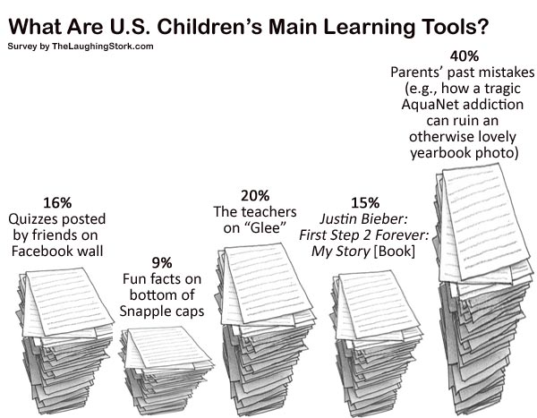

<figure aria-describedby="caption-attachment-2766" class="wp-caption alignleft" id="attachment_2766" style="width: 300px">

<figcaption class="wp-caption-text" id="caption-attachment-2766">Pic courtesy thelaughingstork.com</figcaption></figure>

A history professor from Colorado State University (Jonathan Rees) wrote a hysterical anti-MOOC rant ([The MOOC racket](http://www.slate.com/articles/technology/future_tense/2013/07/moocs_could_be_disastrous_for_students_and_professors.html)) in Slate 6 weeks ago. As I pored through the comments and mined 12 super-interesting perspectives, captured on the TechSangam blog) – [12 MOOC perspectives you may not have heard of](http://www.techsangam.com/2013/09/08/12-mooc-perspectives/). Not directly relevant to the MOOC debate but still very educational, commenter Zarko provides a satirical history of the original model of western education.

> I’d submit that your 90% of college students are there for the frat parties.
> 
> Our model of the university is a relic of a bygone age. Universities were formed as a way of keeping the dissolute sons of nobility out from under foot until they got old enough to take responsibility for oppressing the peasants. In order to perpetuate the university, they needed teachers, so they also educated the clergy – people who were expected to spend their entire lives cloistered in the insular university/church world.
> 
> Secular intellectuals joined the clergy over time, but this fundamental structure didn’t change until very recently. You went to Harvard because you were brilliant or because daddy was rich. It made little sense for other people to go to a university because they lacked the intellectual firepower to spend a life in academia and the family connections to get a job at daddy’s firm.
> 
> The advent of mass popular college education completely disrupts this model. Suddenly we have an influx of people who don’t particularly need to spend piles of money and the early years of their youth studying Ancient Etruscan Pottery, but who are forced to do so in order to get a “not a complete flake” checkmark on their resume.
> 
> Which is silly. We live in an age where the root material of knowledge is freely available to virtually anyone. All colleges do is perform a certification of that knowledge – and they do so at ridiculous expense in both time and money. Why does a doctor or a lawyer need an undergraduate degree? If you took the entering freshman class of a place like Harvard and simply dumped them straight into Harvard Law, you’d get the same quality of lawyers – they wouldn’t learn anything in undergraduate that they didn’t already know that is actually necessary for a law degree.
> 
> The writing is on the wall for such places. The future of education will contain a small number of ‘Harvards’ to educate the sons of privilege, and a large mass of cheap education delivered outside the conventional campus model.