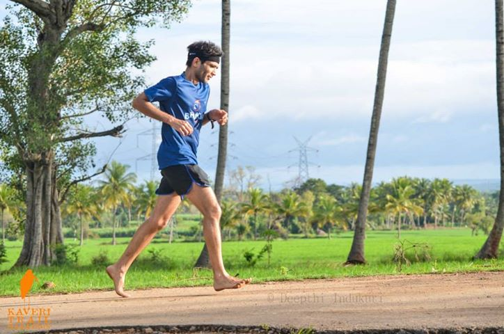

Years ago when I used to play squash regularly at Decathlon Club (Santa Clara), I was struggling to vault myself from a [high C to a low B](http://www.squashmagazine.com/vcm/squashmagazine/features/play/play_your_level.html). One of the bad habits of C level players is that they DON’T prolong the rallies, opting instead to finish things off quickly, usually via ill-conceived drop shots.

How do you change bad habits?

A deep philosophical question, eh? Perhaps one with myriad answers.

My regular playing partner (Joel) had a simple fix. The idea was to not mess with the inherent competitive instinct that drives players — the instinct to WIN every point/game/match. He proposed, after we completed our usual quota of ‘best of 3’ regular games to play a fourth game — a game with just one altered rule — any return that landed in front of the service line would be a foul. In short, drop shots and boast shots were outlawed and one could only play rails and cross-court shots. The competitive instinct to ‘win’ every point was still in place so it ended up becoming a fun drill that wasn’t ‘boring’.

Old habits die really slow. It was several weeks before I curtailed the urge to use drop shots in my ‘regular’ games. As I recall, Joel adjusted much better than me.

\*\*\*\*\*

What was the bad habit I was trying to shake off here? Many ‘poor form’ habits actually but the biggest was that I had become a heel striker. It took several rounds of surreptitious observation (think Heisenberg’s Uncertainty Principle) to come to this conclusion.

In amateur long-distance running, you are rarely chasing a competitor. The competitor is *oneself* – a perpetual quest for Personal Bests — race after race, season after season. My [first barefoot run](http://www.ulaar.com/2012/09/10/my-first-barefoot-run-time-to-pitter-patter/) was a mere *one week* after the end of the previous running season and, with a runway of 7 months before next season’s first race, there were zero competitive distractions.

So I noodled over a few loosely defined goals.

1. **Change my running form so I’d become a reliable front foot/mid-foot striker.**
2. Run at least one full marathon barefoot.
3. I knew my pace would suffer initially so instead of any PB aspirations, I wanted to be *no slower* than last year by the time the season’s last race rolled around.
4. Give myself a complete running season before taking any ‘long-term’ decisions on barefoot vs. shoes.

<figure aria-describedby="caption-attachment-2774" class="wp-caption alignleft" id="attachment_2774" style="width: 300px">

<figcaption class="wp-caption-text" id="caption-attachment-2774">At Kaveri Trail Marathon Sep 15 2013</figcaption></figure>

Goal #1 was the big one. But where did I pluck it from? I had read my share of Chris McDougal articles (refer [this](http://www.ulaar.com/2012/06/26/achieving-terminal-velocity/) and [this](http://www.ulaar.com/2013/04/25/examining-chris-mcdougall-through-a-purchase-funnel-lens/)) but this anecdote from Alberto Salazar resonated deeply. Reproducing from Pete Larson’s blog:

> “*There has to be one best way of running. It’s got to be like a law of physics. And if you deviate too much from that–the way I did in my career–it can be a big handicap. **Dathan can’t be a heel striker and expect to run as good as the best forefoot runners.*** (my emphasis) *You can be efficient for a while with bad form–maybe with a low shuffle stride – but eventually that’s not good for your body. It’s going to produce tightness and muscular imbalances and structural problems. Then you get injuries, and if you’re not careful – if you don’t take care of the muscular and structural issues – the injuries can put you into a downward spiral.*

Possibly the best thing I did in Feb 2012 was go the “whole hog” – i.e. no minimalist footwear, just fully barefoot. The second best thing I did was to stick to it for a good five months before saying [hello to huaraches](http://www.ulaar.com/2013/07/13/say-hello-to-huaraches/). Much later, I would realize that my year-long strategy was (apparently) my personal quest for a natural running form.

Natural running… natural running… hmm, what the heck is *natural running*? Is it the same as *barefoot running*? Runblogger explains..

> Natural running is not some ideal, archetypal running form, **it’s what happens when you let your own body figure out what works best for you when you minimize interference between the foot and the ground**. It’s what happens when you let your own muscles, ligaments, tendons, and bones do all or most of the work. It will vary depending on the type of ground under your feet, how fast you’re running, and so forth. It could hurt you – just because it’s “natural” does not necessarily mean that it’s always good. It could also help you – some people have overcome chronic injury by going “natural.” It’s a form employed by you, not necessarily a form employed by all. And your natural running form can change with time and practice. It might reach a comfortable steady state, or it might continue to change in small ways.
> 
> Natural runners are using the form that is working for them in their current situation, with zero assistance from footwear or other technology.

Furthermore, there is no such thing as a single barefoot running form.

> I get the sense that most people equate the phrase natural running with barefoot running, or at least running with a form similar to that which you would adopt when barefoot (shorter stride, increased cadence, more plantarflexed foot at contact, generally a reduced impact transient if not heel striking, etc.). I largely agree with this definition. However, I think there’s a bit more to it than this.
> 
> Though barefoot running form has certain general elements that characterize it, it’s not something that can be defined concretely. There is no single barefoot running form, and thus there is no single natural running form that applies in all circumstances for all people.

This seems shockingly at odds with Salazar’s assessment earlier. Larson continues…

> The reality is that running form is highly variable, and is largely dependent on an individual runner’s body and the conditions in which they are running (things like speed, surface, incline/decline, etc.). This applies even to foot strike. For barefoot runners, things will change depending on speed, surface, etc. There are habitual barefoot runners that forefoot strike, there are habitually barefoot people who heel strike when they run on softer surfaces. There are barefoot runners who heel strike on asphalt (and I have seen some **very** experienced barefoot runners making initial contact on the heel while running on asphalt). Most shod runners probably forefoot strike running uphill, and heel strike on the flats and downs. In fact, when it comes to foot strike, Prof. Daniel Lieberman of Harvard emphasized variation when I interviewed him for my book. He said:
> 
> *“I think everybody does everything. This idea that you’re just a forefoot striker, or just a midfoot striker, just a heel striker is bizarre. Variation is what biology is all about – everybody does everything! I think barefoot runners heel strike sometimes, of course they do. I don’t think they do it all the time. It’s speed dependent, terrain dependent, warm up dependent, etc.”*

Strange as it may sound, it anecdotally rings true (at least partially). Having seen race day pictures of a few other barefoot runners and myself, there are times when we seem to be heel striking. It must be rare enough because we haven’t developed any heel related injuries. Which brings me to an important closing point. It’s nearly impossible to have persistent incorrect form when you are running ‘whole hog’ barefoot.

Read the rest of Larson’s article here – [Natural running: what the heck does it mean?](http://www.runblogger.com/2013/06/natural-running-what-heck-does-it-mean.html)