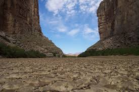

*\[Editor’s Note: On a musical day that started with Depeche Mode, moved on to Buena Vista Social Club, and continued with Omoro Portuondo and Getz/Gilberto in the evening, it wasn’t a surprise that I remembered this story and a 1993 road trip in West Texas.\]*

The man grinned widely, offered his hand and introduced himself.

“My name is Pablo. Is this your first visit to Terlingua?”

“Yes.” I said. “We are students at University of Houston. We came to checkout Big Bend National Park.”

He nodded approvingly.

“What did you say your name was?”

“Vishy,” I said.

Pablo’s eyes widened. He jerked back his head in astonishment, nearly knocking off his sombrero.

“No way! My friend’s name is Vishy too!” He pointed to a man across the room.

“You think I’m kidding, right?” I’ll go bring him here.

A minute later I was shaking hands with a short man in a full panoply Mexican attire. Grinning ear to ear, we shook hands and sized each other up. As my two friends and fellow journeymen (Soumya and Naveen) watched on with amusement, we did some polite small talk and eventually bid goodbye. Three Indians, two Mexicans and four first names. What were the odds of that happening in Terlingua, a small West Texas ghost town?

\*\*\*\*\*\*\*\*\*\*\*\*

Our two years at the University of Houston were a simple blur of action.

- Slog ass off from Monday to Friday (which usually meant a work day that started late and ended in the wee hours of the morning).
- Do something different on weekends (don’t recall exactly what — maybe it was catching up on sleep and groceries)
- Long weekends were special gifts. Gifts that couldn’t and wouldn’t be squandered away by staying within city limits. Simple three step formula: Rent car. Pick destination. Drive.

The destination didn’t matter (sooo.. many awesome destinations). The rental car didn’t matter (all of them easily touched 100 mph).

<figure aria-describedby="caption-attachment-2789" class="wp-caption alignleft" id="attachment_2789" style="width: 275px">

<figcaption class="wp-caption-text" id="caption-attachment-2789">Pic courtesy wikimedia.org</figcaption></figure>

One such long weekend took us to Big Bend National Park. Here are some other memories from the trip.

- The drive from Houston to Big Bend was negotiated with exactly one stop (in San Antonio) where we gorged ourselves on some Mexican burritos, tostadas, and chalupas. It was most likely Taco Bell. We were not the discerning gourmands that we claim ourselves to be (now).
- Last 5-10 miles were rather nervous.. Ten meter visibility means, well, *ten meter visibility*.
- Reaching the park welcome center around 2am and falling asleep in the car. Waking up at 6pm with a magnificent mountainous vista greeting us through the car windshield.
- Dinner one evening at Alice’s Restaurant. It was a *vegetarian* restaurant! Yes – a vegetarian restaurant in West Texas.
- Hiking along the banks of the Rio Grande river.. a boatman offering us to row us over to the Mexican side and we actually deliberated for several minutes before better sense prevailed.
- A deer deciding to cross our path when we were cruising at 70 mph. Only Soumya’s deft reflexes and superb car control ensured that we stopped about two feet short. The deer calmly looked us in the eye (no ‘deer caught in the headlights’ look, no sir) and calmly crossed the highway while the three of us gulped down our hearts.