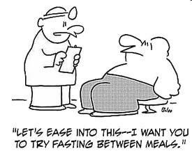

<figure aria-describedby="caption-attachment-2795" class="wp-caption alignleft" id="attachment_2795" style="width: 275px">

<figcaption class="wp-caption-text" id="caption-attachment-2795">Pic courtesy richeats.tv</figcaption></figure>

On the eve of [Karwa Chauth](http://www.karwachauth.com/the-legend-of-karwa-chauth.html), I thought this would be a topical post. Todd Becker (author of the [Getting Stronger](http://gettingstronger.org/) blog) has written on this topic at length. My contribution in this post is to summarize the salient points for the ADD generation. The only reason I filed this post under Running is because of the earlier hormetism post linking cold showers and barefoot running.

**1934 calorie restriction study on lab rats**

> One of the first scientifically rigorous demonstrations of the benefits of hormesis was a 1934 study of calorie restriction (often abbreviated “CR”) in laboratory rats, conducted by Mary Crowell and Clive McCay at Cornell. They found that reducing the calories of rats by 30-50%, supplemented with adequate micro-nutrients, could almost double their lifespans. Later studies found continued lifetime extension with calorie restriction up to 65%. In addition, the rats remained energetic and youthful in appearance, with greatly reduced incidence, and delayed onset, of age-related diseases. This same phenomenon has been observed in a variety of other animals.

**From monkeys and macaques to humans?**

> Studies on rhesus monkeys and macaques at the University of Wisconsin have found that the calorie-restricted monkeys have significantly less diabetes, cancer, cardiovascular disease, and neurodegenerative diseases. Their fasting insulin and glucose levels are greatly reduced, and they have higher insulin sensitivity and excellent lipid profiles. While the study is yet to be completed, at the 20 year point, 80% of the calorically restricted monkeys were still alive, compared to only half of the controls.
> 
> In a study of humans who restrict their calories by 10-25% relative to baseline, but supplied with adequate vitamins and minerals, similar benefits have been seen, with significantly lower blood pressure, insulin, fasting glucose, triglycerides and LDL cholesterol; and significantly higher HDL cholesterol.

**Three theories for why IF works: Autophagy, Mitohormesis and BDNF**

> [Autophagy](http://en.wikipedia.org/wiki/Autophagy_(cellular)) (“Self digestion”) is a phenomenon whereby the cells degrade and digest damaged or non-essential contents within the cell membrane. During nutrient starvation, autophagy basically “cleans house”: it breaks down non-vital components and releases nutrients, ensuring that the vital processes can continue. How does this come about? Calorie restriction is known to dramatically lower the concentrations of insulin, IGF-1 and growth hormone. Reduced levels of these hormones in turn activates the genes and pathways for autophagy or catabolism. Basically this involves the cell producing enzymes that specifically degrade oxidized or otherwise damaged intracellular molecules.
> 
> [Mitohorm](http://www.ncbi.nlm.nih.gov/pubmed/20350594?dopt=AbstractPlus)[esis](http://www.ncbi.nlm.nih.gov/pubmed/20350594?dopt=AbstractPlus) is defense response, which is believed to occur within the mitchondria, the energy factory of the cell. The mitohormesis theory proposes that calorie restriction is a type of “low-intensity stress” that activates genes involved in defensive responses against aging processes such as oxidation. The mitohormesis concept has been demonstrated in studies of the worm *Caenorhabditis elegan**s*, which showed that limiting the amount of glucose being fed to the worm resulted in oxidative stress, to which the organism responded by adapting so as to resist further oxidative stress. This extended its lifespan.

**Some well-known Calorie Restriction (CR) Diets**

- Okinawa Diet: This is a diet high in fish, rice, and yellow and green vegetables, many of them fermented. The Japanese as a whole eat fewer calories than do Americans. But the Okinawans eat even less. Compared with the average Japanese caloric intake, the Okinawa diet has: 
  - 20% fewer calories
  - 25% fewer grains
  - 75% less sugar
  - 300% of level of green/yellow vegetables, especially sweet potatoes
  - small amounts of fish and pork, including pig organs
  - no eggs or dairy

- CRON-diet (Calorie Restriction with Optimal Nutrition) was developed by Roy Walford, Lisa Walford and Brian Delaney. They advocate a plan involving three meals per day. Two of these meals are “free choice” recipes. The third is prepared in advanced according to recommended recipes to ensure adequate micronutrients. Meals are carefully weighed and assessed for calorie content. The CRON-diet is popular among members of the [Calorie Restriction Society](http://www.crsociety.org/).

**Intermittent Fasting**

> A number of studies have shown that fasting for short periods of time, generally less than 2-3 days, produce many of the same health benefits as general calorie reduction, without having to reduce the average number of calories consumed per week. However, many adherents of intermittent fasting find that their average calorie intake tends to decrease voluntarily; in other words, they tend not to “make up for lost time” on their non-fasting days. And many people (myself included) feel that it is psychologically more tolerable to alternate fasting with the ability to eat to fullness, rather than restricting calories at every meal. In addition, there are some scientific arguments that favor a “cycling” approach for optimizing the secretion of hormones such as leptin, and for avoiding a long term adaptive reduction in basal metabolic rate. If you are afraid that skipping meals will cause your metabolism to shut down and shift into “starvation mode”, dispel that thought. A study by Zauner et al in the Journal of Clinical Nurtrition showed [metabolic rate actually increases during fasting up to 4 days](http://www.ajcn.org/cgi/content/abstract/71/6/1511), due to a more than doubling of norepinephrine. So fasting for 6-24 hours hours has no downside.

Above content from Todd Becker’s [Calorie restriction and hormesis](http://gettingstronger.org/wp-content/plugins/wordpress-toolbar/toolbar.php?wptbto=http%3A%2F%2Fgettingstronger.org%2F2010%2F05%2Fcalorie-restriction-and-hormesis%2F&wptbhash=aHR0cDovL2dldHRpbmdzdHJvbmdlci5vcmcvMjAxMS8wNS9pbnRlcm1pdHRlbnQtZmFzdGluZy1mb3ItaGVhbHRoLWFuZC1sb25nZXZpdHkvPHdwdGI%2BSW50ZXJtaXR0ZW50IGZhc3RpbmcgZm9yIGhlYWx0aCBhbmQgbG9uZ2V2aXR5PHdwdGI%2BaHR0cDovL2dldHRpbmdzdHJvbmdlci5vcmc8d3B0Yj5HZXR0aW5nIFN0cm9uZ2Vy) blog post. If you like watching video talks, there are 5 Becker videos embedded in [this post](http://gettingstronger.org/2011/05/intermittent-fasting-for-health-and-longevity/).