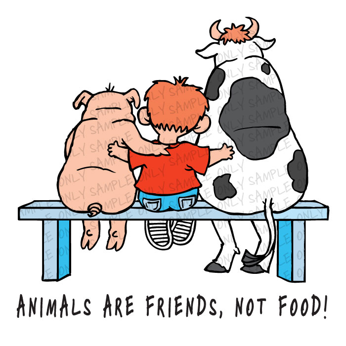

*And what is good, Phaedrus, And what is not good. Need we ask anyone to tell us these things? – Robert Pirsig*

<figure aria-describedby="caption-attachment-2807" class="wp-caption alignleft" id="attachment_2807" style="width: 300px">

<figcaption class="wp-caption-text" id="caption-attachment-2807">Pic courtesy inform2inspire.blogspot.com</figcaption></figure>

I’ve been on this Indian Vegans Facebook group for sometime now. A fairly high traffic group so I pop in every now and then. Two days ago, somebody posted the following question:

> A very nice sincere muslim friend has the argument: “But these animals were also created for us to consume in moderation. And they have to be killed following halal rules”. Can someone help me counter that argument in a nice way? Point to some webpages, etc?

A flurry of responses followed. This morning, the original poster shared the following response – I’ve emphasized the parts that particularly resonated with me.

> Thanks everyone for your helpful responses. FYI, this is what I replied to my friend. Hopefully this will also help you while having conversations with others.
> 
> “But these animals were also created for us to consume in moderation.”  
> This means we should torture and kill in moderation – it doesn’t make sense to me. Does it to you?  
>   
> If animals were given limbs, nose eyes, ears, genitalia that means they were meant to live. They feel emotions, pain, love. They wouldn’t have these sensibilities if they were meant to be “consumed”.  
>   
> No business can be profitable (it is proven) if they ensure that animals do not suffer throughout their lifecycle. So halal way or not, all animals are suffering terribly in meat/dairy/fur/leather/etc industry.  
> It is not just about the pain during the killing, it is also about the enormous suffering every single minute of their life, from birth till death. Please educate yourself – there are lot of pictures, literature and videos available on the internet that show how animals are abused from birth to maximize profit for the business owners, big or small.  
>   
> Btw, all plant based foods are halal.  
>   
> Mankind has evolved to a point where we have lots of non-cruel options available for food and clothing year round. Why do we have to still resort to the ancient lifestyle?  
>   
> The ancient lifestyle where they had limited options has been confused with the word of God in all religions. In fact, if one believes in God, he/she should chose kindness over cruelty. Wouldn’t every God like that – what do you think? We can still follow our own religions and choose a cruelty-free lifestyle.  
>   
> Though plant based diet has enormous health, environmental and social benefits, it is mainly about co-existing peacefully with all the creations of God. It is about peace and harmony, which is the essence of any religion.  
>   
> The animals of the world exist for their own reasons. They were not made for humans, just like black people were not made for whites, and women not for men. – Alice Walker  
>   
> Please if possible, listen to “The best speech ever”:  
> <http://www.youtube.com/watch?v=es6U00LMmC4>  
>   
> Or read the transcript here:  
> [https://www.facebook.com/note.php?note\_id=545356878839452](https://www.facebook.com/note.php?note_id=545356878839452)  
>   
> One highly recommended book is:  
> [http://www.flipkart.com/m/m-search-all/searchAll…](http://www.flipkart.com/m/m-search-all/searchAll?q=Islam+aur+shakahar&otracker=search&fromAS=false&showAS=true&_submit)