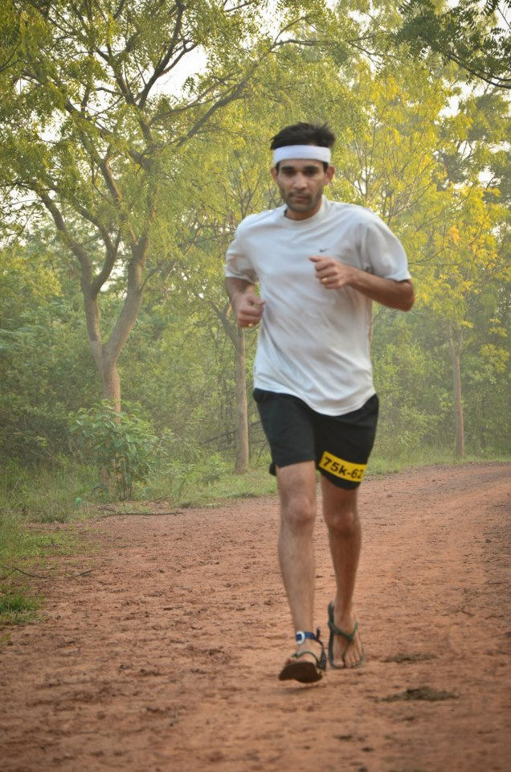
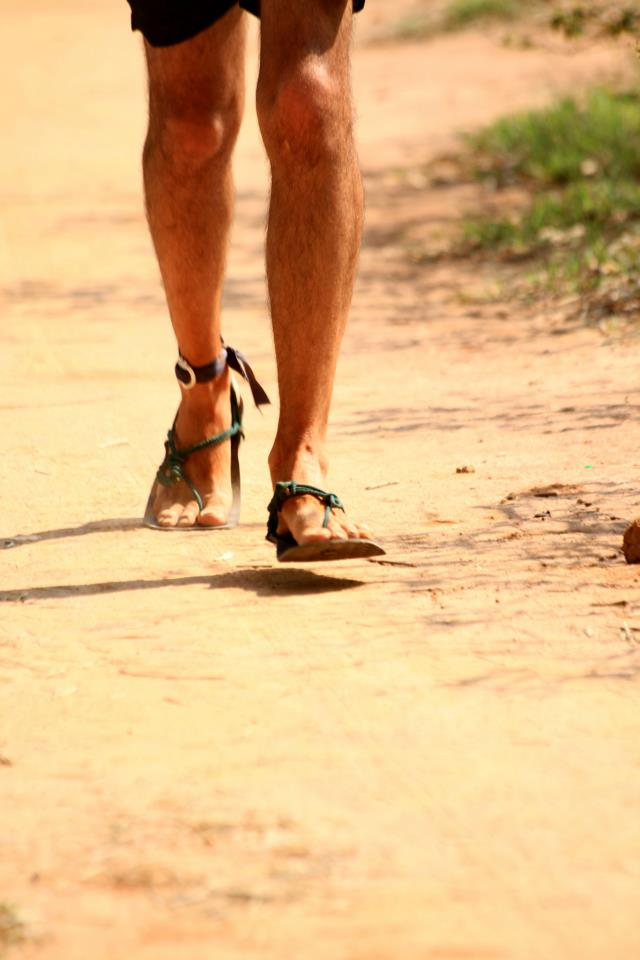

*\[Editor’s note: Translation for my non-Hindi readers: pachattar is the Hindi word for the number 75, chappals are the Indian rendition of flip-flops, a colloquial reference to my 4mm [huarache sandals](http://www.ulaar.com/2013/07/13/say-hello-to-huaraches/). This post is a very belated race report of my first 75k ultra marathon in Nov 2012.\]*

<figure aria-describedby="caption-attachment-2809" class="wp-caption alignleft" id="attachment_2809" style="width: 198px">

<figcaption class="wp-caption-text" id="caption-attachment-2809">Somewhere between 12.5 and 25k.</figcaption></figure>

Just a year ago, I ran my first ultra – a 50k distance at the Bangalore Ultra (Nov 2011). It was a particularly brutal rite of passage into ‘ultra’ territory. Brutal because a large chunk of the race terrain was through ploughed fields. Barring a few mountain goats and gazelles who pulsed their way to fast finishes with nary a missed step, the vast majority were falling like nine pins.

As ultra races go, 50k is the equivalent of a ‘bunny’ slope. If you’ve been running marathons regularly for more than three years, sooner or later you’ll think about the 50k. After all, it’s only *8k* more than the regulation marathon distance. But what lunacy pushed me to upgrade my ultra distance from 50k to 75k in ONE year?

Two reasons. I had been running barefoot for about six months by the time this decision came around. As I wrote in [quest for natural running form](http://www.ulaar.com/2013/09/23/quest-for-natural-running-form/), getting faster wasn’t a 2012 goal. Not getting slower was implicit however. What I was increasingly noticing (after each long run and race) was that I was getting less fatigued. The strain on the knees that I’d invariably feel (either starting at the 22k mark or closer to 30k) was gone. This was somewhat expected because the forefoot strike gets more work done by the calves and demands less of the knees. Changes in my post-run recovery were more dramatic. Previously I’d walk in the door trying not to look like *see-what-the-cat-dragged-in* and hoping the family hadn’t planned a pre-lunch outing (a two hour siesta was paramount to take the edge off my muscle soreness and fatigue).

In my post-[barefootia](http://www.ulaar.com/category/barefootia-2/) metamorphosis, I would return from my long runs and be greeted by “Oh! Did you do a short run today?” Or I’d ask “Which place for weekend grocery shopping?” The afternoon naps were no longer necessary. When it became apparent that this post-run recovery magic was not a fluke (and in fact directly related to my new running form), I started thinking that 75k might be a distinct possibility.

But what about the nightmarish ploughed-up Ultra course? Then word started filtering in that the Ultra organizers were changing the venue. The new venue was an eminently friendlier course in the Hennur forest preserve. My friend Jugy who has an amazing knack of finding awesome trails (KTM course was his first high-profile find) also found this beauty of a course in Hennur. A 12.5k up-and-back trail through a forest preserve which made for a nice 25k loop. There was a fair bit of tree cover (maybe 60%?) and a smallish rocky section close to the turnaround.

**Three rounds of golf**

I had it all worked out in my head. It was not a 75k ultra I was running. I was just going to play 3 rounds of golf on a 25k course. There was the little matter of playing all three rounds in one day, that’s all.

How did I intend to get my body into the golfing *mood*? It had to start with the clothes selection of course. White tee for the first round, blue for the second and red for the third. Since I sweat like a pig, a change of sweatband was also part of the plan. The script really worked out. It’s amazing what a difference a change of tee and sweatband makes. Replacing a soaking *drifit* tee and sweatband was almost like taking a quick shower.

**A Connecticut Yankee in King Arthur’s Court**

The neat thing about long distance running is that one can have long conversations with fellow runners *even* during races. This is especially true for the ultra distances because you are running at a slower pace than most of your training runs, thus allowing for conversations without getting tired. A 5am start at Bangalore Ultra (and a 6am’ish daybreak) ensures that even the fast runners hold back in the first hour. We had reached the Ultra venue very close to start time so it was a bit of mad scramble.

In the process, we forgot to pickup the torchlights. My compatriots (Praveen – who was running 100k and Nari – who was also running 75k) ran back to pick theirs but I demurred, presumably because *why add an extra 100-200m to an already long 75km?* I quickly rationalized my decision with *the light is not going to help with depth perception anyway so*.. From a practical standpoint, I had to stick close to a runner with a torch. Stayed with Praveen and Nari for a bit but they seemed to be in a hurry so I hung back… and found a light meandering at a suitable pace. This particular light was from Bill Nash’s headlamp and Bill was more than happy to share his light. And thus began our conversation.

Maybe it was his Cal Berkeley t-shirt, his friendly demeanor, my natural impulse to engage in conversation, or the fact that we both were running a 75k ultra for the first time (possibly all of the aforementioned), the conversation flowed like we were sitting at a Dublin bar and downing Guinness from the tap. Bill (a Jet Airways pilot stationed in Kochi) talked about his life — his career, his college-going kids, his daughter who spent a year with him in Bombay during his first year in India, the camaraderie he shared with the Indian pilots and crew in Kochi, and a whole range of sundry topics.

Not to be outdone, I talked about my years in Houston, Chicago and Bay Area, of Bangalore and social enterprises and blogging. Before we knew it, we had crossed the 10km marker, daybreak had arrived and the turnaround point wasn’t far away. After consulting Bill’s Garmin, I realized I needed to slow down further. We said our byes and he surged ahead. Sometime after two loops, I realized that I had overtaken him – presumably when he was at a water stop.

<figure aria-describedby="caption-attachment-2810" class="wp-caption alignright" id="attachment_2810" style="width: 200px">

<figcaption class="wp-caption-text" id="caption-attachment-2810">Closeup of the huaraches</figcaption></figure>

**Walk the path? or finish strong?**

The second hour was probably the most spiritual segment of my ultra journey. We had descended into a dark forest at 5am and it was beautiful to see the forest reveal itself bit by bit and tread by tread as dawn broke. The sights and the smells. The undulating trail and the uneven ground. Beautiful vistas all around. Somewhere between 15k and 17k, crossing the friendly hordes of 50k runners (they had a 6am start) was fun, especially seeing some of the speed demons from our running group. The title of this post, *Chappal mein pachattar*, was coined when my friend Rishi yelled it encouragingly when we crossed each other at the 20k mark. The first loop was completed rather uneventfully in 2:45. The white tee was swapped for the blue and off I went for the second loop.

My footwear plan for the ultra was to negotiate the first two loops in the huaraches and decide (at 50km) whether I needed to upgrade to shoes. In the first half of the second loop, Santhosh Padmanabhan (Bangalore’s well-known ultramarathoner, running coach and zenman) egged me on with an approvingly rhetorical “Walking the path?” He didn’t realize it but I’d be pondering on those words between the 40km and 45km markers.

Mentally and physically I was feeling strong. No complaints from the usual suspects (quads, calves, knees). The soles of my feet were a slightly different story. They were sore of course. Not painfully unbearably sore but I had to extrapolate how they would be after a further 25k.

Did I want to be a *barefoot purist* and complete the entire 75k in my huaraches? Or did I want to take the pragmatic approach of upgrading to ‘Business Class’ (shoes) and finish strong? What, in fact, was my top goal for this race? These were the questions I was considering.

One less-known fact is that barefoot walking is harder than barefoot running, especially on barefoot unfriendly terrain. My recollection of this fact turned out to be the clincher in my decision. Since I was *power walking* all the up-slopes, I’d have a fair bit of walking to do… a not-so-appealing a prospect with the 4mm sandals.

I would go on to finish the second loop in a decent 3:15.

**Home stretch with Nari**  
As I neared the end of my second loop I crossed my friend Nari (who was about 1/2 km ahead. He asked whether I intended to tackle the third loop in my sandals. I replied in the negative and he nodded approvingly.

At the 60km water stop I passed Nari without realizing it. As I reached the 62.5k turnaround water stop, I wondered what the heck happened to him..

As I hydrated and picked up some oranges, Nari caught up. Physically we were in a similar place but his body language conveyed a dispirited mental state. And we BHUKMP’rs simply hate that state of mind.

It was no time for solitary brooding and plodding. It was time for a good old-fashioned runversation.. BHUKMP style. We did the math and reckoned that a sub-10 hour finish was clearly in the realm of possibility. With a target set, we set about crunching the km’s – walking the up-slopes, running the flats/down-slopes, and tossing drivel at each other all the way. We finished together in 9:45 min and it was a mighty fine and satisfying feeling.

**Next year?**

My first 75km ultra done and dusted but you know the weirdest thing? I felt there was still plenty of juice inside. Can’t wait for next year, I thought to myself.