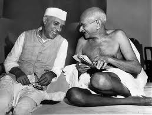
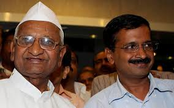

In case you haven’t noticed, the most interesting Indian political discussions are happening on Facebook. Last week, a friend (a keen follower of the ‘India story’ with an appetite for indulging in high quality discussions) shared the following update regarding AAP.

> Just realized AAPs strategy is like Gordon Gekkos. Find a state with decent balance sheet. Promise lots and lots of freebies. Get power, give freebies, destroy balance sheet. Rinse repeat.  
> Unstoppable?

<figure aria-describedby="caption-attachment-2833" class="wp-caption alignleft" id="attachment_2833" style="width: 258px">

<figcaption class="wp-caption-text" id="caption-attachment-2833">Pic courtesy wikimedia.org</figcaption></figure>

One of his friends (Harsh Pant) made a striking analogy between the Anna-Kejriwal partnership-&gt;movement-&gt;split and that other famous partnership from the 1940’s – Gandhi-Nehru. I reproduce Harsh’s comment below with his permission:

> Hey, something made me revisit this: There indeed are SOME parallels to the 1940s:
> 
> - 1) There is a Gandhi figure (Hazare), living austere life, able to (at least till recently) have millions stand behind him on beck and call, fearless of what happens to them, passive resistors, satyagrahis. Is a mass movement leader, who talks of village development and self government, believes State Machinery and Political Parties that control it, are by definition, evil…for the State is but concentrated power to coerce and “discipline” everyone. Gandhi wanted to dissolve the Congress as a political party, was possibly (I’m not remembering that part of the History) opposed to Congress contesting elections under the British reforms in the beginning too, and Hazare has been clear that he does not want to convert his movement into a political party.
> - 2) A Nehru figure that believes the State can be for good, and is Socialistically inclined. Dumps the idea of village centric/self sufficient, simple life village commune organization, goes: ‘modern’ + socialist (read: Statist) + Secural…Breaks from Gandhi totally tho’ still Bapu’ing him around.
> - Jan Sangh (BJP) and the RSS: with a 3rd vision.
> 
> <figure aria-describedby="caption-attachment-2834" class="wp-caption alignright" id="attachment_2834" style="width: 284px">

<figcaption class="wp-caption-text" id="caption-attachment-2834">In happier days (Pic courtesy Outlook India)</figcaption></figure>
> 
> **The difference from 40s**:
> 
> - 1) BJP has more traction with voters than the Jan Sangh had, bcos the talk of BJP is not (merely) focussed on Hindu religion, maryada, pride etc., but also talks Development and expansion of Economic life.
> - 2) there is also the vorginal Congress around.
> - 3) There are now also some powerful caste-based, namesake Socialist formations.
> - GENERAL: Some Marxist parties timepassingly around then and now.
> - Common People engaged – passionately AAPers, BhJPa’is, Kangraesis, et al….like they used to be right at and after independence.
> - Many a Patel fig (eg Kiran Bedi) outsmarted/outlucked by the Kejriwal wrt being the top political beneficiary of the whole thingy….developing two-way soft corner with the Right Wing formation.
> - Nehru willed into existence IITs (would have been to the horror of Gandhi if he lived to see their establishment – To Gandhi: State, Mass Production, Technology — all were evil as they represented concentrated power and ability to repress), whilst Kejri is an IITian.
> - FUNNY TADKA: At the end of the day, we the IITians, at this point, are the most sceptical Kejri is upto any good.

Harsha also weighs in on why Delhi’ites voted for AAP…

> IMO – it was never the mix of Socialism and Capitalism that people in their disgruntlement popped up AAP. Indian political and policy making processes will iterate on them just fine without Kejriwal. We don’t need him to add freebies and reservation, the existing blokes are sufficient to do harm. The corruption and money siphoning by Gov structures have left us hearing about n% growth, but water supply that is neither drinkable nor quite bathable, air near unbreathable, no pathways to walk even 1/2 km to someplace, roads undrivable, gulleys ungujerable with dogs and dump. The corruption of Gov structures is killing us. THAT’s what we expect Kejriwal to deliver us from. We were not looking for expanding subsidies or reservations or unhappy with dollar policy or foreign policy. In fact, economic policy is something Kejriwal can well leave to the Bureucracy…at least for time being. First he needs to act on Gov-public delivery of basic living infrastructure.