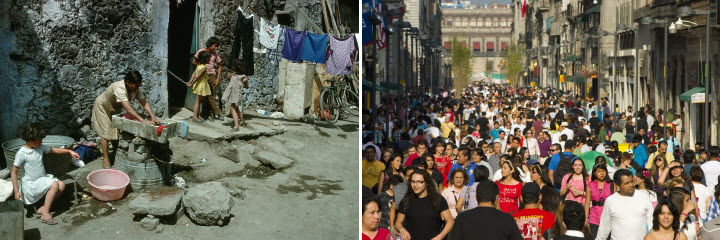

<figure aria-describedby="caption-attachment-2131" class="wp-caption alignleft" id="attachment_2131" style="width: 300px">

<figcaption class="wp-caption-text" id="caption-attachment-2131">Mexico City – 1986 (left), 2011 (right)</figcaption></figure>

The 2014 Gates Annual Letter is out. You should read the entire letter. But since my exhortation may not be sufficient, I’ll present a few teasers from the three myths.

**Myth #1: Poor countries are doomed to stay poor**

> The global picture of poverty has been completely redrawn in my lifetime. Per-person incomes in Turkey and Chile are where the United States level was in 1960. Malaysia is nearly there, as is Gabon. And that no-man’s-land between rich and poor countries has been filled in by China, India, Brazil, and others. Since 1960, China’s real income per person has gone up eightfold. India’s has quadrupled, Brazil’s has almost quintupled, and the small country of Botswana, with shrewd management of its mineral resources, has seen a thirty-fold increase. There is a class of nations in the middle that barely existed 50 years ago, and it includes more than half of the world’s population.
> 
> I’ll turn back to the more specific and pernicious version of this myth: “Sure, the Asian tigers are doing fine, but life in Africa never gets better, and it never will.”
> 
> Africa has also made big strides in health and education. Since 1960, the life span for women in sub-Saharan Africa has gone up from 41 to 57 years, despite the HIV epidemic. Without HIV it would be 61 years. The percentage of children in school has gone from the low 40s to over 75 percent since 1970. Fewer people are hungry, and more people have good nutrition. If getting enough to eat, going to school, and living longer are measures of a good life, then life is definitely getting better there. These improvements are not the end of the story; they’re the foundation for more progress.
> 
> Of course, these regional averages obscure big differences among countries. In Ethiopia, income is only $800 a year per person. In Botswana it’s nearly $12,000. You see this huge variation within countries too: Life in a major urban area like Nairobi looks nothing like life in a rural Kenyan village. You should look skeptically at anyone who treats an entire continent as an undifferentiated mass of poverty and disease.
> 
> I am optimistic enough about this that I am willing to make a prediction. *By 2035, there will be almost no poor countries left in the world*. (I mean by our current definition of poor.)
> 
> Every nation in South America, Asia, and Central America (with the possible exception of Haiti), and most in coastal Africa, will have joined the ranks of today’s middle-income nations. More than 70 percent of countries will have a higher per-person income than China does today. Nearly 90 percent will have a higher income than India does today. \[Go read [Section 1 fully](http://annualletter.gatesfoundation.org/#section=myth-one)\]

**Myth #2: Foreign aid is a big waste**

> For Norway, the most generous nation in the world, foreign aid is less than 3 percent. For the United States, it’s less than 1 percent.
> 
> One percent of the U.S. budget is about $30 billion a year. Of that, roughly $11 billion is spent on health: vaccines, bed nets, family planning, drugs to keep people with HIV alive, and so on. (The other $19 billion goes to things like building schools, roads, and irrigation systems.)
> 
> Another argument from critics is that aid holds back normal economic development, keeping countries dependent on generosity from outsiders.
> 
> This argument makes several mistakes. First, it lumps different kinds of aid together. It doesn’t differentiate aid that is sent directly to governments from funding that is used for research into new tools like vaccines and seeds. The money America spent in the 1960s to develop more productive crops made Asian and Latin American countries less dependent on us, not more. The money we spend today on a Green Revolution for Africa is helping countries grow more food, making them less dependent as well. Aid is a crucial funding source for these “global public goods” that are key for health and economic growth. That’s why our foundation spends over a third of our grants on developing new tools.
> 
> Second, the “aid breeds dependency” argument misses all the countries that have graduated from being aid recipients, and focuses only on the most difficult remaining cases. Here is a quick list of former major recipients that have grown so much that they receive hardly any aid today: Botswana, Morocco, Brazil, Mexico, Chile, Costa Rica, Peru, Thailand, Mauritius, Singapore, and Malaysia. South Korea received enormous amounts of aid after the Korean War, and is now a net donor. China is also a net aid donor and funds a lot of science to help developing countries. India receives 0.09 percent of its GDP in aid, down from 1 percent in 1991.
> 
> As they wrote last month in the medical journal *The Lancet*, with the right investments and changes in policies, *by 2035, every country will have child-mortality rates that are as low as the rate in America or the U.K. in 1980.* \[Go read [Section 2 fully](http://annualletter.gatesfoundation.org/#section=myth-two)\]

**Myth #3: Saving lives leads to overpopulation**

> Take Afghanistan, where child mortality—the number of children who die before turning five years old—is very high. Afghan women have an average of 6.2 children.7 As a result, even though more than 10 percent of Afghan children don’t survive, the country’s population is projected to grow from 30 million today to 55 million by 2050. Clearly, high death rates don’t prevent population growth (not to mention the fact that Afghanistan is nobody’s idea of a model for a prosperous future).
> 
> When children survive in greater numbers, parents decide to have smaller families. Consider Thailand. Around 1960, child mortality started going down. Then, around 1970, after the government invested in a strong family planning program, birth rates started to drop. In the course of just two decades, Thai women went from having an average of six children to an average of two. Today, child mortality in Thailand is almost as low as it is in the United States, and Thai women have an average of 1.6 children.
> 
> When children are well-nourished, fully vaccinated, and treated for common illnesses like diarrhea, malaria, and pneumonia, the future gets a lot more predictable. Parents start making decisions based on the reasonable expectation that their children will live.
> 
> In fact, when girls delay marriage and stay in school, everything changes. In a recent study of 30 developing countries, women with no schooling had three more children on average than women who attended high school. When women are empowered with knowledge and skills, they start to change their minds about the kind of future they want.
> 
> In fact, when girls delay marriage and stay in school, everything changes. In a recent study of 30 developing countries, women with no schooling had three more children on average than women who attended high school. When women are empowered with knowledge and skills, they start to change their minds about the kind of future they want. \[Go read [Section 3 fully](http://annualletter.gatesfoundation.org/#section=myth-three)\]