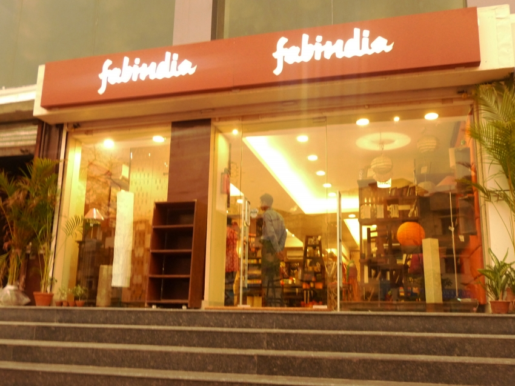
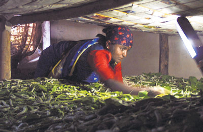

*\[Editor’s Note: This post was 95% complete on Oct 31, 2013. After all, it was largely copy-paste so why did it languish for two months in the Drafts folder? I intended to post a critique of the Companies Bill 2013. (Sigh) That’ll have to wait for another day.\]*

I’ve been neglecting this blog for far too long. My lame excuse is [this](http://www.techsangam.com/2013/08/18/a-different-kind-of-indian-city/) but how long can I keep using it?

Yesterday I stumbled upon this [Ennovent blog post](http://blog.ennovent.com/2013/08/eight-defining-milestones-in-indias-social-enterprise-landscape/) which apparently got simulcasted onto the leading social enterprise news portals. There’s no better way to activate this dormant blog – I present below, in excerpted and annotated style, eight defining milestones in India’s social enterprise ecosystem evolution.

### **1. Founding of Amul Dairy Co-operative (1946 – 1950)**

> The founding of the Kaira District Co-operative Milk Producers Union in 1946 and the Amul Dairy in 1950 has over the years given thousands of dairy farmers access to a wide range of domestic markets and spurred India’s milk revolution.
> 
> Amul demonstrated that the elimination of middlemen and the professional management of milk procurement could result in low-income farmers getting access to new markets thereby lifting them out of poverty. While Amul was not conceived as a social enterprise, it is a historic example of supply chain management that is relevant even today.

<figure aria-describedby="caption-attachment-2133" class="wp-caption alignleft" id="attachment_2133" style="width: 300px">

<figcaption class="wp-caption-text" id="caption-attachment-2133">Pic courtesy cityseekr.com</figcaption></figure>

### **2. Beginnings of Fabindia (1960)**

> Founded by John Bissell to market the diverse craft traditions of India, Fabindia started as a company exporting home furnishings. By linking over 80,000 craft based rural producers to modern urban markets, Fabindia impacted rural artisans at a scale similar to that of Amul for dairy farmers.
> 
> Fabindia’s unique ‘community owned company’ model that promotes inclusive capitalism can be credited for the impact they have created. By providing a minimum 26% shareholding to companies co-owned by artisan communities, Fabindia not only offered artisans a regular income but also dividends from the company’s growth. Today, with a pan-India presence, Fabindia is the largest private platform for products that derive from traditional crafts and knowledge.

### **3. Founding of Ashoka in India (1981)**

> Ashoka laid the foundation for the concept of social entrepreneurship around the world and started working in India in 1981. Their yearly batches of Changemakers – a community of social entrepreneurs that work to launch, refine and scale high potential ideas for low-income markets – has proven to be a successful model that has been adopted by several accelerators globally.
> 
> Ashoka’s establishment in India highlighted the importance of non-financial support in the form of networks, mentors and beyond to accelerate the growth of entrepreneurs working with innovations for low-income markets. Since inception in India, Ashoka has identified and worked with more than 350 fellows with innovative solutions from diverse fields and provided them access to funding, expertise and the global networks necessary to grow operations and scale impact.

<figure aria-describedby="caption-attachment-2134" class="wp-caption alignright" id="attachment_2134" style="width: 300px">

<figcaption class="wp-caption-text" id="caption-attachment-2134">A silk farmer feeding silk worms using Selco solar light</figcaption></figure>

### **4. Establishment of SELCO Solar (1995)**

> SELCO Solar was established with the mission to dispel the myth that low-income communities cannot afford or maintain sustainable technologies. SELCO resolved this challenge by not only creating low-cost solar solutions for lighting, water pumping and computing but also by providing a complete package of product, service and consumer financing through grameena banks, cooperative societies and micro finance institutions.
> 
> In a time when only a limited amount of financial and non-financial support was available to socially focused entrepreneurs and affordable solar power was a distant dream even in developed countries, SELCO not only sold and serviced solar lighting systems but also developed and scaled a business model for bringing rural services to poor families. In the past 18 years, SELCO has sold over 1,35,000 solar home lighting systems.

### **5. India’s First Impact Investments (2001)**

> It was in 2001 that Acumen Fund; a powerful catalyst for socially focused ventures internationally, brought its approach to India and made its debut investment in Aravind Eye Hospital. Acumen went on to open its India office in 2006 and has since invested USD$36 million in 26 different social companies in India.
> 
> In the same year, Vineet Rai also founded Aavishkaar, India’s first for-profit impact investment fund. Aavishkaar now oversees four investment funds and over 25 portfolio companies across sectors such as agriculture, dairy, healthcare, water, sanitation and beyond in India.
> 
> The introduction of both Aavishkaar and Acumen in India showcased the demand for early-stage investments in socially focused enterprises to scale both operations and social impact.

### **6. Social Enterprise Reaches Indian Universities (2007)**

> Education has often been seen as a stepping-stone towards positive change. The introduction of the Masters in Social Enterprise at one of India’s leading academic schools, the Tata Institute of Social Sciences in 2007 heralded a small but growing trend to provide formal training for entrepreneurs aspiring to create social change.
> 
> The founding of this masters program raised the academic profile for social enterprise as a career and created a viable pathway for the next generation of socially focused leaders.

### **7. Introduction of the Sankalp Summit (2009)**

> Sankalp Forum’s annual summit in 2009 was the first such event of its kind in India that brought together multiple stakeholders such as entrepreneurs, investors, experts and development partners to review the progress made within the sector and to set course for the future. It was initiated with the vision of catalyzing impact investments into social enterprises globally and has today evolved into a community of over 350 socially focused enterprises, 300 investors and 300 sector stakeholders.
> 
> The popularity of Sankalp Forum brought to the forefront the importance of local and regional events for the convergence of global knowledge and investment dialog necessary to further the inclusive ecosystem in India.

### **8. Passing of the Companies Bill (2013)**

> The passing of the Companies Bill and along with it the mandatory 2% of profits spend on CSR activities is a historic piece of legislation. While the impact of this spend has been a topic of much debate, including criticism that CSR is simply a public relations exercise, the new bill is an opportunity for Indian corporates to embrace a few large social problems that government benefits have been unable to resolve satisfactorily.
> 
> Moreover, the bill is aimed at providing important financial resources to NGO’s, social enterprises as well as incubators and accelerators with the ultimate intention being for corporates to play a greater role in eradicating social problems such as hunger and lack of education which continue to fester in India.
> 
> Similarly, not only do these eight milestones define India’s social enterprise landscape but they also act as important opportunities for reflection on the way forward – for entrepreneurs, investors, accelerators and governments alike.