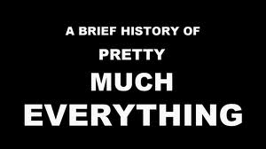

<figure aria-describedby="caption-attachment-2143" class="wp-caption alignleft" id="attachment_2143" style="width: 300px">

<figcaption class="wp-caption-text" id="caption-attachment-2143">Pic courtesy nofatclips.com</figcaption></figure>

Rumors of TechSangam’s demise are greatly exaggerated.

This post was meant to be about [this](http://win.blogadda.com/view-blogs-voting/news_media/Confluence_of_social_enterprises_and_civil_organizations/). (But DON’T click on that link just yet… indulge me for a few more paragraphs please! There’s a bit of an anti-climax so all the more reason to wait!)

In June 2013, I announced my full-time foray into an [entrepreneurial venture](http://www.techsangam.com/2013/08/18/a-different-kind-of-indian-city/). If you then thought that the blog was headed for a protracted period of suspended animation, you’d have been right. Six posts in six months is the VERY definition of *suspended animation*.

In Aug 2013, BlogAdda announced their (possibly first) Blog Awards. It seemed like a metaphorical straw. I grasped it. I nominated my blog. A few weeks ago, the good folks from BlogAdda wrote back with the surprising news that TechSangam was among 11 finalists in the News and Media category. This was particularly gratifying since it was an A-list [jury](http://www.blogadda.com/blog-awards/jury).

The BlogAdda email also had this exhortation..

> You are as close as possible to the finish line and at such a stage, you don’t want to let it go, do you? For the last leap we want the community to like, tweet, comment and tell us who their favourite is! Have a look at all the top blogs, ‘Like &amp; Tweet’ to encourage and increase your favourite blog’s chance of winning! 
>
> Every vote is ought to make a difference, for your blog to reach the top 3! Tell your family and friends to spread the word!

Crikes! This put me in a spot of bother. Now I needed to do *more work* to get past the finish line?I was ambivalent about the extent of self-aggrandizing I wanted to indulge in. I was also suffering guilt pangs of having neglected what was once a full-time activity for seventeen months.I like forcing functions. They sometimes offer redemption.I was going to make a fresh pledge to myself and to my readers. Like [Vishnu’s favorite devotee](http://www.techsangam.com/2011/09/23/vishnu-favorite-devotee-myth-and-its-relevance-to-social-enterprises/), I would resolve to pay obeisance (i.e. blog on TechSangam) as often as possible. And make it happen this time.So what are the select TechSangam moments I wanted to showcase in this post? Well, it was going to be the twists and turns, and the many “aha” moments that I experienced during my blogging journey. But since that’ll take another hour (which I don’t have), I present the Top 25 most popular blog posts – I believe that tells the story as much of the blog’s readership as it does about the blogger.

- \#25: [Anand Kumar’s Super 30 journey](http://www.techsangam.com/2011/05/11/anand-kumars-super-30-journey/)
- \#24: [Social enterprise jobs in India: who’s hiring](http://www.techsangam.com/2012/02/29/social-enterprise-jobs-in-india-whos-hiring/)
- \#23: [Akshaya Patra in 24 pictures](http://www.techsangam.com/2011/07/01/akshaya-patra-in-24-pictures/)
- \#22: [Khata kholo har darwaza kholo – Eko’s branchless banking](http://www.techsangam.com/2011/05/01/khata-kholo-har-darwaza-kholo-ekos-branchless-banking-part-1/)
- \#21: [RSBY: a government initiative that (Gasp) seems to work](http://www.techsangam.com/2012/02/22/rsby-government-initiative-that-mostly-works/)
- \#20: [Boiling the social enterprise ocean](http://www.techsangam.com/2011/05/17/boiling-the-social-enterprise-ocean/)
- \#19: [Supply demand wars in education policy – part 1](http://www.techsangam.com/2011/09/02/supply-demand-wars-in-education-policy-part-1/)
- \#18: [Greenway: cleaner smarter stove for 150 million BOP households](http://www.techsangam.com/2011/08/18/greenway-smart-stove-a-cleaner-smarter-stove-for-150-million-bop-households/)
- \#17: [A page each from Harish Hande and Naveen Krishna](http://www.techsangam.com/2012/05/31/a-page-each-from-harish-hande-naveen-krishna/)
- \#16: [Commodity cooperatives in draught prone areas – Part 1](http://www.techsangam.com/2011/07/29/commodity-cooperatives-in-drought-prone-regions-part-1/)
- \#15: [A monster in the making: the Babajob story](http://www.techsangam.com/2011/04/27/a-monster-in-the-making-the-babajob-story/)
- \#14: [The Ugly Indian’s gift to Bangalore – Part 1](http://www.techsangam.com/2011/10/19/the-ugly-indians-gift-to-bangalore-on-the-occasion-of-namma-metro-launch/)
- \#13: [If I was looking for inspiration… I found it at Sankalp Forum](http://www.techsangam.com/2011/05/09/if-i-was-looking-for-inspiration-i-found-it-at-sankalp-forum/)
- \#12: [List of social enterprises in India](http://www.techsangam.com/2012/06/21/list-of-social-enterprises-in-bangalore/)
- \#11: [Firang invasion of India’s social enterprise ecosystem](http://www.techsangam.com/2012/04/13/firang-invasion-of-indias-social-enterprise-ecosystem/)
- \#10: [ITC’s eChoupal model to increase farmer income and its own bottom line](http://www.techsangam.com/2011/09/20/itc-e-choupal-model-to-increase-farmer-revenue-and-its-own-bottomline/)
- \#9: [The not so curious affair of Raju Narayana Swamy](http://www.techsangam.com/2012/01/25/the-not-so-curious-affair-of-ias-officer-raju-narayana-swamy/)
- \#8: [The Ugly Indian’s gift to Bangalore – Part 3](http://www.techsangam.com/2011/10/20/the-ugly-indians-gift-to-bangalore-on-the-occasion-of-namma-metro-launch-part-3/)
- \#7: [Impact investing landscape in India](http://www.techsangam.com/2011/10/02/impact-investing-landscape-in-india/)
- \#6: [The mud chulhas of India](http://www.techsangam.com/2011/08/17/the-mud-chulhas-of-india/)
- \#5: [The many lives of Trilochan Sastry: academic, social activist, social entrepreneur](http://www.techsangam.com/2011/12/04/the-many-lives-of-trilochan-sastry-%e2%80%93-academic-social-activist-social-entrepreneur/)
- \#4: [This picture needs a caption – help!](http://www.techsangam.com/2012/01/12/this-picture-needs-a-caption-help/)
- \#3: [Creating a nation of electronics geeks](http://www.techsangam.com/2011/08/02/creating-a-nation-of-electronics-geeks/)
- \#2: [Calling bullshit on Forbes’ List of Top 30 Social Entrepreneurs](http://www.techsangam.com/2011/12/05/calling-bullshit-on-forbes-list-of-top-30-social-entrepreneurs/)
- \#1: [So what’s up with Raju Narayana Swamy these days?](http://www.techsangam.com/2012/07/27/so-whats-up-with-raju-narayana-swamy-these-days/)

So if you are new to TechSangam, hope you read some of those most popular of all time posts. If you are an old loyal reader, feel free to leave a comment on your personal favorite.

So NOW you can click on [THE LINK](http://win.blogadda.com/view-blogs-voting/news_media/Confluence_of_social_enterprises_and_civil_organizations/). As you can see, by the time I got around to writing this post, voting has ended 🙂 The good BlogAdda folks have this to say “You can still leave an encouraging comment on your favorite blog :)”

So thank you, dear readers, commenters and social sharers. Hope to keep cranking away useful pieces of social enterprise insights. As often as possible.

