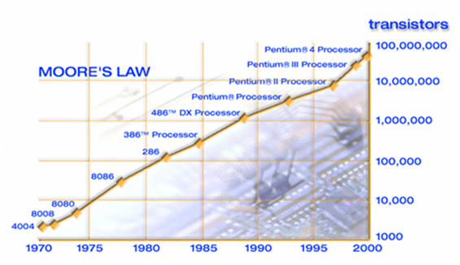

I’m a huge fan of Marc Andreessen.

I won’t wax eloquent about Andreessen but draw attention to his 2011 WSJ article [Why software is eating the world](http://online.wsj.com/news/articles/SB10001424053111903480904576512250915629460). The article (specifically the title/quote) strongly resonated with me. It continues to influence my world view of the type of companies effecting dramatic changes in the world.

Twitter religion came late to Andreessen but he’s making up by posting frequently and insightfully.

<figure aria-describedby="caption-attachment-2165" class="wp-caption alignleft" id="attachment_2165" style="width: 300px">

<figcaption class="wp-caption-text" id="caption-attachment-2165">Pic courtesy fnal.gov</figcaption></figure>

He asked an interesting question today..

> Does anyone know of well-regarded econ research on the broad economic impact of computers/IT/software/Internet as a deflationary force?
> 
> — Marc Andreessen (@pmarca) [February 18, 2014](https://twitter.com/pmarca/statuses/435907231775617024)

and elaborates

> [@slightlylate](https://twitter.com/slightlylate) I’m thinking impact on price levels and GDP. A camcorder used to cost $1,000, now is a free app on your smartphone, etc.
> 
> — Marc Andreessen (@pmarca) [February 18, 2014](https://twitter.com/pmarca/statuses/435911852480921600)

> [@jbaham2](https://twitter.com/jbaham2) [@mattknox](https://twitter.com/mattknox) [@sampullara](https://twitter.com/sampullara) [@noahlt](https://twitter.com/noahlt) Higher-level dynamic languages, programming as combining existing open-source components, …
> 
> — Marc Andreessen (@pmarca) [February 19, 2014](https://twitter.com/pmarca/statuses/435936518494883840)

Responses from his wired followers..

> [@pmarca](https://twitter.com/pmarca) Gary Shilling did some work on deflationary forces and, if I remember, internet was one of them. But that was about 10 years back.
> 
> — Gagan Mehra (@ga2n) [February 18, 2014](https://twitter.com/ga2n/statuses/435910089052913665)

> [@pmarca](https://twitter.com/pmarca) By far the greatest force was the synthesis of ammonia in the early 20th century with tremendous impact on agriculture.
> 
> — Ruben Damiao (@RDAMIAO) [February 19, 2014](https://twitter.com/RDAMIAO/statuses/435953516117770241)

Following the responses (and there were MANY), he puts forth his thesis on ongoing role of Moore’s Law and impact on technology trends..

> Responses to those 3 deflation questions prompted questions about ongoing role of Moore’s Law especially if chip speeds are topping out.
> 
> — Marc Andreessen (@pmarca) [February 18, 2014](https://twitter.com/pmarca/statuses/435924800419024896)

> My assessment for silicon: we are shifting from 30 years of “faster performance for same $” to 30 years of “same performance for less $”.
> 
> — Marc Andreessen (@pmarca) [February 18, 2014](https://twitter.com/pmarca/statuses/435925109228843008)

> Which means at least three dramatic changes in how we think about functionality &amp; performance of computing in our lives:
> 
> — Marc Andreessen (@pmarca) [February 18, 2014](https://twitter.com/pmarca/statuses/435925371880357888)

> 1: On a device (e.g. smartphone), rising use of parallelism (more cores and/or chips for same $), including graphics &amp; many new sensors.
> 
> — Marc Andreessen (@pmarca) [February 18, 2014](https://twitter.com/pmarca/statuses/435925577485144065)

> 2: In cloud, massive parallelism applied against many more big problems — Google &amp; FB just the start; amazing new services in many sectors.
> 
> — Marc Andreessen (@pmarca) [February 18, 2014](https://twitter.com/pmarca/statuses/435925823703363584)

> 3: Ultra-cheap chips on network embedded in virtually every physical object around us; feeding info on real world + controlling real world.
> 
> — Marc Andreessen (@pmarca) [February 18, 2014](https://twitter.com/pmarca/statuses/435926189681545216)

The last point is really “future of science fiction is here and now”. He’s not done yet.

> User experience blends (1) Device in hand + (2) On-demand use of huge # of cloud supercomputers + (3) Online links to every physical object.
> 
> — Marc Andreessen (@pmarca) [February 18, 2014](https://twitter.com/pmarca/statuses/435926560126664704)

> Most use cases for this new world were inconceivable in PC era. Literally no way to provide them — couldn’t be done; couldn’t be imagined.
> 
> — Marc Andreessen (@pmarca) [February 18, 2014](https://twitter.com/pmarca/statuses/435926699469832193)

> Result is what I call “software as a lever on the world” — our ability to understand, and control, the real world around us just beginning.
> 
> — Marc Andreessen (@pmarca) [February 19, 2014](https://twitter.com/pmarca/statuses/435926947558739968)

Moving from “software is eating the world” to “software as a lever on the world”. 🙂