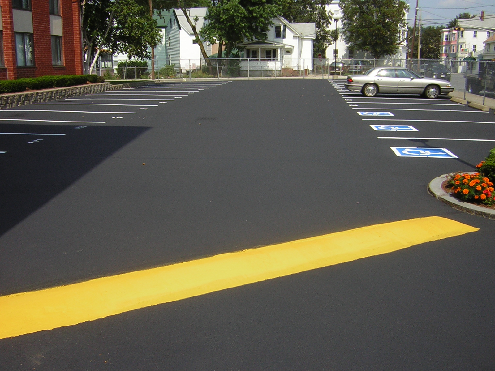
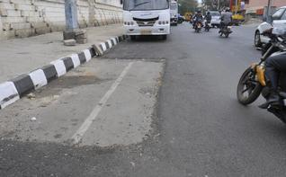

Election time in India. Everybody loves it. The poor love it because it’s “freebies time” and they get to vote out the politicians that didn’t come through for them (usually this meant anti-incumbancy but lately it’s gotten interesting). The non-voting middle class love it because it *appears* that the local MP candidate wants to listen to their gyan. The pundit and the media love it for obvious reasons.

<figure aria-describedby="caption-attachment-2886" class="wp-caption alignleft" id="attachment_2886" style="width: 300px">

<figcaption class="wp-caption-text" id="caption-attachment-2886">What asphalt should look like – Atlanta</figcaption></figure>

I love it because of the asphalt.

I love it because freshly laid asphalt to barefoot runners is like a featherbed to Virendra Sehwag.

Who cares if it’s a *one cm* coating and only lasts till the first monsoon rains? I’m going to enjoy it tomorrow, the next Saturday, the one after.. and so on until one day it would have returned to the miserable god-forsaken gnarled and potholed monstrosity that is the *rest of Bangalore roads*.

Just in case you were wondering.. I’m looking forward to exactly a *one km* stretch on 80 feet road that has received some BBMP love. Actually, many more miles of Bangalore roads have received this facelift but the rest are not on our Saturday Dandi route.

The rest of this post is about how I got *here*.. By here, I mean waxing eloquent on a stretch of Grade C asphalt relaying on a Friday night?

\*\*\*\*\*\*

My two year barefoot running phase has had an interesting journey. In the first four months, it was all *bare* BF. After cutting my teeth (or should I say *toes*) on the Kaikondrahalli Lake trail, I graduated to road running. By ‘road’, I mean the that is the Bangalore road. When the joy started getting squeezed out from my Sat long runs, I upgraded to [huaraches](http://www.ulaar.com/2013/07/13/say-hello-to-huaraches/). Thus began a 16 month phase where 75% of my running miles were on huaraches, the rest barefoot. From a [triple jump running plan](http://www.ulaar.com/2013/04/18/the-triple-jump-running-plan-for-marathoners/) perspective, this meant I was running my tempo and interval runs barefoot (at the Kaikondrahalli Lake) and using huaraches for the Saturday long run and the races. Notable exceptions were the two [Kaveri Trail marathons ](http://www.ulaar.com/2013/09/05/why-im-running-kaveri-trail-marathon-for-the-5th-consecutive-time/)and one other road marathon (not race) barefoot.

<figure aria-describedby="caption-attachment-2887" class="wp-caption alignright" id="attachment_2887" style="width: 300px">

<figcaption class="wp-caption-text" id="caption-attachment-2887">What roads and pavements look like in Bangalore</figcaption></figure>

It may not be evident but huarache laces *wear off* (ask me later what I mean by “wear off”) every 3-4 months. The last time it happened before a Sat run in late 2013, I procrastinated the relacing and decided to go barefoot. I enjoyed it so much that I did it again for the next few Saturdays. I was finding the hills (both up and down) a lot easier to tackle. I was landing lighter and certainly not missing the slap-slap sound of the sandals. I did the [Nandi Hills pilgrimage](http://www.ulaar.com/2013/08/13/my-second-nandi-hills-climb/) twice and learnt some interesting differences between barefoot and 4mm huaraches, especially when one comes tearing down the hill.

After successfully negotiating the Bangalore Ultra 75km (50km in huaraches and 25km in 1cm Puma chappals), I had not made up my mind about Mumbai Marathon. I was strongly leaning towards barefoot but it wasn’t an easy decision. A low-intensity but nagging lower back pain (which I suspected to be a relapse of my slipped disc) took me to Dr. Gladson’s clinic. He correctly diagnosed that it wasn’t a disc relapse but that wasn’t the most interesting finding. He looked at the toughened section of my inner *ball of foot* and posited that it was caused by the difference in foot strike between the huarache and barefoot. He told me to choose “one” of them and stick to it.

I didn’t buy his theory entirely but it served as a forcing function. I chose barefoot for Mumbai. It seemed to be working far better for me in 2013 (compared to 2012), I was landing lighter and by corollary (or was it correlation?) I was cramping less.

Since mid-Dec 2013, I switched back to barefoot. My compliance has been 95% in this period – the last two weekends being the exceptions. The score currently reads 1379km (BF) vs. 2222 (4mmH) but the former is steadily gaining ground.

