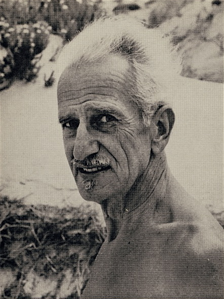
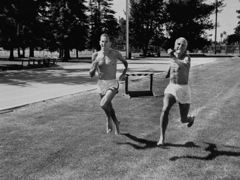
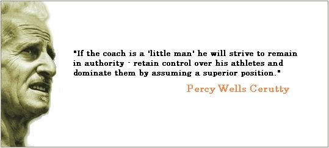

*\[Editor’s Note: Unfinished blog post #77 in my Drafts folder is Scott Jurek’s “Influences and Reading List”. The most interesting character in that list is Percy Cerutty, pronounced “just like ‘sincerity,’ without the sin”. Cerutty came up with the Stotan Code. Seriously inspiring and a heady cocktail of Hatha yoga, Vedanta, and crazy ultra runner.\]*

*Good things take time. Impossible things take a little longer. – Percy Cerutty*

<figure aria-describedby="caption-attachment-2891" class="wp-caption alignleft" id="attachment_2891" style="width: 225px">

<figcaption class="wp-caption-text" id="caption-attachment-2891">Percy Cerutty (pic courtesy racingpast.ca)</figcaption></figure>

**About Stotan Code and Percy Cerutty** \[extract from Scott Jurek’s Eat and Run\]

*In 1939, when he was forty-three, Cerutty \[a former women’s clothing shop manager\] suffered a nervous breakdown. After doctors told him he would be dead within two years, he embarked on a regimen of diet, exercise, and a philosophy of living that he called “Stotan,” which he explained as a combination of Stoic and Spartan. He wrote that an athlete needed “hardness, toughness, and unswerving devotion to an ideal,” but he also needed to embrace “diet, philosophy, cultivation of the intellect, and openness to artistic endeavors.”*

*His most famous protégé, Herb Elliot, the premier mid-distance runner of the late 1950s, called the Stotan sessions “beautiful and painful . . . underneath it all there was a sort of sound philosophy based on ‘Let’s improve ourselves as human beings, let’s become more compassionate, let’s become bigger, let’s become stronger, let’s become nicer people.’”*

*************

<figure aria-describedby="caption-attachment-2892" class="wp-caption alignright" id="attachment_2892" style="width: 300px">

<figcaption class="wp-caption-text" id="caption-attachment-2892">Cerutty with Herb Elliot (coutesy runnersfeed.com)  
Check the terrain and the joy</figcaption></figure>

The Stotan code extract below is from Graem Sims biography of Percy Cerutty, entitled “Why Die”, excerpted from [Alan Couzens’s blog](http://alancouzens.blogspot.in/2008/06/stotan-code.html).

> 
A Stotan is one who hardens, strengthens, toughens and beautifies the body by consistent habits and regular exercises, which are consciously and irrevocably made part of the life plan of the individual, as well as consciously determining that the mind will be cultivated upon such abstractions as purity, beauty and logic. Erudition, in as complete a degree as possible shall be the lifelong aim: Truth, in relation to all aspects of life, the unending search. Stotans will, by virtue of their philosophy, be nature lovers, with a respect and appreciation of all evolved or created things. They will appreciate the sanctity of creative effort both in themselves and in others. They will strive to understand the significance implied by reality, will be able to discern the real from the spurious, and see no anomaly in nudity, either in body or mind. But neither will they cast pearls before swine.
> 
> Stotans, for all the reasons that their philosophy stands for (viz: hardness, toughness, unswerving devotion to an ideal), would look upon the sea (or mountains) as their pristine element and endeavour to associate themselves with their primeval source by immersing themselves at least once per month in all seasons of the year. No practice is disposed to toughen, both the body and the morale, more than this.
> 
> Stotans believe that neither the body nor the mind can be maintained at a high pitch of efficiency unless sufficient and regular rest is obtained, and aim at a daily average of 8 hours sleep. Stotans, also, will not be found in social places after midnight. Stotans shall so regulate their lives that at the end of a period, varying with the intensity of effort, each shall realize that they have attained, without conscious striving, to a state of knowledge, and a position of leadership within the community. It is axiomatic that only the pure can understand purity, only the cultivated appreciate beauty, and only the strong truly measure their strength. **Therefore, only the self-disciplined can command genuine respect.**
> 
> <figure aria-describedby="caption-attachment-2893" class="wp-caption alignleft" id="attachment_2893" style="width: 300px">

<figcaption class="wp-caption-text" id="caption-attachment-2893">Pic courtesy findfreegraphics.com</figcaption></figure>
> 
> A program shall be aimed at which shall be designed to \[train each Stotan\]:-
> 
> (a)… to withstand physical hardship, to accomplish feats of strength and endurance, to understand orderliness, and the true meaning of intelligence.
> 
> (b) To know himself as an organism and a personality
> 
> (c) To emerge, eventually emancipated, from all dogmas, creeds, and beliefs, as well as worldly and unworldly hopes and fears.
> 
> (d) To habitually function upon the highest planes of thought and physical effort.
> 
> **(e) To place the objective of an alert, informed intelligence, and a perfected body, as primary in Life. And to arrive at the conclusion that all else will follow on.**   
> (f) To learn that on this basis, the whole world, and all that it has to offer, opens out as a vision, splendid, normal and realizable.
> 
> **(g) To understand that Past, Futures, Fates, Fears, Death, Selfishness, Egoism, Pride, Envy, Hate and Prejudice can be replaced by Intelligence that controls emotion, dominates destiny, manifests completeness and exults in Life.**
> 
> (h) To understand that, in actuality, evolved man is a King, but without the trappings. That Kingship is his right and his destiny. **That we can make ourselves, in time, all that we would**. That we honour real men but are subservient to none.
> 
> In addition, Stotans shall train themselves to withstand, stoically, personal criticism, also, scepticism as the necessity or wisdom of such a Way of Life. In this regard, Stotans soon learn that they command knowledge, experience and ability not available to the prejudiced, the ignorant or the slothful.
> 
> **Also, having embarked upon the Stotan Way of Life, like the Spartans, one must go through with it to the end. There is no giving up throughout life. The first pre-requisite for a Stotan is tenacity. The next is to understand that his loyalties are towards making the most of the material that is his, to the expansion, or at least the manifestation of the Life Force, and a constant identification of himself with his Life Force through his Way of Life.**
> 
> To live this Way of Life is hard. It is not for weaklings. It is the Way that is travelled by all the truly great ones. It requires strenuous effort of body and mind.
> 
> 

