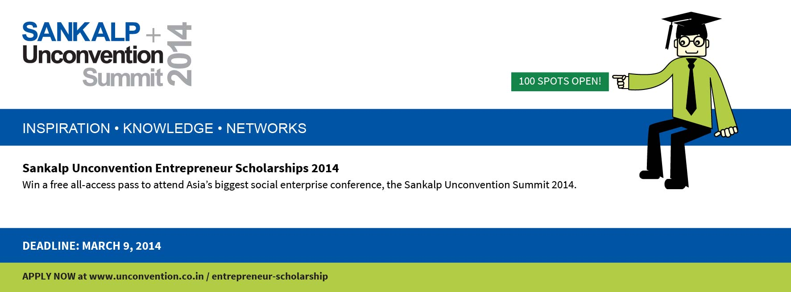

Sankalp and I go back a long way. Well, not *very* long but three years.

- \[2011\] [If I was looking for inspiration.. I found it at Sankalp Forum](http://www.techsangam.com/2011/05/09/if-i-was-looking-for-inspiration-i-found-it-at-sankalp-forum/)
- \[2012\] [Five reasons to be excited about Sankalp](http://www.techsangam.com/2012/04/10/5-reasons-excited-sankalp-forum-2012/)
- \[2013\] [Why you should attend Sankalp](http://www.techsangam.com/2013/04/15/why-you-should-attend-sankalp-forum-2013/)

This will be another year where I’ll be hard-pressed to make it there but.. if you are new to the social enterprise space, you should DEFINITELY give it a dekko.

And if you are a starving “lean startup” social entrepreneur, here’s your chance to get your registration fees completely waived. All you have to do is to pay for your train (or bus) fare.

But first you need to.. [apply here](http://unconvention.co.in/entrepreneur-scholarship). 100 slots apparently.

The eligibility criteria seem lucid enough:

- *The social enterprise must be structured as a for-profit model. If it is a hybrid idea, it must have a for-profit arm.[Read more about eligibility guidelines for Hybrids.](http://unconvention.co.in/faq)*
- *The scholarship is only available for one founder/co-founder/ ideator.*

Good luck!