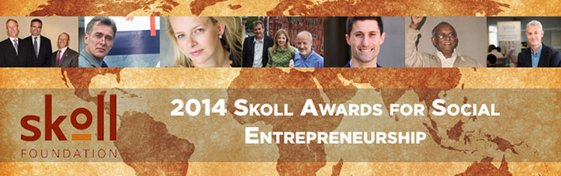

<figure aria-describedby="caption-attachment-2185" class="wp-caption alignleft" id="attachment_2185" style="width: 300px">

<figcaption class="wp-caption-text" id="caption-attachment-2185">Pic courtesy skollworldforum.org</figcaption></figure>

The Skoll Foundation presents the Skoll Awards for Social Entrepreneurship each year to transformative leaders who are disrupting the status quo, driving large-scale change, and are poised to make an even greater impact on the world.

Each Awardee receives a very generous $1.25 million, three-year core support investment to scale their work and increase their impact. Seven organizations received the award for 2014. The organization bios from the Skoll World Forum excerpted below (emphasis is all mine).

**B Lab**

Co-founded by longtime friends and colleagues, Jay Coen Gilbert, Bart Houlahan, and Andrew Kassoy, B Lab is fueling a global movement to redefine “success” in business, so that all companies compete not only to be the best in the world, but the best *for* the world. B Lab is challenging the *status quo* by building a new sector, legal structure, and standards; empowering a community of certified B Corporations; and advancing public policies that enable companies to create financial, social, and environmental value for both its shareholders and for society. With 20 states having passed Benefit Corporation legislation, **nearly 1,000 B Corporations certified**, and **16,000 companies using its tools**, B Lab is focused on accelerating the global adoption of this new model.

**Fundación Capital** (Bogota, Colombia)

Half of the world’s adult population—2.5 billion people—are “unbanked,” lacking access to financial services. Founded by Belgian-born Yves Moury, Fundación Capital is a pioneer in inclusive finance innovation to help the poor save; grow and invest their assets; insure their families against risk; and chart a permanent path out of poverty. Already **reaching three million people**, Fundación Capital is working to reach eight million more in the next few years by expanding access to training, capital, and opportunity. Fundación Capital’s efforts to align advances in public policy, market mechanisms, and technology are building momentum and poised to reach 100 million poor families across three continents by 2030, enabling them to make their own financial decisions and live their ambitions.

**Girls Not Brides** (London, England)

**Every year 14 million girls are married as children**, denied their rights to health, education, and opportunity, and robbed of their childhood. Mabel van Oranje has an inspiring vision of what the world could look like if there were no child brides, and initiated Girls Not Brides with the bold goal of ending child marriage in one generation. Child marriage traps girls and their communities in poverty. By ending the practice, the global community can start to address some of the most difficult challenges in development. Girls Not Brides is a global partnership of more than 300 civil society organizations working across 50 countries. By joining forces and working at all levels—from grassroots to international—members of the global community can tackle this harmful social norm and end child marriage.

**Global Witness** (London, England)

Patrick Alley, Charmian Gooch, and Simon Taylor know that many of the world’s poorest people live in the most resource-rich countries in the world. Natural resources can incentivize corruption, destabilize governments, and lead to conflict and the looting of entire states. **From 2002 to 2011, illicit money flows from corrupt deals in the developing world totaled nearly $6 trillion**. Global Witness investigates and exposes the shadow networks underlying these deals that fuel conflict, corruption, and environmental destruction. They collect evidence and launch hard-hitting campaigns to find global solutions and end the “resource curse” by tackling corruption, protecting the environment, preventing conflict, and defending human rights.

**Medic Mobile** (San Francisco, USA)

One billion people will never see a health professional in their lives. Yet 95 percent of the world’s population has access to a mobile signal. Josh Nesbit’s Medic Mobile was created to improve health in underserved and disconnected communities using communication tools. Medic Mobile builds mobile applications for community health workers, caregivers, and patients to increase life-saving health care coverage. Across 20 countries, its tools support **8,000 frontline health workers** and benefit approximately six million people with plans to double these numbers annually for a total of 200,000 health workers serving 100 million people by 2018.

**Slum Dwellers International (SDI)** (Cape Town, South Africa)

In 2008—for the first time in history—more people were living in urban than in rural areas. Today, more than one billion people live in slums. Founded by a collective of slum dwellers and concerned professionals headed by Jockin Arputham, a community organizer in India, Slum Dwellers International works to have slums recognized as vibrant, resourceful, and dignified communities. SDI organizes slum dwellers to take control of their futures; improve their living conditions; and gain recognition as equal partners with governments and international organizations in the creation of inclusive cities. With programs in nearly 500 cities, including more than **15,000 slum dweller-managed savings groups reaching one million people**; 20 agreements with national governments; and nearly 130,000 families who have secured land rights, SDI has been a driving force for change for slum dwellers around the world.

**Water &amp; Sanitation for the Urban Poor (WSUP)** (London, England)

Every five seconds, the world’s urban population increases by 10 people. Everyone needs access to clean water and sanitation, putting a huge pressure on city service agencies. In response, Water &amp; Sanitation for the Urban Poor has turned the traditional charity model on its head by developing commercially-viable models to bring water and sanitation to nearly **two million people in urban slums in six countries**. Sam Parker, a former business manager, has led the organization since 2006. Offering a creative package of private-sector, nongovernmental-organization, and academic expertise, WSUP equips public and private service agencies with the capacity and incentives to serve all citizens in their city.