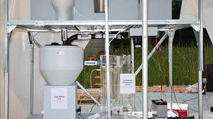

Almost two years ago, Bill and Melinda Gates Foundation declared Caltech as the winner of [Reinvent the Toilet Challenge](http://www.techsangam.com/2012/11/24/once-upon-a-time-in-seattle/).

<figure aria-describedby="caption-attachment-2191" class="wp-caption alignleft" id="attachment_2191" style="width: 300px">

<figcaption class="wp-caption-text" id="caption-attachment-2191">Caltech’s Toilet of the Future (pic webpronews.com)</figcaption></figure>

*A solar-powered toilet that disinfects waste and reuses wastewater to flush. Better yet, it pumps out hydrogen gas for use in fuel cells. Water flushing fixtures, which flushes the poop and pee into a septic holding tank below. Solids sink to the bottom, and the liquid on top goes to the electrochemical reactor, where the waste is oxidized and the water is electrolyzed to hydrogen. Table salt is oxidized to make chlorine, which is used to disinfect the water, which then goes to a tank and can be used for flushing the toilet. The sediment can be removed and used for fertilizer. The power for all this comes from a tracking solar panel.*

If you are a geek, what’s not to like?

Apparently a lot.

Llyod Alter, the managing editor of TreeHugger and architect, wrote a [persuasive case](http://www.treehugger.com/bathroom-design/crapping-bill-gates-reinvent-toilet-winner.html) for why the Caltech design is a terrible idea, at least for the developing world.

There are two main points in Alter’s critique.

**\#1: The toilet isn’t dealing with waste, it’s dealing with the medium that’s moving the waste**

> Almost all of this toilet’s technology is about cleaning and reusing that water; the poop is treated through anaerobic processes not much different than a traditional septic tank. By adding water you lose the valuable urine and you create a need to dry the poop. This toilet isn’t dealing with waste, it is dealing with the medium that is moving the waste, the flushing water.

**\#2: It’s too complicated**

> The idea that this could be maintained and operated in some of the poorest countries in the world is a serious stretch. Oh, and it generates deadly chlorine gas. It would need an engineer to run.

**What does Alter recommend instead?**

The fact is, you don’t need high tech to deal with poop and pee, you need a social organization like they had in China and Japan before the development of artificial fertilizer. He quotes a [Kris De Decker article](http://www.lowtechmagazine.com/2010/09/recycling-animal-and-human-dung-is-the-key-to-sustainable-farming.html) about an entire economic infrastructure for picking the stuff (you know what “stuff” right?) up, processing and storing it to kill microorganisms, and using it as fertilizer.

He ends the critique with..

> There is an economic value to this stuff. Jobs could be created dealing with it. It could be a source of income that is just being pissed and pooped away while they import fertilizer and phosphorus. As Kris De Decker points out, it is not only the key to dealing with human byproducts (don’t call it waste), it is the key to sustainable farming. Yet all the Caltech toilet delivers is a fancy flush.
> 
> This is an issue that doesn’t need technical innovation; it needs social organization. But what do I know.