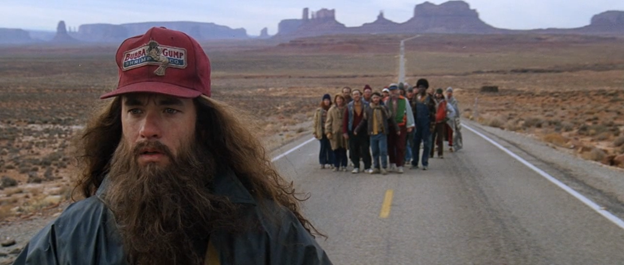

<figure aria-describedby="caption-attachment-2915" class="wp-caption alignleft" id="attachment_2915" style="width: 300px">

<figcaption class="wp-caption-text" id="caption-attachment-2915">Pic courtesy centives.net</figcaption></figure>

Two days ago I had my first DNF in a full marathon. Considering the spate of races recently sprouting all across Bangalore it might surprise you to know that I \*wasn’t\* running in a race.

So where the heck was the FM course? It was on our group’s usual Saturday heartbeat long run course (we call it Dandi). On days like these, what I typically do is start 30 min before my buddies. By the time we finish the customary 30k, I’m left with just a deficit of 7k which I negotiate homeward-bound.

I must tell you that this wasn’t the first time I was running a non-race FM. For quite some time now, I’ve been running a FM every month. Since there are only 3 FM/FM+ races I run every year, the bulk of my recent FM running has been in non-race settings. There have been a few FM’s which I’ve run completely solo ([this](http://www.ulaar.com/2012/08/03/a-quiet-morning-inside-osmania-university/) was one of them) but for the vast majority, I had the company of 1-3 of my friends for at least 30k. One of the cognitively difficult FM’s was Kaikondrahalli Lake (a few months ago) where I had to run 22 loops. Since I had jettisoned my Garmin last year, keeping track of the # of loops was a big challenge (I used 5 postits to represent sets of 5 loops).

So why was (am) I running a FM every month? That is answered in a different post ‘Don’t be a MAD runner, be a MAM runner’. For now, suffice to say that I’ve been doing it for a while now.

Now let me take you back to that scene in Forrest Gump.. That scene where Gump has been running for days (maybe months) and has hundreds of other runners following him. All of a sudden he stops running. Everybody behind also stop. Bewilderment on everyone’s faces.

Gump walks away… Presumably to resume whatever he was doing several months ago. Gump (or someone in the crowd) yells out to the followers “Go home! Just.. Go back!” Amidst murmurs and grumblings, the crowd breaks up and dissipates.

My first DNF was reminiscent of this Gump moment.

Instead of Gump’s following hordes, I had voices in my head. All these months the voices were largely in resonance.. Utterances on the lines of “Go go go” “Oh yeah.. This is fun” “First time doing xyz variant of an FM – that tickles me”.

The first inkling that something was amiss came close to the 33k mark. Sampath (our group’s Speedy Gonzales) was giving me company and, as we sipped deliciously sweet coconut water, asked how much more I had to go. I gave an approximate number (7km – the number I needed to run after reaching Cubbon Park).

Hmm.. 7km more after Cubbon?? It was strangely unsettling. I was surprised because I had *been* *here* before… like more than a dozen times. It wasn’t that I was running particularly fast. Sure – Young Sid and I did a pacey stretch from 6 to 16 but I wasn’t feeling particularly exhausted. No aches and pains from the usual suspects. The soles were a bit sore but they *always were* at this point (thanks to that pathetic excuse of asphalt near IISc and later near Sankey Tank).

It had to be the mind of course.

The usual “clarity of mind” was missing in action.

Ostensibly there were two contributing factors:

- I was supposed to meet a friend (visiting from Mumbai) for breakfast at 9am. If I *had* to finish my FM, I’d have to postpone by 30 min. I was reluctant to because..
- I had also promised my wife that I’d return home before 11am since we had some apartment hunting to do.

We are all prisoners of our own desires.

But only if we choose to.

If we choose differently, we can just up and walk out of the prison.

Which is what I did after I reached Cubbon Park. I called my pal, changed the rendezvous to a barefoot-friendly establishment and proceeded to walk the final 2km. DNF at 37km.

*(Closing note: This post was 90% written using WordPress for Android)*