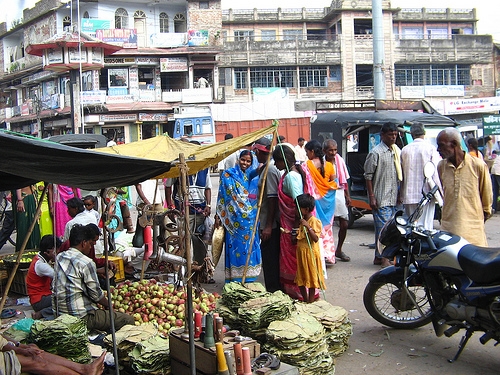

<figure aria-describedby="caption-attachment-2940" class="wp-caption alignleft" id="attachment_2940" style="width: 300px">

<figcaption class="wp-caption-text" id="caption-attachment-2940">Pic courtesy flickr/Google</figcaption></figure>

*\[Editor’s Note: The piece below was penned by Akshay Garg, former co-founder at Komli Media. It appeared on his Facebook feed and I’m republishing here with his permission. Interesting analogies all around.\]*

Modi’s emphatic win in these Indian elections is shocking for many reasons, not the least of which is that in a country as divided by religion, caste, language and culture as this, he managed to stitch together a campaign that let the BJP emerge with enough votes to form a government on its own. To many in my generation who are used to the political horse-trading that follows every election and the Shakespearean drama that accompanies coalition politics in India, this is a parting of the clouds moment.

However, even more noteworthy in my opinion is the oft mentioned but little thought about fact that Modi, a tea-maker’s (chai-wallah’s) son with no political lineage and no godfather to guide him, has made it to the most powerful position in India. For those who thought that Slumdog Millionaire was all fiction, here’s living proof that it’s not. Incredible India. Really, yes.

Modi’s ascendance is a sign of the times. It’s no flash in the pan. To astute observers of the changes sweeping through India, and the subcontinent, Modi’s ascendance might even have been expected. There’s a deep and strong current that is bringing Modi and the likes of him to the surface, and it’s not the last time that we’ll be seeing this.

To understand what is going on here, take a look at the Indian cricket team. In the previous century, the nucleus of the Indian cricket team was a bunch of well behaved, English-speaking, middle to upper class gentlemen that all came from Bombay. Gavaskar, Amarnath, Manjrekar, Shastri and finally Tendulkar. All competent players, some even best in the land, but when it came to a team, they were a bunch of also-rans. With the exception of the World Cup victory in 1983, the Indian cricket team was a bunch of good guys who were super comfortable donning blazers and making small talk at the Marylebone Cricket Club (more commonly known as the home of the Lord’s cricket ground) then grinding their noses to the ground in the quest for the top position. All that started changing with Saurav Ganguly captaining India from 2000 onwards. Who can forget that scene in 2001 where he took off his shirt and waved it while standing in the Lord’s balcony celebrating India’s come from behind victory beating England? The musketeers who lead that charge for Ganguly were two small town players – Yuvraj and Mohammed Kaif. Ganguly selected guys like them, stood by them and expected them to get results. They did. Ganguly didn’t have a perfect record, but his captaincy was a ‘come out of the shadows’ moment for India. Other teams started taking India seriously. The Indian team, too, started believing that they could take on the best and beat them too, on their home turf. With MS Dhoni, the son of a plumber from Ranchi, Jharkhand, the phenomenon has come full circle. Dhoni and his men are uninhibitedly small-town India. They flex their muscles, they twirl their moustaches, they give lip and they take it. At times, it results in extremely poor behaviour like when Harbhajan Singh, the truck driving spinner from Jalandhar, called Andrew Symonds a ‘monkey’ in reference to his race, but for the most part, this small town backgrounds manifests itself in hunger and ‘an eye for an eye’ attitude that the Indian cricket team never had in the previous century.

Modi represents the same phenomenon. In this drama, you can let the Gandhi family take the place of the Bombay cricketers referenced above. They’ve had a stranglehold on Indian politics since our independence in 1947 but today, the Congress party has been reduced to having less than 10% of the seats in the Lok Sabha. In their place now is Modi and small town India. Look through the electoral map and you’ll be amazed by how many of the urban educated, suave candidates have lost. More and more, it’s the ‘salt of the earth’ candidates who are voted into our Parliament.

I don’t have a view of this being good or bad or better or worse. It’s just another manifestation of what’s happening in India where traditional centers of power and influence are getting upended by the spreading of opportunity and increased awareness in Tier 2 and rural India. These candidates are local in terms of their affiliations and outlook, petty-minded if you will, but they at least bring to India a sense of belief and self-confidence that had all but disappeared with the Congress. The Nehru-Gandhi family had the temerity to make the affairs of a billion people a family business. Every year for the past 5 years, all the corruption, lack of decision making, empty posturing had chipped away an inch from the height of every Indian. Here’s India, straining at the leashes trying to jump high, and there, they, while claiming to be the representatives and guardians of the people, take one inch away from the people every year! It’s like making a dog run harder and harder to catch its own tail. Bastards.

Modi and team will, if they’re lucky, get much right and little wrong, but more realistically, much right and much wrong. Making a jump from running a state of 60 million people to running a country of a billion people is not easy. Making a jump from managing affairs at a local level to playing a responsible role on the world stage is a road littered with mines. But that’s not where Modi’s success or failure lies. In giving a big f\*\*\*ing middle finger to the Nehru-Gandhi family, he is taking away that collective feeling of being handicapped and in place restoring some much needed confidence and self-belief in the psyche of India’s people who’ve been battered and bruised in the past 5-10 years. As any sports coach will tell you, confidence and self-belief is at least 50% of the winning formula. The rest is skill, for which the jury on Modi is still out.