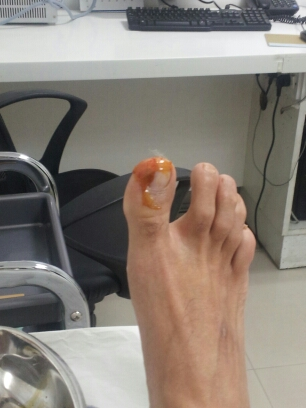
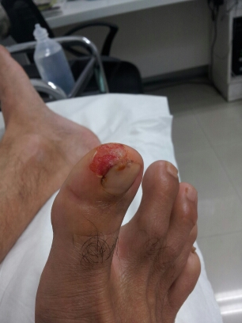
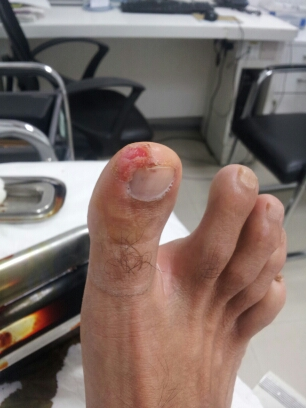
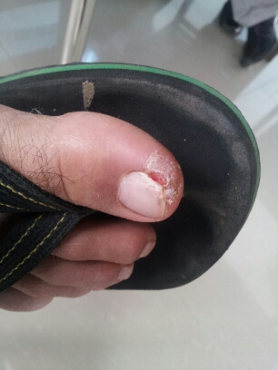

For the uninitiated it must seem like an act of god that we barefoot runners don’t get injured more often… especially with all those glass pieces and strewn on the road, right?

Turns out no superhuman powers are required. Barefoot runners have no choice but to be aware of the running surface – innate survival instinct kicks in. Glass pieces and sundry sharp objects are easily spotted and evasive maneuvers executed.

What about soreness on the running soles? That can persist for a few days to a few hours (depending on how many barefoot miles you’ve put in already) but it’s NOT an injury! It’s “breaking in” your soles!

Analysis of road accidents in US revealed that a high percentage of accidents occur within a few kilometers from people’s homes. Apparently motorists are in a “lowered state of alertness” as they get closer home.. presumably resulting in careless mistakes. Tennis buffs might term them “unforced errors”.

I committed a similar unforced error on the morning of Sep 20, 2013 at Kaikondrahalli Lake. I had finished an interval run when I ran into a few running buddies who were just getting started. We began a slow ambling run – they were warming up and I was cooling down.

Bam!

Visualize your big toe (10 o’clock area) gently hitting the top end of a protrusion at a nearly parallel angle. That’s all it took for my first “barefoot injury” — seventeen months after I commenced my barefoot running journey.

The next 3 pictures were taken in the nurse’s office as she dressed my toe.

The injury happened on a Thursday. I had to eschew shoes, wear chappals and get my dressing changed every other day. Within a week, my toe was looking like this (see below). With a regular bandaid on, I negotiated the Saturday long run without any mishap (I \*did\* use my 4mm huaraches).

Running downtime due to injury: 8 days (or 3 runs).

The best was yet to come.

Next week I continued to wear chappals as I allowed my toe to get its fresh coat of skin. At some point I realized that this ‘wearing chappals to work’ business wasn’t too bad.

I was experiencing open toed freedom while walking to/from/in the office *five days a week*. I was already doing this over the weekend and for my runs. But extending this to the majority of my waking walking hours was heady stuff.

Gee! Now why didn’t I think of this earlier?

Hmm.. perhaps because people who work in offices are \*supposed\* to wear shoes?

I remember the first time I saw a SoCal surfer hippie in Yahoo’s Santa Clara office walking around barefoot. My jaw dropped! Then I saw him nonchalantly saunter into the restroom (still \*barefoot\*). Ew! was my reaction. Native and immigrant role reversal.

Years later in the Bangalore offices of Adobe, one of my initial observations was a high number of male engineers wore sandals to work. To me, it seemed ‘casual’. As though coming to work was not ‘important enough’ to warrant donning shoes. Why weren’t people projecting a ‘buttoned up’ persona? After all, clothes make a man, no?

Inertia, as they say, is a powerful thing. Conditioning and on what’s “proper” and what’s not) is also a powerful thing.

So what had happened? How did I suddenly become comfortable with the notion of “anything but shoes” in a professional environment?

The truth was that it wasn’t sudden at all. In the past two years I had become comfortable being an outlier/maverick barefoot runner. So extending this new found ‘freedom’ to walking was a logical next step.

Walking around the office either in my 5 year old Puma chappals… or huaraches… or barefoot became the norm. A meeting with the Police Commissioner… could I get away with it? Yes I could. Meetings with potential partners… could I get away with it? Yes I could. VC meetings? Yes. Friends and relatives’ weddings? Yes.

There was no turning back now. The chasm had been crossed.

*When life gives you a lemon you make lemonade*

*When life gives you a ripped toe you stop wearing shoes*

*When life gives you a ripped toe you make lemonade*