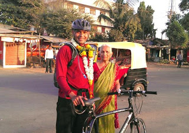
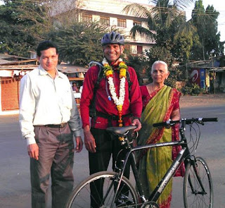

<figure aria-describedby="caption-attachment-2849" class="wp-caption alignleft" id="attachment_2849" style="width: 300px">

<figcaption class="wp-caption-text" id="caption-attachment-2849">Shriram Revankar (the adventurer with his mom at the end of his journey)</figcaption></figure>

\[Editor’s Note: My good friend and ex-colleague Shriram undertook an amazing trip last year. Shriram is a cyclist and a runner. He belittles his running but he’s blessed with natural abilities. With no training plan and just two long 30k runs under his belt, he knocked off a full marathon (Auroville 2011) in 3:55. But this post isn’t about his running abilities.. nor is it about his cycling abilities (of which he has plenty to boast about too). This is about his pain enduring abilities, sheer grit and stubbornness. His [entire account](http://go-payaniga.blogspot.in/2013/09/highway-stories-bicycling-from.html) is eminently worth a read – I’ve cherry picked the bits that serve as a “portrait of pain”.\]

An 8 year old’s humble beginnings with a bicycle..

> When I was an 8 year old child in Ankola, a quaint little coastal town in Karnataka, I had learnt bicycling the hard way. My father, in his late forties was my coach. The bicycle was about the same height as me, but probably weighed double my body-weight. My riding style was quite awkward. The left hand controlled the handle and the right hand tightly wrapped around the seat. My little painfully-thin and knotty frame bobbed up-and-down as I peddled in-and-out through the frame of the bicycle. Manoeuvring the bicycle was not easy. I do remember suffering from persistent open wounds on my knees, shins, palms and elbows for a period of nearly a year or may be more. The poor bicycle did not fare much better either. It was a miracle that the bicycle survived my vigorous ‘half peddling’ through the monsoon hammered streets of Ankola.

Gentle beginnings with pain..

> The primary issue was the pain at the buttocks. 

When the pain could no longer be ignored..

> I kept on riding while my shoulders and butt kept on howling in pain. By around 12:15 PM more than seven hours after I left home, I crossed the midway point of that day’s ride… That stop was a big relief from persistent pain. Interestingly the most prominent pain, the butt pain, would cease as soon as I got off the bike. However shoulder pain would not go down by much.

**The pain and the brain**

> It had been nearly 9 hours since I started my ride. Sun was hot and bright – but I did not notice either the sun or the heat. I had other things distracting me. How many ways can I talk about pain?! There are not enough ways. As my butt felt like it was in a blender, (sorry for being so graphic) I started supporting my weight on my legs and shoulders. Although my knees and thighs were up to the task, my shoulders were not holding up well. Slowly the intensity of pain at the butt and the shoulders overwhelmed all my thoughts. The blunt pain just below the neck, underneath and around the shoulder blades was constant and excruciatingly gnawing. It felt as if a heavy dumbbell got buried into my back and stayed-put and did not move even an iota no matter what I did. I pulled the shoulders in, pulled them down; pulled the chest in and hunched back. Nothing worked. It was a constant struggle.
> 
> I started frequent walks just to relieve me of the pain. The shoulders were getting increasingly worse because walking or resting made no difference to them.
> 
> After every break, getting going again became highly unpalatable. It took immense effort to climb back on the bicycle and continue the ride. I started noticing that the rest-breaks no longer helped me to get a break from pain. It felt like every riding episode started and ended with the same intensity of pain. It was as if I took no break. The breaks were of no help at all. My younger brother had already reached Hubli and was willing to come and rescue me if I asked for it. That put further dent in my resolve to bear the pain and continue. I was still quite far from my first day’s destination – Chitradurga. By that time I had completely forgotten my over enthusiastic early eagerness to go an additional sixty kilo-metres past Chitradurga, to Davanagere.

If you thought he was done talking about his pain on day #1, think again..

> Other than a Google search of a few hotels in Chitradurga, I had not made any arrangements for the night’s stay. I wanted to reach there early while there was still sunlight. I thought that it would give me an opportunity to evaluate more than one hotels option. However the pain was unrelenting, brute-force speeding up was out of the question. I decided not to take breaks anymore – they were not helping. I started walking and bicycling. Every time I bicycled, I had to get down and walk again within a couple of kilometres. I really tried to extend my riding time to walking time ratio. The idea was to match the walking time with the up-hill stretches and the riding time with the flat or downhill stretches. The up-hills were not particularly harsh. It was just that on the up-hills I had to pedal relatively more compared to the downhill or the flat stretches. Not a deep revelation, but the “butt” equation was forcing me to minimize the number of ‘pedalling-s per kilo metre’. I could barely tolerate resting my butt on the seat; any further movement was sadistically cruel. I also rationalized that the ratio of walking speed to riding speed is the highest during an uphill anyway.

Did you know that the brain is the biggest muscle in the human body?

> My democratic body was on complete non-cooperation movement, but my dictatorial brain was taking none of it. It was not letting any of these revolting body parts to make their own decision. At this stage I was ready to take any and all moral victories with great relish. If I could get a few more rolls while not pedalling, that was a win. If there was a stretch of shade that I could get under, it was a win. If I avoided a bump on the road, that was a win. It was getting pathetic and what made the situation ridiculous was the headwind. My whole strategy of uphill-walk; down-hill-ride had to be thrown out. There was a stretch where I was going downhill and I had to pedal as if I was going uphill. Given the state of pain I was in, this made it a real torture. Wikipedia says “it is a practice or act of deliberately inflicting severe physical pain and possibly injury” I think that description of torture matched my situation very well. J It is during this stretch of ‘not-reaching-Chitradurga-yet’, it became clear to me that my brain was the biggest “muscle” that was driving the ride and the rest of the muscles were but secondary.

Pain, music and Ibuprofen

> During early hours of riding, I used to sit on the bike-seat and ride for a stretch of five to ten minutes. By the time I crossed Davanagere, I could bear to sit on my seat and ride only for two three minutes at a stretch and then I had to switch position. This was putting a lot of stress on legs and thighs. My legs had been rock solid till then. They were supporting without complaint and helped in alleviating my butt, shoulder and upper back pain. However as I rode past Harihar, legs started cramping. I longed for some shelter by the road side where I can just lie down for a few minutes in the shade. There was no such luck!
> 
> From then on I had to stop favouring my butt, shoulder and back. The piercing pain was getting increasingly unbearable, but I had no choice. Slowly the legs stopped cramping. The riding speed or effort no longer had any bearing on pain or tiredness. So I started riding quite hard and fast for a few kilo metres and then walked for a 100-200 metres. It was much better now. Soon I found out that no matter how short or long a break I took, it hurt with the same intensity as soon as I started riding. So I made the breaks very short, just enough to remove the edge of the pain and then ride again. I had taken with me some Ibuprophen (pain killer, fever reducer) tablets, but taking two of them had no effect even an hour after taking them. So I did not take them for the rest of the trip.

Uphills, downhills and headwinds

> I left the shelter and continued my bicycling by 2:00 PM and immediately the pain returned with all its glory. My dictatorial brain made a special note of the fact that the pain paid no respect for all that heavenly rest! So it ordered me to take no breaks for the rest of the way. I started walking for a few minutes and riding bike for a few minutes. Uphill or downhill rides did not matter anymore. It all felt like uphill all the time. I attributed the lack of speed to severe headwind. Just as I was about to dismiss the headwind theory as a concoction of my tired mind, huge plume of some kind of a husk started pummelling my face and body. There was headwind after all! 

Victory at last!

> still had about 10 kilo metres to go. The next half hour of ride through the streets of Hubli was uneventful, although I over stretched myself trying to follow my brother and mother, who were on a scooter. I did not know that they were trying to go well ahead of me because my mother wanted to prepare some ritualistic welcome for me into the house. Over exuberant me reached there along with them and then waited at the gate for my mother to get ready for the welcome. That gave my younger brother some more time to snap a few final pictures of the trip.
> 
> Amazingly the butt pain went away without any vestigial effects after the first night’s sleep. I had hurt my left knee while chasing my brother’s scooter during the last stretch. The knee healed in a couple of days. However the upper back and shoulder pain lingered for a few more days. I rested in Hubli for two days before heading back to Bangalore ……….by train.

<figure aria-describedby="caption-attachment-2953" class="wp-caption aligncenter" id="attachment_2953" style="width: 300px">

<figcaption class="wp-caption-text" id="caption-attachment-2953">The victorious protagonist with his mother and brother</figcaption></figure>