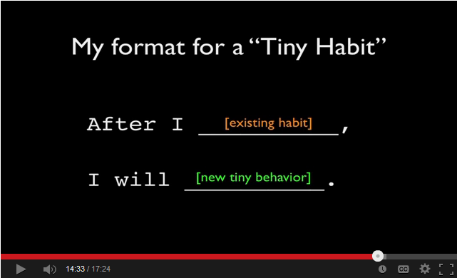

I once audited a class at Stanford.

The year was 2007. I was in the midst of a startup (Graspr.com – an attempt to create a ‘howto slice’ of Youtube), yet I was intrigued enough to take that class.

It was no ordinary class.

Dr. BJ Fogg, a psychology professor and Director of the Stanford Persuasive Technology Lab, was offering a new (possibly one-time) course – *Psychology of Facebook*. Fogg’s recent claim to fame was his earlier class (*Building Facebook Applications*) which he co-taught (I think with Dave McClure). That class produced many apps that reached millions of downloads within weeks and I think a few went on to become companies as well.

For this follow-on (Psychology of Facebook) course, Fogg wanted an industry mix in his classroom and made interested participants fill out a brief questionnaire. I must have contributed something insightful (or witty) because I was ‘accepted’.

It was quite a fascinating course and something that warrants a separate post (short version: I ended up reading Robert Cialdini’s [Psychology of Persuasion](http://www.amazon.com/Influence-Psychology-Persuasion-Revised-Edition/dp/006124189X) in about 3 sittings). Suffice to say that after class got over, I kept regular tabs on Dr. BJ Fogg and Persuasive Lab’s work.

A few years later, after we had moved to Bangalore, I learnt about his latest innovation around behavior change – [Tiny Habits](http://tinyhabits.com/). I promptly signed up for his remote 2-week Tiny Habits workshop. The essential principles around this innovation were:

- It’s *incredibly hard* to form new habits (Duh! you knew that already, right?)
- Any habit that requires motivation is doomed. You might not fail on day#2.. you might even make it to month#10 but fail you will. Eventually.
- Individuals need to first get into the *habit of creating habits*. Sounds like a mouthful? Bear with me for just a bit..
- How does one create habits that DO NOT require motivation and yet can sustain in the long term? 
  - Answer: Tiny habits
- A *tiny habit* is a habit that requires no more than 2 minutes to execute and is *anchored* to a deterministic daily event
- Examples of anchors: *rolling out of bed*, *brushing teeth*, *taking a leak*
- Examples of tiny habits: 
  - After I roll out of bed, I will do exactly 2 push-ups
  - After I finish brushing teeth, I will floss one tooth
  - After I finish my bath, I will fold two items of clothing
- During this tiny habit phase (of getting into the habit of creating habits), it’s NOT important what the tiny habit is… what’s important is to *establish that automatic response*: 
  1. Anchor event X happens
  2. Mind reminds you that you have to do tiny habit Y.
  3. After you automatically do this (what Robert Cialdini calls the “Click… whirr” sequence) for 3-4 weeks, you become a believer. In tiny habits.
- The word *automaticity* seems appropriate to describe this phenomenon but those clever word jocks at Webster haven’t bought into it yet.
- Once you have established tiny habit formation (for a handful) and you’ve done them for 3-4 weeks, it’s time to get ambitious and convert to a regular habit, albeit gradually. 
  - For example, increase 2 push-ups to 3.. to 5 and so on.

**My brief experiments**

- \[Success\] I anchored my push-ups to “rolling out of bed”. 
  - From my wife’s vantage point, the reaction changed from ‘alarmed’ to “he really CAN get nuttier than he already is”
  - After a few weeks of promising results, I raised the ante — 5 per day all the way up to 75 pushups. I then reduced it to 50 (to sustain for a longer period). Two months later I stopped. The point had been proved but I also realized that biceps and triceps are vanity muscles and.. what’s the point if it didn’t make me a better runner? My next tiny habit anchored to the same “rolling out of bed” event will most likely involve planks.
- \[Failure\] Tiny habit was “watch a Khan Academy after bidding good night to kids”. This had a rough start and barely sustained for the minimum 2 week period. For the simple reason that it violated the “tiny” habit principle. Watching a Khan Academy video is *at least* 5-7 minutes.
- \[Middling success\] At the peak of my push-ups obsession, I created another tiny habit (inspired by a @bjfogg tweet) – *after coming out of the rest room, I will do ten push-ups*. I enjoyed this, especially since I had to explain myself to my colleagues at work.

**Closing Thought**

If you are like me… as in struggling to balance insane work pressures, spending quality time with your spouse and kids, and holding on to that *one* rhythmic act of sanity restoration (running/squash/yoga/dancing/\[something\]) and you want to extract 30 min more per day? Forget it, it ain’t gonna happen.

What *may* be possible is to find *six* anchor points during the day.. create and sustain *5-min duration* tiny habits.. and if those tiny habits do sustain, coalesce a few of them into a 15-min routine.