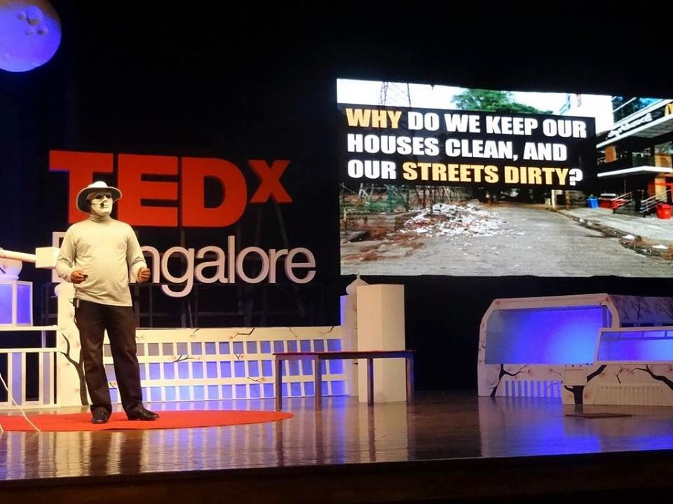

Behold the Ugly Indian.

The *Kaam Chalu Mooh Bandh* Ugly Indian.

The *non-preachy* Ugly Indian.

The *not-your-activist* Ugly Indian.

The *anonymous* Ugly Indian.

The *inspiring* Ugly Indian.

The *unassuming* Ugly Indian.

You can’t change your country.

You can’t change your city.

You *may* be able to change your neighborhood.

But…

You certainly ***CAN*** change a spot.

What’s that? A *spot* you say?

Yes – a 50-100 meter stretch of something (a road, a wall, a sidewalk, a public loo, and hot off the press, *[underground ](https://www.facebook.com/theugl.yindian/photos/pcb.739353939457197/739353776123880/?type=1)*too).

Behold the mighty spotfix!

\*\*\*\*\*\*\*\*\*\*\*\*\*

The Ugly Indian has been on my radar since early 2011. This [seminal spot fix](http://www.techsangam.com/2011/10/19/the-ugly-indians-gift-to-bangalore-on-the-occasion-of-namma-metro-launch/) captured my imagination and I’ve been one of their biggest fans ever since. When I’m happy, I’m liking their spotfix pictures. When I’m sad, I’m sharing their status updates. When I’m bored, I’m trolling their Facebook page. If this is sounding like my former addiction to tobacco, let me reiterate that I AM ADDICTED TO THE UGLY INDIAN!

First the composters and waste segregators came and I told them “No. You are NOT the real deal. TUI is the real deal.”

Then the Anna Hazare fans came and I told them “No. You are NOT the real deal. TUI is the real deal.”

Then came the AAP/Kejriwal fans came and I told them “No. You are NOT the real deal. TUI is the real deal.”

Then came the Modi bhakts and I told them ” No. You are NOT the real deal. TUI is the real deal.”

Then came the Modi Independence Day speech fanboys and I told them “You are STILL not the real deal but this provides the perfect storm for TUI to go national.”

\*\*\*\*\*\*\*\*\*\*\*\*\*\*\*\*\*\*\*\*\*\*\*

But TUI has ALREADY GONE NATIONAL !!!

Don’t believe me? Indians from other Tier 1/2/3 cities are hearing about TUI, getting seriously inspired, going and doing their own local spotfixes and sharing their before/after pictures with TUI. Heck, is Samalkota (AP) a Tier 4 or Tier 5 city? But who cares? This virus is spreading and believe me, this is one helluva good virus! No CDC intervention please!

- Hyderabad : [Film Nagar Primary Govt School](https://www.facebook.com/media/set/?set=a.1517411598474082.1073741836.1511101342438441&type=1) (Aug 12, 2014), [Manjeera Road](https://www.facebook.com/media/set/?set=a.1511365389078703.1073741833.1511101342438441&type=1) (Jul 21, 2014)
- Mumbai Rising (Aug 11, 2014): [Everything you need to know about Mumbai Rising](http://mumbaiboss.com/2014/08/11/everything-you-need-to-know-about-mumbai-rising/)
- Meerut Rising (Aug 10, 2014): [Surajkund Park](https://www.facebook.com/media/set/?set=a.1506676596234648.1073741846.1483151638587144&type=1)
- [Gurgaon Rising](https://www.facebook.com/gurgaonrising) (Jul 16 2014)
- [Rajahmundry](https://www.facebook.com/photo.php?fbid=780824915291157&set=p.780824915291157&type=1&theater) (Jul 10 2014)
- Coimbatore Rising: Take 1, Take 2, [Take 3](https://www.facebook.com/photo.php?fbid=745897822151808&set=a.745137252227865.1073741833.712208442187413&type=3&theater)
- Kanpur Rising: [Arya Nagar Chauraha](https://www.facebook.com/photo.php?fbid=10105004260448824&set=oa.675150815898229&type=1&theater) (Jun 27 2014)
- [Goa Rising](https://www.facebook.com/goarisingnow)
- [8 spotfixes from 6 cities](https://www.facebook.com/theugl.yindian/photos/a.125833837475880.17876.123459791046618/679968538729071/?type=1&relevant_count=1) in one weekend (Apr 29 2014): New Delhi ([Kaam Aadmi Party](https://www.facebook.com/theugl.yindian/photos/pcb.678575685535023/678575472201711/?type=1)), Jaipur, Kanpur, Vizag, Chennai, Gurgaon
- [Samalkota](https://www.facebook.com/theugl.yindian/photos/pcb.667987876593804/667987656593826/?type=1) (AP) – Apr 4 2014
- Mumbai Spotfixin: [Senapati Bapat Marg](https://www.facebook.com/theugl.yindian/photos/a.661564133902845.1073741863.123459791046618/661765847216007/?type=1), opposite Phoenix Mills (Mar 21 2014)
- Bhopal: rescuing the [walls of Moti Masjid](https://www.facebook.com/Bhopal.City.of.Lakes/photos/a.10151851962717582.1073742219.141193332581/10151962736922582/?type=3&theater) – Feb 19 2014
- Ludhiana: [Govt Model school](https://www.facebook.com/theugl.yindian/photos/a.125833837475880.17876.123459791046618/627599680632624/?type=1&relevant_count=1) on Cemetery Road, Civil Lines – Jan 14 2014

 \*\*\*\*\*\*\*\*\*\*\*\*\*\*\*\*\*\*\*\*\*\*\*A

We’ve come to that part of the post where I’ll indulge in some back slapping.

Don’t get me wrong. As far as participating in The Ugly Indian *movement* (the closest word that can be ascr ibed to it), I’m just a greenhorn or a dilettante. Maybe participated in half a dozen spotfixes (if that) and gave TUI a modest [birthday present](http://www.techsangam.com/2011/11/11/calling-bangalore-birthday-presents-for-the-ugly-indian/).

I’m applauding myself for spotting a winning trend three years ago. Three years ago, the TUI Facebook page had 7,000 likes. As of Aug 17, 2014, that number is upward of 182,000 and, judging by the velocity, they are picking up a 1,000 new likes daily. Show me a non-celebrity Indian Facebook page with more traction and I’ll eat my running shoe (ok – only my runner friends will get this joke).

I’m reminded of a chat I had with a friend (who’s in the media business) about TUI soon after I got [TUI religion](http://www.techsangam.com/category/the-ugly-indian-2/).

**Me**: Hey, have you heard about THE UGLY INDIAN?

**She**: Yeah. I have. What have they been up to recently?

**Me** (a little miffed at the lackadaisical response): Well, the Namma Metro Station spotfix ring a bell?

**She**: Well.. I know about their spotfixes but haven’t heard about this particular one.

**Me** (alerting her to [this](http://www.techsangam.com/2011/10/19/the-ugly-indians-gift-to-bangalore-on-the-occasion-of-namma-metro-launch/), [this ](http://www.techsangam.com/2011/10/20/the-ugly-indians-gift-to-bangalore-on-the-occasion-of-namma-metro-launch-part2/)and [this](http://www.techsangam.com/2011/10/20/the-ugly-indians-gift-to-bangalore-on-the-occasion-of-namma-metro-launch-part-3/))

**She**: This is all good but I don’t see how this will be *sustainable*.

**Me**: What do you mean?

**She**: How many of these spotfixes sustain beyond a few weeks?

**Me**: (pointed out a few spotfixes that have sustained for more than six months)

**She**: I don’t know. I love the spotfixes but it’s not sustainable because it is dependent on large numbers of people ‘joining the movement’ and doing spotfixes galore in every part of Bangalore. And what about other cities?

….

**Me**: Sistah! I’ve got news for you. It’s all happening. The spotfixing revolution has begun. Hope you are part of it.

I’ll end my fanboy episode with a Carlos Castaneda quote that a good friend shared with me recently.

> *The world is a description.*

The Ugly Indian has described the world to us ugly indians. They have given us simple and lucid templates to do our bit. So let’s do our bit. And by us (and our), I mean the whole billion lot of us. Jai Hind!