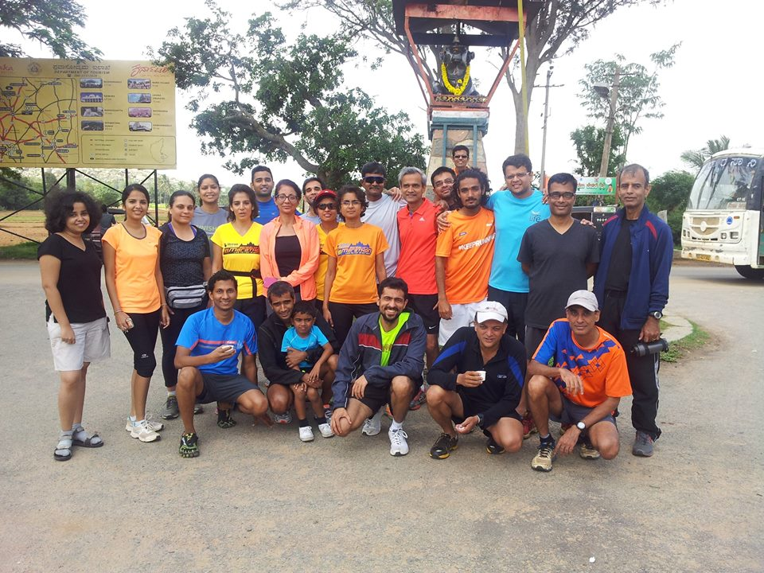

***sacred cow*** (idiom):  *something considered (perhaps unreasonably) immune from question or criticism*

I’ve been a regular long distance runner for almost 6 years. For exactly 2 1/2 of those years (or 42%), I have been a barefoot runner. During my barefoot years, I frequently get asked “is the switch permanent?” My answer almost always is on the lines of “it seems to be working for me.. so I don’t see why not.”

In these years, the following sacred cow had been raised onto my living room pedestal: *thou shalt run all your runs barefoot for the rest of your life because it’s quite obviously been good for you so far*.

I was reminded of two conversations in this regard.

**Conversation #1** (between a Chicago colleague and me circa 1995)

**RR**: “How’s that meditation class coming along?”

**Me**: “Great. I’ve been meditating regularly for about 40 days now!”

**RR**: “Nice! Keep at it.”

**Me**: (feeling that I wasn’t getting sufficient plaudits for my FORTY CONSECUTIVE DAYS of meditating) “You know, I can’t remember the last time I picked up a good habit so easily.”

**RR**: “Hate to break your bubble but it’s not hard to *break* a good thing. Do you know that I learnt and played the bansuri for 9 years and one fine day I just stopped?”

**Me** (bubble clearly pricked): “Oh!”

**Conversation #2** (with a Bangalore runner on barefoot running, recidivism rates and articles of faith):

**Me**: “Among all the barefoot runners I know and hear about, there are exactly TWO who have returned to ‘shoes ways’. Surely that says something?”

**Him**: “Well, there’s anecdotal and there’s data…”

**Me**: “Do you have any data on recidivism rates? Who are the high profile BF’rs who returned to shod running?”

**Him**: “Bikila? Every Indian national level runner I met growing up in the 70’s? Every Kenyan and Ethiopian?”

**Me**: “Oh!”

**Him**: ” BFery is at least as much an issue of faith and unsubstantiable personal belief as it is about practicality – no religion easily admits apostasy and I don’t see how BF is any different – it’s clearly more about faith and individual experience than incontrovertible evidence from which general principles can safely be made. So recidivism rates per se won’t tell you much, just as apostasy rates among Muslims tells you almost nothing about whether Muslims actually have issues with their belief system. It’s the wrong metric to seek when you bring faith into the picture.”

\*\*\*\*\*\*

<figure aria-describedby="caption-attachment-2978" class="wp-caption alignleft" id="attachment_2978" style="width: 300px">

<figcaption class="wp-caption-text" id="caption-attachment-2978">The gang that ran (or walked) up and down Nandi Hills – Aug 10, 2014</figcaption></figure>

Today was my third pilgrimage to Nandi Hills. My [second Nandi Hills climb](http://www.ulaar.com/2013/08/13/my-second-nandi-hills-climb/) was almost a year ago. The first climb was negotiated with barefoot (first 18k) and Puma chappals (next 10k). The second climb was done entirely using my huaraches. As I chronicled earlier, tearing downhill and landing heavily resulted in severe calf pain. This time I wanted to do it entirely barefoot (so I could *land lighter).*

There was one catch though. I was nursing an injury in the inner ball of my right foot. For over a year, the 1 square-inch area had become toughened and the consensus diagnosis suggested a callus. It was harmless enough.. in the sense that it would only start hurting after 30k. There was another catch but I discovered it much later.

**Clarity of mind**

Clarity of mind is imperative. Not just for races, it comes in handy for your training runs as well. The only (sorta) *goal* I had was to run the first loop as hard as possible *barefoot* and negotiate the second loop with my Puma chappals. The chappals remained in MJ’s car –&gt; I forgot to take his keys when I passed him -&gt; and the rest was history.

**The first loop**

A wise soul (either Jugy or Sunil) had once said “don’t attack the hill from the base”. Remembering this, I ambled relatively slowly behind the pack. By the 3-4km mark, I was passing folks and I was definitely *not wasted* by the time I reached the top. I celebrated by hurtling downhill for 3km. No Garmin this time but I reckon I was going faster than last year’s 4:30. And yes, I was definitely getting superior traction and braking with the bare feet (compared to the 4mm huaraches). As the gradient became less steep, I slowed down and, with about 1k to the bottom, I only picked up my pace after a guy wearing a Messi tee passed me.

**Craving for shoes**

At the turnaround, I encountered the effervescently ebullient Nirupma who generously offered me all manners of snacks while regaling me with her exploits. She managed to reduce my gathering gloom but there was no way to wish away the Nandi terrain (THIS was the second catch – I had forgotten how terrible the terrain was). The first 4 km with its gnarly surface sprinkled liberally with gravel was particularly uninviting. I balefully looked at MJ’s car, cursed myself silently and headed back up. Not going for the second loop was obviously NOT an option. One doesn’t drive 60km on a weekend morning to run just ONE loop.

It’s confession time, people! In THIRTY months of barefoot running, this was the FIRST time I came down with a craving for shoes. It was not an evanescent craving. It first hit me as I negotiated the final few km of the downhill. The craving became stronger after I had enough of the damn road and starting walking (and running) on the parapet. As I passed Eka, I hopefully asked him if he had a spare set of sandals. Turns out he did but his car was 2km away and he wasn’t coming back for seconds. I must have cussed something godawful when Rinaz offered his shoes to me. I declined… but had he asked me one more time, I might have accepted. How bad was the craving? [THIS bad](http://theoatmeal.com/comics/running5)! (replace the purple soda with shoes).

**Redemption**

MJ drove me to Nandi. He also turned out to be my guardian angel. After finishing his first loop, he decided to drive his car up the hill to pickup any stragglers who were inclined to skip the second downhill. As soon as he stopped his car alongside me, I mumbled something unintelligible, opened the door and grabbed my Puma chappals. The remaining 4km was a piece of cake

**That Superman scene**

Most runners *today* know that being a barefoot runner is *not that hard*. It’s usually the non-runners who perceive barefoot running as some kind of masochism. On my third sojourn at Nandi Hills, I finally understood what they *perceived*. Why on earth was I running barefoot when it was so godawfully painful?

Thirty goddamn months and I hadn’t felt misery anywhere close to what I felt today. You recall that scene in Superman (or Superman II?) when he loses his superpowers, walks into a bar, tries to save a damsel in distress, cops it on the jaw and lips, and can’t believe that he’s actually bleeding!) I kinda felt that way. The barefoot superman had turned into a mortal.

\*\*\*\*\*\*\*\*\*\*\*

Have I recidivated to shod running? Or is the Nandi experience a prominent notch on my bare feet signaling an inflection point to the next level of difficulty of The Great Running Game? Time will tell and this blog will chronicle. But first I will tell you about the *disposable shoes theory*, freshly minted in the windmills of the Nandi.